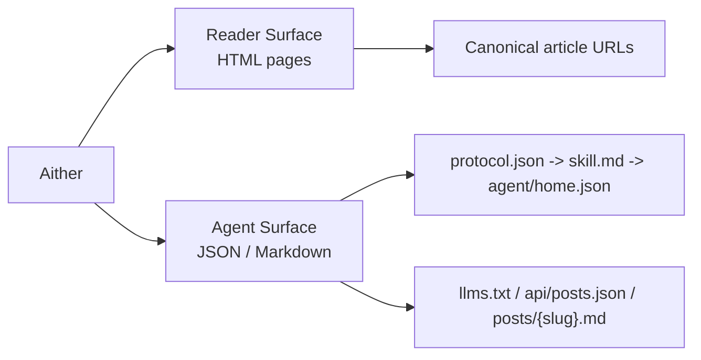

# Aither

**English** | [简体中文](./README_ZH-HANS.md) | [繁體中文](./README_ZH-HANT.md) | [한국어](./README_KO.md) | [Français](./README_FR.md) | [Deutsch](./README_DE.md) | [Italiano](./README_IT.md) | [Español](./README_ES.md) | [Русский](./README_RU.md) | [Bahasa Indonesia](./README_ID.md) | [Português (BR)](./README_PT-BR.md)

[](https://github.com/justinhuangai/astro-theme-aither/actions/workflows/deploy-cloudflare-pages.yml)
[](LICENSE)
[](https://astro.build)
[](https://tailwindcss.com)
[](https://github.com/justinhuangai/astro-theme-aither/stargazers)
[](https://github.com/justinhuangai/astro-theme-aither/commits/main)

**[Live Preview](https://astro-theme-aither.pages.dev)**

An AI-native Astro theme built around beautiful text. ✍️

Typography-first for human readers, machine-readable for AI agents.

Aither is a multilingual publishing theme that treats both surfaces as first-class product work: calm, readable pages for humans; explicit public protocol documents and Markdown endpoints for agents. It is not a generic blog starter with an AI badge added later.

## Reader / Agent Model

- `Reader` means a human reading the HTML site: homepage cards, post pages, the about page, comments, and theme controls.
- `Agent` means software consuming the public machine-readable surface: `protocol.json`, `skill.md`, locale-specific `agent/home.json`, `llms.txt`, `api/posts.json`, and per-post Markdown.
- `Read-only` means discovery, retrieval, indexing, and monitoring are supported today; posting, commenting, and authenticated writes are not.



## Why Aither?

Most blog themes optimize for hero sections, motion, and UI chrome. Aither optimizes for reading rhythm, typographic restraint, and clean information density.

At the same time, it assumes your site may be read by software as often as by people. That is why the repo ships a real protocol surface: `protocol.json`, `skill.md`, localized machine docs, `llms.txt`, Markdown article bodies, JSON schemas, and a cross-locale posts API.

## What Ships Today

- **Typography-first reading experience** -- Bricolage Grotesque headings, system-first body text, CJK-aware fallbacks, and locally bundled font assets so the site feels intentional without relying on remote font CDNs
- **Dual home surfaces** -- The homepage has a reader view and an agent view; humans get cards, agents get direct Markdown access, and `/for-agents/` explains the protocol in plain language
- **41 curated themes** -- Light / Dark / System plus 41 named styles in `src/config/themes.ts`; you can keep the mode switch while hiding the larger theme picker if you want a quieter brand surface
- **AI-native protocol** -- `/protocol.json`, `/skill.md`, localized `/agent/home.json`, `/policy.md`, `/reading.md`, `/subscribe.md`, `/auth.md`, `/llms.txt`, `/llms-full.txt`, `/api/posts.json`, per-post `.md`, About Markdown, JSON schemas, and `/.well-known/ai-plugin.json`
- **Read-only by design** -- Agents can discover, fetch, index, summarize, monitor, and cite content; there is currently no first-party write API, comments API, or authenticated agent action flow
- **11-locale publishing** -- English, 简体中文, 繁體中文, 한국어, Français, Deutsch, Italiano, Español, Русский, Bahasa Indonesia, Português (BR), all with localized UI, hreflang, routes, and feeds
- **66 localized sample posts** -- 6 starter slugs mirrored across 11 locales (`11 x 6 = 66`), with coverage enforced by `pnpm check:post-coverage`
- **Publishing essentials** -- Dynamic OG images, RSS, sitemap, JSON-LD, canonical URLs, tags, pinned posts, pagination, TOC, and optional Giscus / Crisp / Google Analytics
- **Enhanced Markdown authoring** -- Expressive Code blocks with line numbers, KaTeX math, Mermaid diagrams, and Markmap mind maps integrated into the shared markdown pipeline
- **Extensible beyond posts** -- The route system already supports additional content sections through Astro Content Collections and `siteConfig.sections`, not just the default `posts` collection
- **Modern Astro stack** -- Astro 6, MDX, React 19 where useful, Tailwind CSS v4 tokens, and a validation pipeline that checks content parity, build output, and protocol artifacts before deploy

## Requirements

- **Node.js** -- `22 LTS` recommended. Minimum supported versions are `20.19.1+` or `22.12.0+`
- **pnpm** -- This repo pins `pnpm@10.32.1` via `packageManager`
- **Corepack** -- Run `corepack enable` once so the pinned pnpm version is used automatically
- **Chromium for Mermaid in CI** -- If your content includes Mermaid diagrams, install it with `pnpm exec playwright install --with-deps chromium` in CI before building
- **Cloudflare Pages** -- Only required if you want to use the included GitHub Actions deployment workflow

## Quick Start

### Use as a GitHub template

1. Click **"Use this template"** on [GitHub](https://github.com/justinhuangai/astro-theme-aither)
2. Clone your new repo:

```bash
git clone https://github.com/YOUR_USERNAME/YOUR_REPO.git
cd YOUR_REPO
```

3. Enable Corepack and install dependencies:

```bash
corepack enable
pnpm install
```

4. Configure your site:

```bash
# astro.config.mjs -- set your site URL (only place you need to set it)
site: 'https://your-domain.com'

# src/config/site.ts -- set name, description, social links, nav, footer
# (url is automatically read from astro.config.mjs)
```

5. Set up environment variables (optional):

```bash
cp .env.example .env
# Edit .env with your values (GA, Giscus, Crisp)
```

6. Validate the starter before making larger changes:

```bash
pnpm validate
```

7. Start writing:

```bash
pnpm dev
```

8. Deploy when ready. If you want to use the included Cloudflare Pages workflow, finish the setup in [Deployment](#deployment) before pushing to `main`.

### Manual setup

```bash
git clone https://github.com/justinhuangai/astro-theme-aither.git my-blog
cd my-blog
corepack enable
pnpm install
pnpm validate
pnpm dev
```

Best practice: use the GitHub template flow for a new site. If you clone the upstream repo manually, verify everything works first, then create your own repository or import the project into a fresh repo. Avoid deleting `.git` before you have a working local copy.

## Upgrading Existing Sites

Aither currently ships as a `starter-first` theme, not as an installable Astro integration package.

- If your site still shares upstream git history, upgrade release-to-release with git branches or cherry-picks.
- If your site was created from GitHub Template, compare upstream release tags side by side and port the changes you want.
- In both cases, treat `src/content/`, `src/config/site.ts`, and your local environment configuration as site-owned files.
- Use `pnpm upgrade:diff -- --from <old-tag> --to <new-tag>` in a clean upstream clone when you want a categorized file diff before porting changes.

The full workflow lives in [UPGRADING.md](./UPGRADING.md).

## Content Model

Create MDX files in `src/content/posts/{locale}/`:

```markdown
---
title: Your Post Title
date: "2026-01-01T16:00:00+08:00"
description: Optional description for SEO
category: Technology
tags: [optional, tags]
pinned: false
image: ./optional-cover.jpg
---

Your content here.
```

| Field | Type | Required | Default | Description |
|---|---|---|---|---|
| `title` | string | Yes | -- | Post title |
| `date` | date | Yes | -- | Publish timestamp (ISO 8601 with timezone) |
| `description` | string | No | -- | Used in RSS feed and meta tags |
| `category` | string | No | `"General"` | Post category |
| `tags` | string[] | No | -- | Post tags |
| `pinned` | boolean | No | `false` | `true` features post at top of listing |
| `image` | image | No | -- | Cover image (relative path or import) |

Best practices:

- Use a full ISO 8601 timestamp with timezone when possible, for example `2026-03-19T16:27:43+08:00`
- Keep the same slug in every locale so `pnpm check:post-coverage` can verify parity against English
- Treat English as the baseline collection; add the same file name under each locale directory when localizing a post
- Use fenced `mermaid` blocks for diagrams, fenced `markmap` blocks for mind maps, and `$...$` / `$$...$$` for math

## Commands

| Command | Description |
|---|---|
| `pnpm dev` | Start local dev server |
| `pnpm check` | Run Astro type and content checks |
| `pnpm check:post-coverage` | Verify that every locale ships the same post slug coverage |
| `pnpm build` | Build static site to `dist/` |
| `pnpm smoke:markdown` | Verify built markdown samples render code blocks, math, Mermaid, and Markmap |
| `pnpm smoke:package` | Verify the `@aither/astro` package surface and export map |
| `pnpm smoke` | Build the site, then run markdown, package, and AI-native protocol smoke tests |
| `pnpm preview` | Preview production build locally |
| `pnpm validate` | Recommended pre-push check: run `check`, `check:post-coverage`, `build`, and both smoke suites together |

## AI-Native Protocol

There is a human-facing guide at `/for-agents/`, but the machine-facing contract is the real source of truth:

| Endpoint | Scope | Purpose |
|---|---|---|
| `/protocol.json` | Global | Lightweight manifest and schema links |
| `/skill.md` | Global | Canonical narrative entrypoint for agents |
| `/{locale}/agent/home.json` | Per locale | Current site state plus latest posts |
| `/{locale}/policy.md` | Per locale | Rules, discovery order, and safety boundaries |
| `/{locale}/reading.md` | Per locale | Recommended retrieval workflow |
| `/{locale}/subscribe.md` | Per locale | Monitoring and polling guidance |
| `/{locale}/auth.md` | Per locale | Reserved auth contract; current mode is still read-only |
| `/{locale}/llms.txt` | Per locale | Compact content index for LLM discovery |
| `/{locale}/llms-full.txt` | Per locale | Full inlined content for bulk LLM workflows |
| `/api/posts.json` | All locales | Structured metadata across every locale |
| `/{locale}/posts/{slug}.md` | Per locale | Canonical Markdown body for one article |
| `/{locale}/about.md` | Per locale | About page as Markdown |
| `/.well-known/ai-plugin.json` | Global | Lightweight machine discovery metadata |
| `/schemas/agent-protocol.schema.json` | Global | JSON Schema for `protocol.json` |
| `/schemas/agent-home.schema.json` | Global | JSON Schema for `agent/home.json` |

For the default locale, `en`, the locale prefix is omitted. For example, English article Markdown lives at `/posts/{slug}.md`, while Simplified Chinese lives at `/zh-hans/posts/{slug}.md`.

Best practices:

1. Start with `/protocol.json`, then read `/skill.md`, then fetch the locale-specific `agent/home.json`.
2. Use `/api/posts.json` for cross-locale discovery and individual `.md` endpoints for final article retrieval.
3. Cite the canonical HTML article URL back to humans, not the Markdown endpoint.
4. Re-fetch if freshness matters; the protocol is public and intentionally read-only.
5. Treat `pnpm smoke` as the minimum guardrail whenever you change `protocol.json`, `skill.md`, `agent/home.json`, or any agent-facing Markdown protocol doc.

## Configuration

The main files to know are:

- `astro.config.mjs` -- canonical production URL plus shared `@aither/astro` defaults for integrations, Vite, and locale routing
- `src/config/site.ts` -- site metadata, nav/footer, pagination, timezone, theme controls, social links, and optional extra content sections
- `src/config/themes.ts` -- the 41-theme catalog and localized theme labels
- `src/content.config.ts` -- Zod content schema and collection registration
- `src/i18n/index.ts` and `src/i18n/messages/*.ts` -- locale definitions, routing helpers, and translated UI copy
- `.env` -- optional Google Analytics, Crisp, and Giscus settings

### Site settings (`src/config/site.ts`)

```typescript
export const siteConfig = {
  name: 'Aither',
  title: 'An AI-native Astro theme built around beautiful text.',
  description: '...',
  author: {
    name: 'Aither',
    avatar: '', // Import from src/assets/ for optimization, or use URL string
  },
  // url is automatically read from astro.config.mjs — no need to set it here
  social: [
    { title: 'GitHub', href: 'https://github.com/...', icon: 'github' },
    { title: 'Twitter', href: '', icon: 'x' },
  ],
  blog: { paginationSize: 20, timeZone: 'Asia/Shanghai' },
  analytics: { googleAnalyticsId: import.meta.env.PUBLIC_GA_ID || '' },
  crisp: { websiteId: import.meta.env.PUBLIC_CRISP_WEBSITE_ID || '' },
  ui: {
    defaultMode: 'system',
    defaultStyle: 'default',
    enableModeSwitch: true,
    showMoreThemesMenu: true,
  },
  sections: [
    // Optional extra collections beyond posts
    // { id: 'translations', labelKey: 'translations', contentLocale: 'zh-hans' },
  ],
  giscus: {
    repo: '...',
    repoId: '...',
    category: '...',
    categoryId: '...',
    themeLight: 'light',
    themeDark: 'dark',
  },
  nav: [
    { labelKey: 'blog', href: '/' },
    { labelKey: 'about', href: '/about' },
  ],
  footer: { copyrightYear: 'auto', sections: [/* ... */] },
};
```

Set `ui.showMoreThemesMenu` to `false` if you want to keep Light / Dark / System switching but hide the custom theme picker.

`giscus.themeLight` and `giscus.themeDark` follow the resolved color mode, so custom Aither theme styles can still keep comments in the correct light or dark surface.

### Extra content sections

The project is already wired for more than one collection. To add a new section:

```typescript
// src/config/site.ts
sections: [{ id: 'translations', labelKey: 'translations', contentLocale: 'zh-hans' }]

// src/content.config.ts
const translations = defineCollection({
  loader: glob({ pattern: '**/*.mdx', base: './src/content/translations' }),
  schema: contentSchema,
});

export const collections = { posts, translations };
```

Then create content under `src/content/translations/{locale}/`. If you set `contentLocale`, store the content only in that locale directory, for example `src/content/translations/zh-hans/`. List and detail routes are generated automatically at `/translations/`, `/{locale}/translations/`, and their nested slug pages.

Use `contentLocale` when a section should publish one canonical content language while still reusing the surrounding site shell in every locale. The built-in translations shelf uses this pattern so the interface stays localized but the translated article body remains Simplified Chinese everywhere.

### Astro config (`astro.config.mjs`)

```javascript
import { defineConfig } from 'astro/config';
import aither from '@aither/astro';

export default defineConfig({
  site: 'https://your-domain.com',
  integrations: [aither()],
});
```

### Environment variables (`.env`)

```bash
# Google Analytics (leave empty to disable)
PUBLIC_GA_ID=

# Crisp Chat (leave empty to disable)
PUBLIC_CRISP_WEBSITE_ID=

# Giscus Comments (leave all empty to disable)
PUBLIC_GISCUS_REPO=
PUBLIC_GISCUS_REPO_ID=
PUBLIC_GISCUS_CATEGORY=
PUBLIC_GISCUS_CATEGORY_ID=
```

### i18n

Language config is in `src/i18n/index.ts`, translations in `src/i18n/messages/*.ts`.

| Code | Language |
|---|---|
| `en` | English (default) |
| `zh-hans` | 简体中文 |
| `zh-hant` | 繁體中文 |
| `ko` | 한국어 |
| `fr` | Français |
| `de` | Deutsch |
| `it` | Italiano |
| `es` | Español |
| `ru` | Русский |
| `id` | Bahasa Indonesia |
| `pt-br` | Português (BR) |

The default locale (`en`) has no URL prefix. Other locales use their code as prefix (e.g. `/zh-hans/`, `/ko/`).

Best practice: keep the English slug set as the canonical baseline and use `pnpm check:post-coverage` to catch missing localized articles before deploy.

## Project Structure

```
packages/
└── aither-astro/                # Emerging shared package layer for config + integration defaults
src/
├── config/
│   ├── site.ts                     # Site metadata, nav/footer, theme controls, optional sections
│   └── themes.ts                   # 41 curated themes + localized labels
├── content.config.ts               # Content Collections schema (Zod)
├── content/
│   └── posts/{locale}/*.mdx        # Multilingual post content
├── i18n/
│   ├── index.ts                     # Locale definitions and routing helpers
│   └── messages/*.ts                # UI translations for all locales
├── components/
│   ├── pages/                       # Page-level UI: home, post, about, for-agents
│   ├── AIAccessList.astro           # Agent-facing Markdown post list
│   ├── Navbar.astro                 # Nav, locale switcher, theme controls
│   ├── ModeSwitcher.astro           # Light/Dark/System + custom theme picker
│   ├── TableOfContents.astro        # Heading-driven TOC
│   └── Giscus.astro                 # Optional comments
├── lib/
│   ├── agent-protocol.ts            # Protocol manifest + agent docs generation
│   ├── markdown-endpoint.ts         # Markdown response helpers
│   ├── og-image.ts                  # Dynamic OG image generation
│   ├── posts.ts                     # Locale-aware content fetching + sorting
│   ├── site-content.ts              # Paths, pagination, RSS, llms.txt helpers
│   └── theme.ts                     # Theme preference state helpers
├── layouts/
│   └── Layout.astro                 # SEO, hreflang, JSON-LD, alternates, global shell
├── pages/
│   ├── index.astro                  # Home (default locale)
│   ├── about.astro                  # About page
│   ├── for-agents.astro             # Human-facing protocol landing page
│   ├── page/[num].astro             # Paginated home listing
│   ├── posts/
│   │   ├── [slug].astro             # Post detail
│   │   └── [slug].md.ts             # Per-post Markdown endpoint
│   ├── agent/home.json.ts           # Aggregated machine-readable site state
│   ├── protocol.json.ts             # Structured manifest
│   ├── skill.md.ts                  # Canonical narrative protocol document
│   ├── policy.md.ts                 # Agent rules and safety guidance
│   ├── reading.md.ts                # Retrieval workflow guidance
│   ├── subscribe.md.ts              # Monitoring guidance
│   ├── auth.md.ts                   # Reserved auth contract
│   ├── llms.txt.ts                  # Compact LLM index
│   ├── llms-full.txt.ts             # Full inlined content for LLMs
│   ├── api/posts.json.ts            # Cross-locale posts metadata
│   ├── schemas/*.json.ts            # JSON Schemas for protocol endpoints
│   ├── [section]/...                # Auto-generated extra collection routes
│   └── [locale]/...                 # Localized counterparts for all major routes
├── styles/
│   ├── fonts.css                    # Local Bricolage Grotesque font faces
│   └── global.css                   # Tailwind v4 tokens, typography, theme variables
public/
├── .well-known/ai-plugin.json       # Public machine discovery metadata
├── favicon.svg
├── logo.svg / logo-dark.svg
└── og.png
scripts/
├── check-post-coverage.mjs          # Enforce slug parity across locales
└── smoke-agent-protocol.mjs         # Validate generated protocol artifacts
```

## Deployment

### Cloudflare Pages (default)

The included workflow (`.github/workflows/deploy-cloudflare-pages.yml`) is opinionated and validates the site before deploying to Cloudflare Pages.

1. Create a Cloudflare Pages project. The workflow uses your repository name by default, or `CLOUDFLARE_PAGES_PROJECT_NAME` if you want to override it
2. Add GitHub Secrets: `CLOUDFLARE_API_TOKEN` and `CLOUDFLARE_ACCOUNT_ID`
3. Update `site` in `astro.config.mjs` to your production URL
4. Run `pnpm validate`
5. Push to `main` and let GitHub Actions build and deploy

Best practice: keep the repository name aligned with your Pages project, or set the repository variable `CLOUDFLARE_PAGES_PROJECT_NAME` when you need a different target.

### Other platforms

The output is static HTML in `dist/`, so you can deploy it on any static host:

```bash
pnpm build
# Upload dist/ to Netlify, Vercel, GitHub Pages, or any static host
```

## Principles

1. **Typography is the interface** -- Good writing should not fight the theme.
2. **Humans and agents both matter** -- The public protocol is part of the product, not an afterthought.
3. **Multilingual parity is enforced** -- Locale coverage is checked, not assumed.
4. **Extension points stay close to content** -- Add sections through Content Collections and config, not through a separate app layer.
5. **Keep the stack calm** -- Static output, explicit docs, and clear contracts beat hidden magic.

## Acknowledgments

- Inspired by [yinwang.org](https://www.yinwang.org).
- Parts of the theme system are inspired by [Raphael Publish](https://github.com/liuxiaopai-ai/raphael-publish) and [EvoMap](https://evomap.ai).

## Contributing

Contributions are welcome. Please open an issue first to discuss what you'd like to change.

## License

[MIT](LICENSE)
