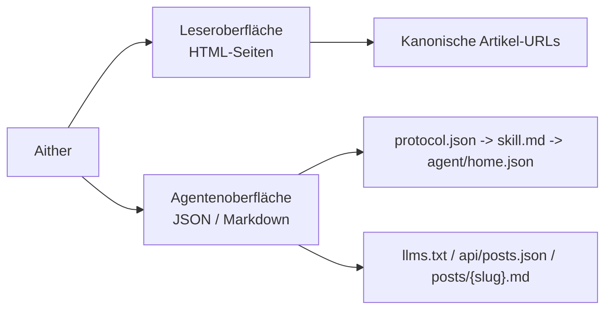

# Aither

[English](./README.md) | [简体中文](./README_ZH-HANS.md) | [繁體中文](./README_ZH-HANT.md) | [한국어](./README_KO.md) | [Français](./README_FR.md) | **Deutsch** | [Italiano](./README_IT.md) | [Español](./README_ES.md) | [Русский](./README_RU.md) | [Bahasa Indonesia](./README_ID.md) | [Português (BR)](./README_PT-BR.md)

[](https://github.com/justinhuangai/astro-theme-aither/actions/workflows/deploy-cloudflare-pages.yml)
[](LICENSE)
[](https://astro.build)
[](https://tailwindcss.com)
[](https://github.com/justinhuangai/astro-theme-aither/stargazers)
[](https://github.com/justinhuangai/astro-theme-aither/commits/main)

**[Live-Vorschau](https://astro-theme-aither.pages.dev)**

Ein AI-natives Astro-Theme rund um schönen Text. ✍️

Typografie im Mittelpunkt für Menschen, maschinenlesbare Endpunkte für KI-Agenten.

Aither ist ein mehrsprachiges Publishing-Theme, das beide Oberflächen als Produkt behandelt: ruhige, lesbare Seiten für Menschen und explizite öffentliche Protokolldokumente plus Markdown-Endpunkte für Agenten. Es ist kein generisches Blog-Template, dem nachträglich ein KI-Label verpasst wurde.

## Leser- / Agent-Modell

- `Leser` bezeichnet Menschen, die die HTML-Seite lesen: Startseite, Beitragsseiten, About-Seite, Kommentare und Theme-Steuerung.
- `Agent` bezeichnet Software, die die öffentliche maschinenlesbare Oberfläche nutzt: `protocol.json`, `skill.md`, locale-spezifisches `agent/home.json`, `llms.txt`, `api/posts.json` und Artikel-Markdown.
- `Schreibgeschützt` bedeutet, dass Entdeckung, Abruf, Indexierung und Überwachung unterstützt werden; Schreiben, Kommentare und authentifizierte Schreibzugriffe derzeit nicht.



## Warum Aither?

Die meisten Blog-Themes optimieren für große Aufmacher, Animationen und visuelle Oberflächen-Dekoration. Aither optimiert für Lesefluss, typografische Zurückhaltung und Informationsdichte.

Gleichzeitig geht das Projekt davon aus, dass Ihre Website nicht nur von Menschen, sondern auch von Software gelesen wird. Deshalb bringt das Repository eine echte Protokolloberfläche mit: `protocol.json`, `skill.md`, lokalisierte Maschinendokumente, `llms.txt`, Markdown-Artikelkörper, JSON-Schemas und eine Posts-API über alle Sprachen hinweg.

## Was heute enthalten ist

- **Typografie zuerst** -- Bricolage-Grotesque-Überschriften, systemnahe Fließtexte, CJK-taugliche Fallbacks und lokal gebündelte Font-Assets statt externer Font-CDNs
- **Zwei Startseiten-Ansichten** -- Die Homepage hat eine Leser-Ansicht und eine Agent-Ansicht; Menschen sehen Karten, Agenten direkte Markdown-Zugänge, und `/for-agents/` erklärt das Protokoll in Klartext
- **41 kuratierte Themes** -- Light / Dark / System plus 41 benannte Styles in `src/config/themes.ts`; auf Wunsch können Sie den Theme-Picker ausblenden und nur den Modus-Switch behalten
- **AI-native Protokolloberfläche** -- `/protocol.json`, `/skill.md`, lokalisierte `/agent/home.json`, `/policy.md`, `/reading.md`, `/subscribe.md`, `/auth.md`, `/llms.txt`, `/llms-full.txt`, `/api/posts.json`, `.md` pro Artikel, About-Markdown, JSON-Schemas und `/.well-known/ai-plugin.json`
- **Schreibgeschützt als Prinzip** -- Agenten können Inhalte finden, abrufen, indexieren, zusammenfassen, überwachen und zitieren; es gibt derzeit keine First-Party-Write-API, keine Kommentar-API und keinen authentifizierten Schreibfluss für Agenten
- **11 Sprachen** -- Englisch, 简体中文, 繁體中文, 한국어, Français, Deutsch, Italiano, Español, Русский, Bahasa Indonesia und Português (BR), inklusive lokalisierter UI, hreflang, Routen und Feeds
- **66 lokalisierte Beispielposts** -- 6 Starter-Slugs gespiegelt über 11 Sprachversionen (`11 x 6 = 66`), abgesichert durch `pnpm check:post-coverage`
- **Publishing-Grundlagen** -- Dynamische OG-Bilder, RSS, Sitemap, JSON-LD, kanonische URLs, Tags, angeheftete Posts, Paginierung, TOC und optional Giscus / Crisp / Google Analytics
- **Erweiterbar über Posts hinaus** -- Das Routing unterstützt bereits zusätzliche Inhaltsbereiche via Astro Content Collections und `siteConfig.sections`, nicht nur `posts`
- **Moderner Astro-Stack** -- Astro 6, MDX, React 19 wo sinnvoll, Tailwind CSS v4 Tokens und eine Validierungs-Pipeline für Content-Parität, Build-Ausgabe und Protokollartefakte

## Anforderungen

- **Node.js** -- `22 LTS` empfohlen. Mindestversionen: `20.19.1+` oder `22.12.0+`
- **pnpm** -- Das Repository pinnt `pnpm@10.32.1` über `packageManager`
- **Corepack** -- Führen Sie einmal `corepack enable` aus, damit automatisch die gepinnte pnpm-Version verwendet wird
- **Cloudflare Pages** -- Nur erforderlich, wenn Sie den enthaltenen GitHub-Actions-Deploy-Ablauf nutzen möchten

## Schnellstart

### Als GitHub-Template verwenden

1. Klicken Sie auf **"Use this template"** auf [GitHub](https://github.com/justinhuangai/astro-theme-aither)
2. Klonen Sie Ihr neues Repository:

```bash
git clone https://github.com/YOUR_USERNAME/YOUR_REPO.git
cd YOUR_REPO
```

3. Corepack aktivieren und Abhängigkeiten installieren:

```bash
corepack enable
pnpm install
```

4. Website konfigurieren:

```bash
# astro.config.mjs -- Produktions-URL setzen (nur hier noetig)
site: 'https://your-domain.com'

# src/config/site.ts -- Name, Beschreibung, Social Links, Navigation, Footer setzen
# URL wird automatisch aus astro.config.mjs gelesen
```

5. Umgebungsvariablen einrichten (optional):

```bash
cp .env.example .env
# Tragen Sie Ihre Werte in .env ein (GA, Giscus, Crisp)
```

6. Den Starter vor größeren Änderungen validieren:

```bash
pnpm validate
```

7. Entwicklung starten:

```bash
pnpm dev
```

8. Wenn Sie den eingebauten Cloudflare-Ablauf nutzen möchten, schließen Sie zuerst die Schritte unter [Bereitstellung](#bereitstellung) ab, bevor Sie nach `main` pushen

### Manuelle Einrichtung

```bash
git clone https://github.com/justinhuangai/astro-theme-aither.git my-blog
cd my-blog
corepack enable
pnpm install
pnpm validate
pnpm dev
```

Empfehlung: Für neue Sites den GitHub-Template-Flow verwenden. Wenn Sie das Upstream-Repo manuell klonen, prüfen Sie zuerst lokal alles durch, bevor Sie ein neues Repo erstellen oder importieren. `.git` nicht löschen, bevor Sie eine funktionierende lokale Kopie haben.

## Bestehende Sites aktualisieren

Aither wird derzeit als `starter-first`-Theme ausgeliefert, nicht als installierbares Astro-Integrationspaket. Für bestehende Sites sollten Updates deshalb release-basiert per Git erfolgen, nicht per `pnpm up`. Wenn Sie einen sauberen Upstream-Clone haben, können Sie vorab `pnpm upgrade:diff -- --from <altes Tag> --to <neues Tag>` ausführen, um die Änderungen nach Typ zu gruppieren. Die vollständige Anleitung steht in [UPGRADING.md](./UPGRADING.md).

## Inhaltsmodell

Erstellen Sie MDX-Dateien in `src/content/posts/{locale}/`:

```markdown
---
title: Mein Beitragstitel
date: "2026-01-01T16:00:00+08:00"
description: Optionale Beschreibung fuer SEO
category: Technology
tags: [beispiel, tags]
pinned: false
image: ./optional-cover.jpg
---

Your content here.
```

| Feld | Typ | Pflicht | Standard | Beschreibung |
|---|---|---|---|---|
| `title` | string | Ja | -- | Titel des Beitrags |
| `date` | date | Ja | -- | Veröffentlichungszeitpunkt, idealerweise ISO 8601 mit Zeitzone |
| `description` | string | Nein | -- | Für RSS und Meta-Tags |
| `category` | string | Nein | `"General"` | Kategorie |
| `tags` | string[] | Nein | -- | Tags |
| `pinned` | boolean | Nein | `false` | Mit `true` oben anheften |
| `image` | image | Nein | -- | Coverbild per Relativpfad oder Import |

Empfehlungen:

- Verwenden Sie nach Möglichkeit vollständige ISO-8601-Timestamps mit Zeitzone, z. B. `2026-03-19T16:27:43+08:00`
- Halten Sie den gleichen Slug in jeder Locale, damit `pnpm check:post-coverage` Parität gegen Englisch prüfen kann
- Behandeln Sie Englisch als Baseline-Collection und verwenden Sie beim Lokalisieren denselben Dateinamen in allen Sprachordnern

## Befehle

| Befehl | Beschreibung |
|---|---|
| `pnpm dev` | Lokalen Dev-Server starten |
| `pnpm check` | Astro-Typ- und Content-Checks ausführen |
| `pnpm check:post-coverage` | Prüfen, ob jede Locale die gleichen Slugs hat |
| `pnpm build` | Statische Site nach `dist/` bauen |
| `pnpm smoke:package` | Paketoberfläche von `@aither/astro` und Export-Zuordnung prüfen |
| `pnpm smoke` | Verifikationstests für Paket und KI-Protokollartefakte ausführen |
| `pnpm preview` | Produktions-Build lokal ansehen |
| `pnpm validate` | Empfohlener Pre-Push-Check: `check`, `check:post-coverage`, `build` und beide Smoke-Suiten |

## AI-native Protokoll

`/for-agents/` ist die menschenlesbare Hilfeseite, aber der maschinenlesbare Vertrag ist maßgeblich:

| Endpunkt | Umfang | Zweck |
|---|---|---|
| `/protocol.json` | Global | Leichtgewichtiges Manifest und Schema-Links |
| `/skill.md` | Global | Kanonischer narrativer Einstiegspunkt |
| `/{locale}/agent/home.json` | Pro Locale | Aktueller Site-Zustand und neueste Posts |
| `/{locale}/policy.md` | Pro Locale | Regeln, Discovery-Reihenfolge und Sicherheitsgrenzen |
| `/{locale}/reading.md` | Pro Locale | Empfohlener Abruf-Workflow |
| `/{locale}/subscribe.md` | Pro Locale | Monitoring- und Polling-Hinweise |
| `/{locale}/auth.md` | Pro Locale | Reservierter Auth-Vertrag; aktuell weiterhin schreibgeschützt |
| `/{locale}/llms.txt` | Pro Locale | Kompakter Inhaltsindex für LLMs |
| `/{locale}/llms-full.txt` | Pro Locale | Vollständig inline eingebettete Inhalte für LLM-Abläufe in größeren Mengen |
| `/api/posts.json` | Alle Locales | Strukturierte Metadaten über alle Sprachen hinweg |
| `/{locale}/posts/{slug}.md` | Pro Locale | Kanonischer Markdown-Body eines Artikels |
| `/{locale}/about.md` | Pro Locale | About-Seite als Markdown |
| `/.well-known/ai-plugin.json` | Global | Leichtgewichtige Discovery-Metadaten |
| `/schemas/agent-protocol.schema.json` | Global | JSON Schema für `protocol.json` |
| `/schemas/agent-home.schema.json` | Global | JSON Schema für `agent/home.json` |

Für die Default-Locale `en` gibt es keinen Präfix. Englisches Markdown lebt also unter `/posts/{slug}.md`, Deutsch unter `/de/posts/{slug}.md`.

Empfehlungen:

1. Mit `/protocol.json` starten, dann `/skill.md` lesen, dann das locale-spezifische `agent/home.json` abrufen
2. Für Cross-Locale-Discovery `/api/posts.json` nutzen und für den finalen Artikelabruf die einzelnen `.md`-Endpunkte
3. Gegenüber Menschen auf die kanonische HTML-URL verlinken, nicht auf den Markdown-Endpunkt
4. Wenn Aktualität wichtig ist, neu abrufen und nicht auf alte Caches vertrauen
5. `pnpm smoke` mindestens immer dann ausführen, wenn `protocol.json`, `skill.md`, `agent/home.json` oder Markdown-Dokumente für Agenten geändert werden

## Konfiguration

Wichtige Einstiegsdateien:

- `astro.config.mjs` -- kanonische Produktions-URL plus gemeinsame `@aither/astro`-Defaults fuer Integrationen, Vite und Locale-Routing
- `src/config/site.ts` -- Site-Metadaten, Navigation/Footer, Pagination, Zeitzone, Theme-Steuerung, Social Links und optionale zusätzliche Sections
- `src/config/themes.ts` -- der 41-Theme-Katalog und lokalisierte Theme-Labels
- `src/content.config.ts` -- Zod-Schema und Collection-Registrierung
- `src/i18n/index.ts` und `src/i18n/messages/*.ts` -- Locale-Definitionen, Routing-Helper und übersetzte UI-Texte
- `.env` -- optionale Einstellungen für Google Analytics, Crisp und Giscus

### Site-Einstellungen (`src/config/site.ts`)

```typescript
export const siteConfig = {
  name: 'Aither',
  title: 'An AI-native Astro theme built around beautiful text.',
  description: '...',
  author: {
    name: 'Aither',
    avatar: '', // Fuer Optimierung aus src/assets/ importieren oder direkte URL verwenden
  },
  // URL wird automatisch aus astro.config.mjs gelesen — hier nicht erneut setzen
  social: [
    { title: 'GitHub', href: 'https://github.com/...', icon: 'github' },
    { title: 'Twitter', href: '', icon: 'x' },
  ],
  blog: { paginationSize: 20, timeZone: 'Asia/Shanghai' },
  analytics: { googleAnalyticsId: import.meta.env.PUBLIC_GA_ID || '' },
  crisp: { websiteId: import.meta.env.PUBLIC_CRISP_WEBSITE_ID || '' },
  ui: {
    defaultMode: 'system',
    defaultStyle: 'default',
    enableModeSwitch: true,
    showMoreThemesMenu: true,
  },
  sections: [
    // Optional extra collections beyond posts
    // { id: 'translations', labelKey: 'translations' },
  ],
  giscus: { repo: '...', repoId: '...', category: '...', categoryId: '...' },
  nav: [
    { labelKey: 'blog', href: '/' },
    { labelKey: 'about', href: '/about' },
  ],
  footer: { copyrightYear: 'auto', sections: [/* ... */] },
};
```

Setzen Sie `ui.showMoreThemesMenu` auf `false`, wenn Sie Light / Dark / System behalten, aber den großen Theme-Picker ausblenden möchten.

### Zusätzliche Inhaltsbereiche

Das Projekt ist bereits auf mehr als eine Collection ausgelegt. So fügen Sie eine neue Section hinzu:

```typescript
// src/config/site.ts
sections: [{ id: 'translations', labelKey: 'translations' }]

// src/content.config.ts
const translations = defineCollection({
  loader: glob({ pattern: '**/*.mdx', base: './src/content/translations' }),
  schema: contentSchema,
});

export const collections = { posts, translations };
```

Erstellen Sie danach Inhalte unter `src/content/translations/{locale}/`. Listen- und Detailseiten werden automatisch unter `/translations/`, `/{locale}/translations/` und den entsprechenden Slug-Routen erzeugt.

### Astro-Konfiguration (`astro.config.mjs`)

```javascript
import { defineConfig } from 'astro/config';
import aither from '@aither/astro';

export default defineConfig({
  site: 'https://your-domain.com',
  integrations: [aither()],
});
```

### Umgebungsvariablen (`.env`)

```bash
# Google Analytics (leave empty to disable)
PUBLIC_GA_ID=

# Crisp Chat (leave empty to disable)
PUBLIC_CRISP_WEBSITE_ID=

# Giscus Comments (leave all empty to disable)
PUBLIC_GISCUS_REPO=
PUBLIC_GISCUS_REPO_ID=
PUBLIC_GISCUS_CATEGORY=
PUBLIC_GISCUS_CATEGORY_ID=
```

### i18n

Sprachkonfiguration liegt in `src/i18n/index.ts`, Übersetzungen in `src/i18n/messages/*.ts`.

| Code | Sprache |
|---|---|
| `en` | English (default) |
| `zh-hans` | 简体中文 |
| `zh-hant` | 繁體中文 |
| `ko` | 한국어 |
| `fr` | Français |
| `de` | Deutsch |
| `it` | Italiano |
| `es` | Español |
| `ru` | Русский |
| `id` | Bahasa Indonesia |
| `pt-br` | Português (BR) |

Die Default-Locale `en` hat keinen URL-Präfix. Andere Locales verwenden ihren Code, z. B. `/de/`, `/zh-hans/` oder `/ko/`.

Empfehlung: Englisch als kanonische Baseline für Slugs behandeln und `pnpm check:post-coverage` vor der Bereitstellung laufen lassen.

## Projektstruktur

```text
src/
├── config/
│   ├── site.ts                     # Site-Metadaten, Nav/Footer, Theme-Steuerung, optionale Sections
│   └── themes.ts                   # 41 kuratierte Themes + lokalisierte Bezeichnungen
├── content.config.ts               # Schema für Content Collections (Zod)
├── content/
│   └── posts/{locale}/*.mdx        # Mehrsprachige Beitragsinhalte
├── i18n/
│   ├── index.ts                    # Locale-Definitionen und Routing-Helfer
│   └── messages/*.ts               # UI-Übersetzungen für alle Locales
├── components/
│   ├── pages/                      # Seitenebene: Start, Beitrag, About, for-agents
│   ├── AIAccessList.astro          # Markdown-Beitragsliste für Agenten
│   ├── Navbar.astro                # Navigation, Locale-Switcher, Theme-Steuerung
│   ├── ModeSwitcher.astro          # Light/Dark/System + eigener Theme-Picker
│   ├── TableOfContents.astro       # Inhaltsverzeichnis aus Überschriften
│   └── Giscus.astro                # Optionale Kommentare
├── lib/
│   ├── agent-protocol.ts           # Protokollmanifest und Agent-Dokumente erzeugen
│   ├── markdown-endpoint.ts        # Hilfsfunktionen für Markdown-Antworten
│   ├── og-image.ts                 # Dynamische OG-Bilder erzeugen
│   ├── posts.ts                    # Inhalte locale-sensitiv laden und sortieren
│   ├── site-content.ts             # Hilfen für Pfade, Pagination, RSS und llms.txt
│   └── theme.ts                    # Hilfsfunktionen für Theme-Präferenzen
├── layouts/
│   └── Layout.astro                # SEO, hreflang, JSON-LD, Alternates, globale Hülle
├── pages/
│   ├── index.astro                 # Startseite (Standard-Locale)
│   ├── about.astro                 # About-Seite
│   ├── for-agents.astro            # Protokoll-Landingpage für Menschen
│   ├── page/[num].astro            # Paginierte Startseitenliste
│   ├── posts/
│   │   ├── [slug].astro            # Beitragsdetail
│   │   └── [slug].md.ts            # Markdown-Endpunkt pro Beitrag
│   ├── agent/home.json.ts          # Aggregierter maschinenlesbarer Site-Status
│   ├── protocol.json.ts            # Strukturiertes Manifest
│   ├── skill.md.ts                 # Kanonisches narratives Protokolldokument
│   ├── policy.md.ts                # Agent-Regeln und Safety-Hinweise
│   ├── reading.md.ts               # Empfohlener Retrieval-Ablauf
│   ├── subscribe.md.ts             # Monitoring-Hinweise
│   ├── auth.md.ts                  # Reservierter Auth-Vertrag
│   ├── llms.txt.ts                 # Kompakter LLM-Index
│   ├── llms-full.txt.ts            # Vollständig inline eingebettete Inhalte für LLMs
│   ├── api/posts.json.ts           # Beitragsmetadaten über alle Locales
│   ├── schemas/*.json.ts           # JSON-Schemas für Protokollendpunkte
│   ├── [section]/...               # Automatisch erzeugte Routen für zusätzliche Collections
│   └── [locale]/...                # Lokalisierte Gegenstücke für alle wichtigen Routen
├── styles/
│   ├── fonts.css                   # Lokal gebündelte Bricolage-Grotesque-Fonts
│   └── global.css                  # Tailwind-v4-Tokens, Typografie und Theme-Variablen
public/
├── .well-known/ai-plugin.json      # Öffentliche Metadaten für Maschinen-Discovery
├── favicon.svg
├── logo.svg / logo-dark.svg
└── og.png
scripts/
├── check-post-coverage.mjs         # Erzwingt gleiche Slugs über alle Locales
└── smoke-agent-protocol.mjs        # Validiert erzeugte Protokollartefakte
```

## Bereitstellung

### Cloudflare Pages (Standard)

Der enthaltene Ablauf `.github/workflows/deploy-cloudflare-pages.yml` ist auf Cloudflare Pages ausgerichtet und validiert die Site vor der Bereitstellung.

1. Ein Cloudflare-Pages-Projekt anlegen. Der Ablauf nutzt standardmäßig Ihren Repository-Namen oder optional `CLOUDFLARE_PAGES_PROJECT_NAME` als Override
2. GitHub-Secrets `CLOUDFLARE_API_TOKEN` und `CLOUDFLARE_ACCOUNT_ID` hinzufügen
3. `site` in `astro.config.mjs` auf Ihre Produktions-URL setzen
4. `pnpm validate` ausführen
5. Nach `main` pushen und GitHub Actions bauen und deployen lassen

Empfehlung: Halten Sie den Repository-Namen und den Pages-Projektnamen möglichst gleich oder setzen Sie die Repository-Variable `CLOUDFLARE_PAGES_PROJECT_NAME`, wenn ein anderer Zielname nötig ist.

### Andere Plattformen

Das Ergebnis ist statisches HTML in `dist/` und kann deshalb auf jedem statischen Host veröffentlicht werden:

```bash
pnpm build
# dist/ zu Netlify, Vercel, GitHub Pages oder einem anderen statischen Host hochladen
```

## Prinzipien

1. **Typografie ist die Oberfläche** -- Guter Text sollte nicht gegen das Theme kämpfen müssen.
2. **Menschen und Agenten sind gleich wichtig** -- Das öffentliche Protokoll ist Teil des Produkts, kein nachträglicher Zusatz.
3. **Mehrsprachige Parität wird geprüft** -- Locale-Abdeckung wird nicht angenommen, sondern verifiziert.
4. **Erweiterungspunkte bleiben nah am Content** -- Zusätzliche Sections entstehen über Content Collections und Konfiguration, nicht über eine separate App-Schicht.
5. **Weniger Magie, mehr Klarheit** -- Statischer Output, explizite Dokumente und klare Verträge schlagen versteckte Komplexität.

## Danksagung

- Inspiriert von [yinwang.org](https://www.yinwang.org).
- Teile des Theme-Systems sind inspiriert von [Raphael Publish](https://github.com/liuxiaopai-ai/raphael-publish) und [EvoMap](https://evomap.ai).

## Mitwirken

Beiträge sind willkommen. Bitte eröffnen Sie zuerst ein Issue, um die Änderung zu besprechen.

## Lizenz

[MIT](LICENSE)
