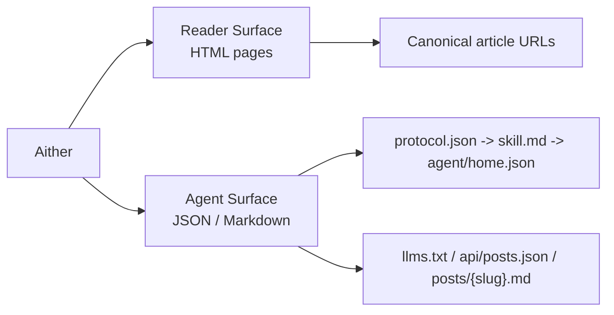

# Aither

[English](./README.md) | [简体中文](./README_ZH-HANS.md) | [繁體中文](./README_ZH-HANT.md) | [한국어](./README_KO.md) | [Français](./README_FR.md) | [Deutsch](./README_DE.md) | [Italiano](./README_IT.md) | **Español** | [Русский](./README_RU.md) | [Bahasa Indonesia](./README_ID.md) | [Português (BR)](./README_PT-BR.md)

[](https://github.com/justinhuangcode/astro-theme-aither/actions/workflows/deploy-cloudflare-pages.yml)
[](LICENSE)
[](https://astro.build)
[](https://tailwindcss.com)
[](https://github.com/justinhuangcode/astro-theme-aither/stargazers)
[](https://github.com/justinhuangcode/astro-theme-aither/commits/main)

**[Vista previa en vivo](https://astro-theme-aither.pages.dev)**

Un tema Astro AI-native construido alrededor de un texto hermoso. ✍️

Tipografía primero para lectores humanos, endpoints legibles por máquina para agentes IA.

Aither es un tema de publicación multilingüe que trata ambas superficies como trabajo de producto real: páginas sobrias y legibles para personas, y documentos de protocolo públicos con endpoints Markdown para agentes. No es un starter de blog genérico al que después se le añadió una capa de IA.

## Modelo Lector / Agente

- `Reader` significa una persona leyendo el sitio HTML: home, páginas de artículos, página About, comentarios y controles de tema.
- `Agent` significa software consumiendo la superficie machine-readable pública: `protocol.json`, `skill.md`, `agent/home.json` por locale, `llms.txt`, `api/posts.json` y Markdown por artículo.
- `Read-only` significa que hoy se soportan descubrimiento, lectura, indexación y monitoreo; no existen publicación, comentarios ni escrituras autenticadas.



## ¿Por qué Aither?

La mayoría de los temas de blog optimizan hero sections, animaciones y chrome visual. Aither optimiza ritmo de lectura, sobriedad tipográfica y densidad informativa.

Al mismo tiempo, asume que el sitio será leído por software tanto como por personas. Por eso el repositorio incluye una superficie de protocolo real: `protocol.json`, `skill.md`, documentos máquina localizados, `llms.txt`, cuerpos de artículos en Markdown, JSON Schema y una API de posts multi-locale.

## Qué incluye hoy

- **Lectura centrada en tipografía** -- títulos con Bricolage Grotesque, texto del sistema, fallbacks CJK y fuentes empaquetadas localmente
- **Dos vistas de inicio** -- la home tiene vista de lector y vista de agente; humanos ven tarjetas, agentes ven acceso directo a Markdown y `/for-agents/` explica el protocolo
- **41 temas curados** -- Light / Dark / System más 41 estilos nombrados en `src/config/themes.ts`
- **Superficie AI-native** -- `/protocol.json`, `/skill.md`, `/agent/home.json` localizado, `/policy.md`, `/reading.md`, `/subscribe.md`, `/auth.md`, `/llms.txt`, `/llms-full.txt`, `/api/posts.json`, `.md` por artículo, About Markdown, esquemas JSON y `/.well-known/ai-plugin.json`
- **Read-only por diseño** -- los agentes pueden descubrir, leer, indexar, resumir, monitorear y citar contenido, pero no existe API de escritura ni flujo autenticado para agentes
- **11 idiomas** -- UI localizada, hreflang, rutas y feeds para 11 locales
- **66 sample posts localizados** -- 6 slugs de arranque replicados en 11 locales (`11 x 6 = 66`), verificados con `pnpm check:post-coverage`
- **Base editorial completa** -- OG dinámicas, RSS, sitemap, JSON-LD, canonicals, tags, pinned posts, paginación, TOC y Giscus / Crisp / Google Analytics opcionales
- **Extensible más allá de posts** -- el enrutado ya soporta otras colecciones con Astro Content Collections y `siteConfig.sections`
- **Stack Astro moderno** -- Astro 6, MDX, React 19 cuando aporta valor, Tailwind CSS v4 y una pipeline de validación para contenido, build y protocolo

## Requisitos

- **Node.js** -- `22 LTS` recomendado. Versiones mínimas: `20.19.1+` o `22.12.0+`
- **pnpm** -- el repo fija `pnpm@10.32.1` mediante `packageManager`
- **Corepack** -- ejecuta `corepack enable` una vez para usar la versión esperada de pnpm
- **Cloudflare Pages** -- solo si vas a usar el workflow de despliegue incluido

## Inicio rápido

### Usar como plantilla de GitHub

1. Haz clic en **"Use this template"** en [GitHub](https://github.com/justinhuangcode/astro-theme-aither)
2. Clona tu nuevo repositorio:

```bash
git clone https://github.com/YOUR_USERNAME/YOUR_REPO.git
cd YOUR_REPO
```

3. Activa Corepack e instala dependencias:

```bash
corepack enable
pnpm install
```

4. Configura tu sitio:

```bash
# astro.config.mjs -- set your site URL (only place you need to set it)
site: 'https://your-domain.com'

# src/config/site.ts -- set name, description, social links, nav, footer
# (url is automatically read from astro.config.mjs)
```

5. Configura variables de entorno (opcional):

```bash
cp .env.example .env
# Edit .env with your values (GA, Giscus, Crisp)
```

6. Valida el starter antes de cambios grandes:

```bash
pnpm validate
```

7. Arranca desarrollo:

```bash
pnpm dev
```

8. Si vas a usar el workflow de Cloudflare, completa antes la sección [Despliegue](#despliegue)

### Configuración manual

```bash
git clone https://github.com/justinhuangcode/astro-theme-aither.git my-blog
cd my-blog
corepack enable
pnpm install
pnpm validate
pnpm dev
```

Buena práctica: para un sitio nuevo, usa la plantilla de GitHub. Si clonas el repositorio upstream manualmente, verifica primero que todo funcione en local.

## Modelo de contenido

Crea archivos MDX en `src/content/posts/{locale}/`:

```markdown
---
title: Your Post Title
date: "2026-01-01T16:00:00+08:00"
description: Optional description for SEO
category: Technology
tags: [optional, tags]
pinned: false
image: ./optional-cover.jpg
---

Your content here.
```

| Campo | Tipo | Requerido | Por defecto | Descripción |
|---|---|---|---|---|
| `title` | string | Sí | -- | Título del artículo |
| `date` | date | Sí | -- | Fecha de publicación, idealmente ISO 8601 con zona horaria |
| `description` | string | No | -- | Para RSS y meta tags |
| `category` | string | No | `"General"` | Categoría |
| `tags` | string[] | No | -- | Etiquetas |
| `pinned` | boolean | No | `false` | Fija el artículo arriba |
| `image` | image | No | -- | Imagen de portada |

Buenas prácticas:

- Usar timestamps ISO 8601 completos con zona horaria, por ejemplo `2026-03-19T16:27:43+08:00`
- Mantener el mismo slug en cada locale para que `pnpm check:post-coverage` pueda validar paridad
- Tratar el inglés como baseline y usar el mismo nombre de archivo en cada idioma

## Comandos

| Comando | Descripción |
|---|---|
| `pnpm dev` | Inicia el servidor local |
| `pnpm check` | Ejecuta comprobaciones de Astro y contenido |
| `pnpm check:post-coverage` | Verifica paridad de slugs entre locales |
| `pnpm build` | Genera el sitio estático en `dist/` |
| `pnpm smoke` | Ejecuta smoke tests del protocolo IA |
| `pnpm preview` | Previsualiza el build de producción |
| `pnpm validate` | Chequeo recomendado antes de push: `check`, `check:post-coverage`, `build` y `smoke` |

## Protocolo AI-native

`/for-agents/` es la guía humana, pero el contrato machine-readable real es este:

| Endpoint | Alcance | Propósito |
|---|---|---|
| `/protocol.json` | Global | Manifest ligero y enlaces a schemas |
| `/skill.md` | Global | Punto de entrada narrativo canónico |
| `/{locale}/agent/home.json` | Por locale | Estado actual del sitio y últimos posts |
| `/{locale}/policy.md` | Por locale | Reglas, orden de descubrimiento y límites |
| `/{locale}/reading.md` | Por locale | Workflow recomendado de lectura |
| `/{locale}/subscribe.md` | Por locale | Guía de polling y monitoreo |
| `/{locale}/auth.md` | Por locale | Contrato de auth reservado; el modo sigue siendo read-only |
| `/{locale}/llms.txt` | Por locale | Índice compacto para LLMs |
| `/{locale}/llms-full.txt` | Por locale | Contenido inline completo para workflows bulk |
| `/api/posts.json` | Todas las locales | Metadatos estructurados en todos los idiomas |
| `/{locale}/posts/{slug}.md` | Por locale | Cuerpo Markdown canónico de un artículo |
| `/{locale}/about.md` | Por locale | Página About en Markdown |
| `/.well-known/ai-plugin.json` | Global | Metadatos ligeros de descubrimiento |
| `/schemas/agent-protocol.schema.json` | Global | JSON Schema de `protocol.json` |
| `/schemas/agent-home.schema.json` | Global | JSON Schema de `agent/home.json` |

La locale por defecto `en` no lleva prefijo. El Markdown en inglés vive en `/posts/{slug}.md`, el español en `/es/posts/{slug}.md`.

Buenas prácticas:

1. Empieza por `/protocol.json`, luego `/skill.md`, luego `agent/home.json`
2. Usa `/api/posts.json` para descubrimiento multi-locale y endpoints `.md` para recuperar el artículo final
3. Cita la URL HTML canónica al enlazar hacia humanos
4. Vuelve a consultar los endpoints si la frescura importa
5. Ejecuta al menos `pnpm smoke` al modificar documentos del protocolo

## Configuración

Archivos principales:

- `astro.config.mjs` -- URL de producción, integraciones Astro y routing de locales
- `src/config/site.ts` -- metadatos del sitio, nav/footer, paginación, timezone, controles de tema, enlaces sociales y sections opcionales
- `src/config/themes.ts` -- catálogo de 41 temas y etiquetas localizadas
- `src/content.config.ts` -- esquema Zod y registro de colecciones
- `src/i18n/index.ts` y `src/i18n/messages/*.ts` -- locales, helpers de routing y textos traducidos
- `.env` -- Google Analytics, Crisp y Giscus opcionales

### Ajustes del sitio (`src/config/site.ts`)

```typescript
export const siteConfig = {
  name: 'Aither',
  title: 'An AI-native Astro theme built around beautiful text.',
  description: '...',
  author: {
    name: 'Aither',
    avatar: '', // Import from src/assets/ for optimization, or use URL string
  },
  // url is automatically read from astro.config.mjs — no need to set it here
  social: [
    { title: 'GitHub', href: 'https://github.com/...', icon: 'github' },
    { title: 'Twitter', href: '', icon: 'x' },
  ],
  blog: { paginationSize: 20, timeZone: 'Asia/Shanghai' },
  analytics: { googleAnalyticsId: import.meta.env.PUBLIC_GA_ID || '' },
  crisp: { websiteId: import.meta.env.PUBLIC_CRISP_WEBSITE_ID || '' },
  ui: {
    defaultMode: 'system',
    defaultStyle: 'default',
    enableModeSwitch: true,
    showMoreThemesMenu: true,
  },
  sections: [
    // Optional extra collections beyond posts
    // { id: 'translations', labelKey: 'translations' },
  ],
  giscus: { repo: '...', repoId: '...', category: '...', categoryId: '...' },
  nav: [
    { labelKey: 'blog', href: '/' },
    { labelKey: 'about', href: '/about' },
  ],
  footer: { copyrightYear: 'auto', sections: [/* ... */] },
};
```

Pon `ui.showMoreThemesMenu` en `false` si quieres conservar Light / Dark / System pero ocultar el picker completo.

### Secciones de contenido adicionales

El proyecto ya está preparado para más de una colección:

```typescript
// src/config/site.ts
sections: [{ id: 'translations', labelKey: 'translations' }]

// src/content.config.ts
const translations = defineCollection({
  loader: glob({ pattern: '**/*.mdx', base: './src/content/translations' }),
  schema: contentSchema,
});

export const collections = { posts, translations };
```

Luego crea contenido en `src/content/translations/{locale}/`. Las rutas se generan automáticamente.

### Configuración de Astro (`astro.config.mjs`)

```javascript
export default defineConfig({
  site: 'https://your-domain.com',
  integrations: [react(), mdx(), sitemap()],
  i18n: {
    defaultLocale: 'en',
    locales: ['en', 'zh-hans', 'zh-hant', 'ko', 'fr', 'de', 'it', 'es', 'ru', 'id', 'pt-br'],
    routing: { prefixDefaultLocale: false },
  },
  vite: { plugins: [tailwindcss()] },
});
```

### Variables de entorno (`.env`)

```bash
# Google Analytics (leave empty to disable)
PUBLIC_GA_ID=

# Crisp Chat (leave empty to disable)
PUBLIC_CRISP_WEBSITE_ID=

# Giscus Comments (leave all empty to disable)
PUBLIC_GISCUS_REPO=
PUBLIC_GISCUS_REPO_ID=
PUBLIC_GISCUS_CATEGORY=
PUBLIC_GISCUS_CATEGORY_ID=
```

### i18n

La configuración de idioma está en `src/i18n/index.ts`, las traducciones en `src/i18n/messages/*.ts`.

| Código | Idioma |
|---|---|
| `en` | English (default) |
| `zh-hans` | 简体中文 |
| `zh-hant` | 繁體中文 |
| `ko` | 한국어 |
| `fr` | Français |
| `de` | Deutsch |
| `it` | Italiano |
| `es` | Español |
| `ru` | Русский |
| `id` | Bahasa Indonesia |
| `pt-br` | Português (BR) |

Buena práctica: tratar el conjunto de slugs en inglés como baseline canónico y ejecutar `pnpm check:post-coverage` antes de desplegar.

## Estructura del proyecto

```text
src/
├── config/
│   ├── site.ts                     # Site metadata, nav/footer, theme controls, optional sections
│   └── themes.ts                   # 41 curated themes + localized labels
├── content.config.ts               # Content Collections schema (Zod)
├── content/
│   └── posts/{locale}/*.mdx        # Multilingual post content
├── i18n/
│   ├── index.ts                    # Locale definitions and routing helpers
│   └── messages/*.ts               # UI translations for all locales
├── components/
│   ├── pages/                      # Page-level UI: home, post, about, for-agents
│   ├── AIAccessList.astro          # Agent-facing Markdown post list
│   ├── Navbar.astro                # Nav, locale switcher, theme controls
│   ├── ModeSwitcher.astro          # Light/Dark/System + custom theme picker
│   ├── TableOfContents.astro       # Heading-driven TOC
│   └── Giscus.astro                # Optional comments
├── lib/
│   ├── agent-protocol.ts           # Protocol manifest + agent docs generation
│   ├── markdown-endpoint.ts        # Markdown response helpers
│   ├── og-image.ts                 # Dynamic OG image generation
│   ├── posts.ts                    # Locale-aware content fetching + sorting
│   ├── site-content.ts             # Paths, pagination, RSS, llms.txt helpers
│   └── theme.ts                    # Theme preference state helpers
├── layouts/
│   └── Layout.astro                # SEO, hreflang, JSON-LD, alternates, global shell
├── pages/
│   ├── index.astro                 # Home (default locale)
│   ├── about.astro                 # About page
│   ├── for-agents.astro            # Human-facing protocol landing page
│   ├── page/[num].astro            # Paginated home listing
│   ├── posts/
│   │   ├── [slug].astro            # Post detail
│   │   └── [slug].md.ts            # Per-post Markdown endpoint
│   ├── agent/home.json.ts          # Aggregated machine-readable site state
│   ├── protocol.json.ts            # Structured manifest
│   ├── skill.md.ts                 # Canonical narrative protocol document
│   ├── policy.md.ts                # Agent rules and safety guidance
│   ├── reading.md.ts               # Retrieval workflow guidance
│   ├── subscribe.md.ts             # Monitoring guidance
│   ├── auth.md.ts                  # Reserved auth contract
│   ├── llms.txt.ts                 # Compact LLM index
│   ├── llms-full.txt.ts            # Full inlined content for LLMs
│   ├── api/posts.json.ts           # Cross-locale posts metadata
│   ├── schemas/*.json.ts           # JSON Schemas for protocol endpoints
│   ├── [section]/...               # Auto-generated extra collection routes
│   └── [locale]/...                # Localized counterparts for all major routes
├── styles/
│   ├── fonts.css                   # Local Bricolage Grotesque font faces
│   └── global.css                  # Tailwind v4 tokens, typography, theme variables
public/
├── .well-known/ai-plugin.json      # Public machine discovery metadata
├── favicon.svg
├── logo.svg / logo-dark.svg
└── og.png
scripts/
├── check-post-coverage.mjs         # Enforce slug parity across locales
└── smoke-agent-protocol.mjs        # Validate generated protocol artifacts
```

## Despliegue

### Cloudflare Pages (por defecto)

El workflow `.github/workflows/deploy-cloudflare-pages.yml` está orientado a Cloudflare Pages y valida el sitio antes de desplegar.

1. Crea un proyecto de Cloudflare Pages. El workflow usa por defecto el nombre del repositorio, o `CLOUDFLARE_PAGES_PROJECT_NAME` si quieres sobrescribirlo
2. Añade `CLOUDFLARE_API_TOKEN` y `CLOUDFLARE_ACCOUNT_ID` en GitHub Secrets
3. Actualiza `site` en `astro.config.mjs`
4. Ejecuta `pnpm validate`
5. Haz push a `main`

Buena práctica: mantén alineados el nombre del repositorio y el proyecto de Pages, o define la variable de repositorio `CLOUDFLARE_PAGES_PROJECT_NAME` si necesitas otro destino.

### Otras plataformas

La salida es HTML estático en `dist/`:

```bash
pnpm build
# Upload dist/ to Netlify, Vercel, GitHub Pages, or any static host
```

## Principios

1. **La tipografía es la interfaz** -- el buen texto no debería pelear con el tema.
2. **Humanos y agentes importan igual** -- el protocolo público es parte del producto.
3. **La paridad multilingüe se comprueba** -- no se supone.
4. **Los puntos de extensión viven cerca del contenido** -- vía Collections y configuración.
5. **Menos magia, más claridad** -- salida estática, documentos explícitos y contratos claros.

## Agradecimientos

- Inspirado en [yinwang.org](https://www.yinwang.org).
- Partes del sistema de temas están inspiradas en [Raphael Publish](https://github.com/liuxiaopai-ai/raphael-publish) y [EvoMap](https://evomap.ai).

## Contribuir

Las contribuciones son bienvenidas. Abre primero un issue para discutir el cambio.

## Licencia

[MIT](LICENSE)
