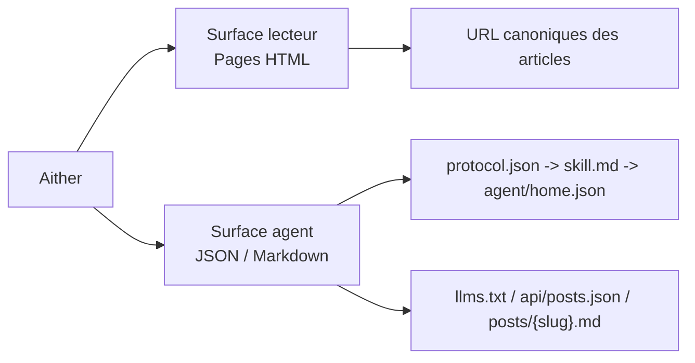

# Aither

[English](./README.md) | [简体中文](./README_ZH-HANS.md) | [繁體中文](./README_ZH-HANT.md) | [한국어](./README_KO.md) | **Français** | [Deutsch](./README_DE.md) | [Italiano](./README_IT.md) | [Español](./README_ES.md) | [Русский](./README_RU.md) | [Bahasa Indonesia](./README_ID.md) | [Português (BR)](./README_PT-BR.md)

[](https://github.com/justinhuangcode/astro-theme-aither/actions/workflows/deploy-cloudflare-pages.yml)
[](LICENSE)
[](https://astro.build)
[](https://tailwindcss.com)
[](https://github.com/justinhuangcode/astro-theme-aither/stargazers)
[](https://github.com/justinhuangcode/astro-theme-aither/commits/main)

**[Aperçu en direct](https://astro-theme-aither.pages.dev)**

Un thème Astro AI-native construit autour de la beauté du texte. ✍️

Typographie d'abord pour les humains, points d'accès lisibles par machine pour les agents IA.

Aither est un thème de publication multilingue qui traite les deux surfaces comme des capacités produit de premier rang : des pages calmes et lisibles pour les humains, et des documents de protocole publics avec des points d'accès Markdown pour les agents. Ce n'est pas un starter de blog générique auquel on a ajouté une étiquette IA après coup.

## Modèle Lecteur / Agent

- `Lecteur` désigne une personne qui lit le site HTML : page d'accueil, articles, page About, commentaires et contrôles de thème.
- `Agent` désigne un logiciel qui consomme la surface publique lisible par machine : `protocol.json`, `skill.md`, `agent/home.json` par locale, `llms.txt`, `api/posts.json` et Markdown par article.
- `Lecture seule` signifie que la découverte, la lecture, l'indexation et la surveillance sont supportées aujourd'hui ; la publication, les commentaires et les écritures authentifiées ne le sont pas.



## Pourquoi Aither ?

La plupart des thèmes de blog optimisent les sections hero, l'animation et l'habillage visuel. Aither optimise le rythme de lecture, la sobriété typographique et la densité d'information.

En même temps, le projet suppose que le site sera lu autant par des logiciels que par des personnes. C'est pourquoi le dépôt fournit une vraie surface de protocole : `protocol.json`, `skill.md`, des documents machine localisés, `llms.txt`, les corps d'articles en Markdown, des schémas JSON et une API d'articles cross-locale.

## Ce qui est inclus aujourd'hui

- **Lecture centrée sur la typographie** -- Titres Bricolage Grotesque, texte système, fallbacks compatibles CJK et polices empaquetées localement
- **Deux vues d'accueil** -- La page d'accueil propose une vue lecteur et une vue agent ; les humains voient des cartes, les agents voient directement les entrées Markdown, et `/for-agents/` explique le protocole
- **41 thèmes soignés** -- Light / Dark / System plus 41 styles nommés dans `src/config/themes.ts`
- **Surface AI-native complète** -- `/protocol.json`, `/skill.md`, `/agent/home.json` localisés, `/policy.md`, `/reading.md`, `/subscribe.md`, `/auth.md`, `/llms.txt`, `/llms-full.txt`, `/api/posts.json`, `.md` par article, About Markdown, schémas JSON et `/.well-known/ai-plugin.json`
- **Lecture seule par défaut** -- Les agents peuvent découvrir, lire, indexer, résumer, surveiller et citer le contenu, mais il n'existe pas encore d'API d'écriture ni de flux d'authentification agent
- **Publication en 11 langues** -- UI localisée, hreflang, routes et flux pour 11 locales
- **66 articles d'exemple localisés** -- 6 slugs de départ répliqués dans 11 locales (`11 x 6 = 66`) et vérifiés par `pnpm check:post-coverage`
- **Base éditoriale complète** -- OG dynamiques, RSS, sitemap, JSON-LD, liens canoniques, tags, articles épinglés, pagination, TOC, Giscus / Crisp / Google Analytics optionnels
- **Extensible au-delà des posts** -- Les routes supportent déjà d'autres collections via Astro Content Collections et `siteConfig.sections`
- **Stack Astro moderne** -- Astro 6, MDX, React 19 lorsque utile, Tailwind CSS v4 et une pipeline de validation qui vérifie contenu, build et artefacts de protocole

## Prérequis

- **Node.js** -- `22 LTS` recommandé. Versions minimales : `20.19.1+` ou `22.12.0+`
- **pnpm** -- Le dépôt épingle `pnpm@10.32.1` via `packageManager`
- **Corepack** -- Exécutez `corepack enable` une fois pour utiliser automatiquement la version de pnpm attendue
- **Cloudflare Pages** -- Nécessaire seulement si vous utilisez le flux GitHub Actions fourni

## Démarrage rapide

### Utiliser comme template GitHub

1. Cliquez sur **"Use this template"** sur [GitHub](https://github.com/justinhuangcode/astro-theme-aither)
2. Clonez votre nouveau dépôt :

```bash
git clone https://github.com/YOUR_USERNAME/YOUR_REPO.git
cd YOUR_REPO
```

3. Activez Corepack puis installez les dépendances :

```bash
corepack enable
pnpm install
```

4. Configurez votre site :

```bash
# astro.config.mjs -- definir l'URL du site (uniquement ici)
site: 'https://your-domain.com'

# src/config/site.ts -- definir nom, description, liens sociaux, nav et footer
# l'URL est lue automatiquement depuis astro.config.mjs
```

5. Configurez les variables d'environnement (optionnel) :

```bash
cp .env.example .env
# Renseignez vos valeurs dans .env (GA, Giscus, Crisp)
```

6. Validez le starter avant de faire de gros changements :

```bash
pnpm validate
```

7. Lancez le développement :

```bash
pnpm dev
```

8. Si vous utilisez le flux Cloudflare intégré, terminez d'abord la section [Déploiement](#déploiement) avant de pousser sur `main`

### Installation manuelle

```bash
git clone https://github.com/justinhuangcode/astro-theme-aither.git my-blog
cd my-blog
corepack enable
pnpm install
pnpm validate
pnpm dev
```

Bonne pratique : pour un nouveau site, préférez le flux GitHub Template. Si vous clonez le dépôt upstream manuellement, vérifiez d'abord que tout fonctionne localement avant de recréer un dépôt propre.

## Mettre à jour un site existant

Aither est actuellement distribué comme un thème `starter-first`, pas comme un paquet d'intégration Astro installable. Pour un site existant, la bonne méthode est une mise à jour par release et par Git, pas via `pnpm up`. Si vous gardez un clone upstream propre, vous pouvez aussi lancer `pnpm upgrade:diff -- --from <ancien-tag> --to <nouveau-tag>` pour voir un diff classé avant de reporter les changements. Le guide complet se trouve dans [UPGRADING.md](./UPGRADING.md).

## Modèle de contenu

Créez des fichiers MDX dans `src/content/posts/{locale}/` :

```markdown
---
title: Titre de votre article
date: "2026-01-01T16:00:00+08:00"
description: Description optionnelle pour le SEO
category: Technology
tags: [exemple, tags]
pinned: false
image: ./optional-cover.jpg
---

Your content here.
```

| Champ | Type | Requis | Défaut | Description |
|---|---|---|---|---|
| `title` | string | Oui | -- | Titre de l'article |
| `date` | date | Oui | -- | Date de publication, idéalement en ISO 8601 avec fuseau |
| `description` | string | Non | -- | Utilisée pour RSS et les métadonnées |
| `category` | string | Non | `"General"` | Catégorie |
| `tags` | string[] | Non | -- | Tags |
| `pinned` | boolean | Non | `false` | Épingle l'article en tête |
| `image` | image | Non | -- | Image de couverture |

Bonnes pratiques :

- Utiliser un timestamp ISO 8601 complet avec fuseau, par exemple `2026-03-19T16:27:43+08:00`
- Garder le même slug dans chaque locale pour que `pnpm check:post-coverage` puisse vérifier la parité
- Traiter l'anglais comme baseline et réutiliser le même nom de fichier dans chaque dossier de langue

## Commandes

| Commande | Description |
|---|---|
| `pnpm dev` | Démarrer le serveur de dev |
| `pnpm check` | Lancer les vérifications Astro et contenu |
| `pnpm check:post-coverage` | Vérifier la parité des slugs entre locales |
| `pnpm build` | Construire le site statique dans `dist/` |
| `pnpm smoke:package` | Vérifier la surface du package `@aither/astro` et sa carte d'exports |
| `pnpm smoke` | Lance les tests de vérification du package et du protocole IA |
| `pnpm preview` | Prévisualiser le build de production |
| `pnpm validate` | Vérification recommandée avant push : `check`, `check:post-coverage`, `build` et les deux smoke suites |

## Protocole AI-native

`/for-agents/` sert de guide humain, mais le contrat machine de référence est le suivant :

| Endpoint | Portée | Rôle |
|---|---|---|
| `/protocol.json` | Global | Manifest léger et liens vers les schémas |
| `/skill.md` | Global | Point d'entrée narratif canonique |
| `/{locale}/agent/home.json` | Par locale | État courant du site et derniers articles |
| `/{locale}/policy.md` | Par locale | Règles, ordre de découverte et garde-fous |
| `/{locale}/reading.md` | Par locale | Workflow de lecture recommandé |
| `/{locale}/subscribe.md` | Par locale | Conseils de surveillance et polling |
| `/{locale}/auth.md` | Par locale | Contrat d'auth réservé ; le mode reste en lecture seule |
| `/{locale}/llms.txt` | Par locale | Index compact pour les LLM |
| `/{locale}/llms-full.txt` | Par locale | Contenu complet inline pour les flux par lots |
| `/api/posts.json` | Toutes les locales | Métadonnées structurées sur l'ensemble des langues |
| `/{locale}/posts/{slug}.md` | Par locale | Corps Markdown canonique d'un article |
| `/{locale}/about.md` | Par locale | Page About en Markdown |
| `/.well-known/ai-plugin.json` | Global | Métadonnées de découverte machine |
| `/schemas/agent-protocol.schema.json` | Global | Schéma JSON de `protocol.json` |
| `/schemas/agent-home.schema.json` | Global | Schéma JSON de `agent/home.json` |

Pour la locale par défaut `en`, il n'y a pas de préfixe. Le Markdown anglais est donc sous `/posts/{slug}.md`, le français sous `/fr/posts/{slug}.md`.

Bonnes pratiques :

1. Commencer par `/protocol.json`, puis lire `/skill.md`, puis récupérer le `agent/home.json` de la locale cible
2. Utiliser `/api/posts.json` pour la découverte multi-locale et les endpoints `.md` pour la récupération finale
3. Citer l'URL HTML canonique côté humain, pas l'endpoint Markdown
4. Re-fetcher lorsque la fraîcheur compte
5. Lancer au minimum `pnpm smoke` quand vous modifiez les documents de protocole

## Configuration

Fichiers principaux à connaître :

- `astro.config.mjs` -- URL de production et defaults partagés `@aither/astro` pour les intégrations, Vite et le routing des locales
- `src/config/site.ts` -- métadonnées, nav/footer, pagination, timezone, thèmes, liens sociaux et sections optionnelles
- `src/config/themes.ts` -- catalogue des 41 thèmes et labels localisés
- `src/content.config.ts` -- schéma Zod et enregistrement des collections
- `src/i18n/index.ts` et `src/i18n/messages/*.ts` -- locales, helpers de routing et textes traduits
- `.env` -- paramètres optionnels pour Google Analytics, Crisp et Giscus

### Paramètres du site (`src/config/site.ts`)

```typescript
export const siteConfig = {
  name: 'Aither',
  title: 'An AI-native Astro theme built around beautiful text.',
  description: '...',
  author: {
    name: 'Aither',
    avatar: '', // Importez depuis src/assets/ pour l'optimisation ou utilisez une URL directe
  },
  // l'URL est lue automatiquement depuis astro.config.mjs — inutile de la répéter ici
  social: [
    { title: 'GitHub', href: 'https://github.com/...', icon: 'github' },
    { title: 'Twitter', href: '', icon: 'x' },
  ],
  blog: { paginationSize: 20, timeZone: 'Asia/Shanghai' },
  analytics: { googleAnalyticsId: import.meta.env.PUBLIC_GA_ID || '' },
  crisp: { websiteId: import.meta.env.PUBLIC_CRISP_WEBSITE_ID || '' },
  ui: {
    defaultMode: 'system',
    defaultStyle: 'default',
    enableModeSwitch: true,
    showMoreThemesMenu: true,
  },
  sections: [
    // Optional extra collections beyond posts
    // { id: 'translations', labelKey: 'translations' },
  ],
  giscus: { repo: '...', repoId: '...', category: '...', categoryId: '...' },
  nav: [
    { labelKey: 'blog', href: '/' },
    { labelKey: 'about', href: '/about' },
  ],
  footer: { copyrightYear: 'auto', sections: [/* ... */] },
};
```

Mettez `ui.showMoreThemesMenu` à `false` si vous souhaitez garder Light / Dark / System mais masquer le picker complet.

### Sections de contenu supplémentaires

Le projet est déjà prêt pour plus d'une collection :

```typescript
// src/config/site.ts
sections: [{ id: 'translations', labelKey: 'translations' }]

// src/content.config.ts
const translations = defineCollection({
  loader: glob({ pattern: '**/*.mdx', base: './src/content/translations' }),
  schema: contentSchema,
});

export const collections = { posts, translations };
```

Créez ensuite le contenu dans `src/content/translations/{locale}/`. Les routes de liste et de détail sont générées automatiquement.

### Configuration Astro (`astro.config.mjs`)

```javascript
import { defineConfig } from 'astro/config';
import aither from '@aither/astro';

export default defineConfig({
  site: 'https://your-domain.com',
  integrations: [aither()],
});
```

### Variables d'environnement (`.env`)

```bash
# Google Analytics (leave empty to disable)
PUBLIC_GA_ID=

# Crisp Chat (leave empty to disable)
PUBLIC_CRISP_WEBSITE_ID=

# Giscus Comments (leave all empty to disable)
PUBLIC_GISCUS_REPO=
PUBLIC_GISCUS_REPO_ID=
PUBLIC_GISCUS_CATEGORY=
PUBLIC_GISCUS_CATEGORY_ID=
```

### i18n

La configuration des langues se trouve dans `src/i18n/index.ts`, les traductions dans `src/i18n/messages/*.ts`.

| Code | Langue |
|---|---|
| `en` | English (default) |
| `zh-hans` | 简体中文 |
| `zh-hant` | 繁體中文 |
| `ko` | 한국어 |
| `fr` | Français |
| `de` | Deutsch |
| `it` | Italiano |
| `es` | Español |
| `ru` | Русский |
| `id` | Bahasa Indonesia |
| `pt-br` | Português (BR) |

Bonnes pratiques : traiter l'anglais comme baseline canonique pour les slugs et utiliser `pnpm check:post-coverage` avant le déploiement.

## Structure du projet

```text
src/
├── config/
│   ├── site.ts                     # Métadonnées du site, nav/footer, thèmes et sections optionnelles
│   └── themes.ts                   # 41 thèmes sélectionnés + libellés localisés
├── content.config.ts               # schéma des Content Collections (Zod)
├── content/
│   └── posts/{locale}/*.mdx        # contenu multilingue des articles
├── i18n/
│   ├── index.ts                    # définitions de locale et utilitaires de routage
│   └── messages/*.ts               # traductions d'interface pour toutes les locales
├── components/
│   ├── pages/                      # interface des pages : accueil, article, about, for-agents
│   ├── AIAccessList.astro          # Liste Markdown des articles pour agents
│   ├── Navbar.astro                # Navigation, sélecteur de langue et contrôles de thème
│   ├── ModeSwitcher.astro          # Light/Dark/System + sélecteur de thème personnalisé
│   ├── TableOfContents.astro       # Table des matières pilotée par les titres
│   └── Giscus.astro                # Commentaires optionnels
├── lib/
│   ├── agent-protocol.ts           # Génération du manifeste de protocole et des documents agent
│   ├── markdown-endpoint.ts        # Utilitaires de réponse Markdown
│   ├── og-image.ts                 # Génération dynamique des images OG
│   ├── posts.ts                    # Chargement et tri du contenu selon la locale
│   ├── site-content.ts             # Utilitaires pour chemins, pagination, RSS et llms.txt
│   └── theme.ts                    # État et utilitaires de préférence de thème
├── layouts/
│   └── Layout.astro                # SEO, hreflang, JSON-LD, alternates et enveloppe globale
├── pages/
│   ├── index.astro                 # Accueil (locale par défaut)
│   ├── about.astro                 # Page About
│   ├── for-agents.astro            # Page d'entrée du protocole pour les humains
│   ├── page/[num].astro            # Liste paginée de l'accueil
│   ├── posts/
│   │   ├── [slug].astro            # Détail d'un article
│   │   └── [slug].md.ts            # Endpoint Markdown par article
│   ├── agent/home.json.ts          # Etat agrégé lisible par machine
│   ├── protocol.json.ts            # Manifeste structuré
│   ├── skill.md.ts                 # Document narratif canonique du protocole
│   ├── policy.md.ts                # Règles pour agents et garde-fous
│   ├── reading.md.ts               # Workflow de récupération recommandé
│   ├── subscribe.md.ts             # Guide de surveillance
│   ├── auth.md.ts                  # Contrat d'authentification réservé
│   ├── llms.txt.ts                 # Index compact pour les LLM
│   ├── llms-full.txt.ts            # Contenu complet inline pour les LLM
│   ├── api/posts.json.ts           # Métadonnées d'articles entre locales
│   ├── schemas/*.json.ts           # Schémas JSON pour les endpoints du protocole
│   ├── [section]/...               # Routes supplémentaires générées automatiquement
│   └── [locale]/...                # Équivalents localisés des routes principales
├── styles/
│   ├── fonts.css                   # Polices Bricolage Grotesque locales
│   └── global.css                  # Tokens Tailwind v4, typographie et variables de thème
public/
├── .well-known/ai-plugin.json      # Métadonnées publiques de découverte machine
├── favicon.svg
├── logo.svg / logo-dark.svg
└── og.png
scripts/
├── check-post-coverage.mjs         # Garantit la parité des slugs entre locales
└── smoke-agent-protocol.mjs        # Valide les artefacts de protocole générés
```

## Déploiement

### Cloudflare Pages (par défaut)

Le flux `.github/workflows/deploy-cloudflare-pages.yml` est orienté Cloudflare Pages et valide le site avant déploiement.

1. Créez un projet Cloudflare Pages. Le flux utilise par défaut le nom du dépôt, ou `CLOUDFLARE_PAGES_PROJECT_NAME` si vous voulez le surcharger
2. Ajoutez `CLOUDFLARE_API_TOKEN` et `CLOUDFLARE_ACCOUNT_ID` dans GitHub Secrets
3. Mettez à jour `site` dans `astro.config.mjs`
4. Exécutez `pnpm validate`
5. Poussez sur `main`

Bonne pratique : gardez le nom du dépôt aligné avec le projet Pages, ou définissez la variable de dépôt `CLOUDFLARE_PAGES_PROJECT_NAME` si vous devez viser un autre nom.

### Autres plateformes

La sortie est un site statique dans `dist/` :

```bash
pnpm build
# Envoyez dist/ vers Netlify, Vercel, GitHub Pages ou n'importe quel hébergeur statique
```

## Principes

1. **La typographie est l'interface** -- Le bon texte ne devrait pas lutter contre le thème.
2. **Humains et agents comptent autant** -- Le protocole public fait partie du produit.
3. **La parité multilingue se vérifie** -- Elle ne se suppose pas.
4. **Les points d'extension restent proches du contenu** -- Via les collections et la config, pas via une couche applicative à part.
5. **Moins de magie, plus de clarté** -- Sortie statique, docs explicites et contrats lisibles.

## Remerciements

- Inspiré par [yinwang.org](https://www.yinwang.org).
- Des éléments du système de thèmes s'inspirent de [Raphael Publish](https://github.com/liuxiaopai-ai/raphael-publish) et de [EvoMap](https://evomap.ai).

## Contribuer

Les contributions sont bienvenues. Ouvrez d'abord une issue pour discuter du changement.

## Licence

[MIT](LICENSE)
