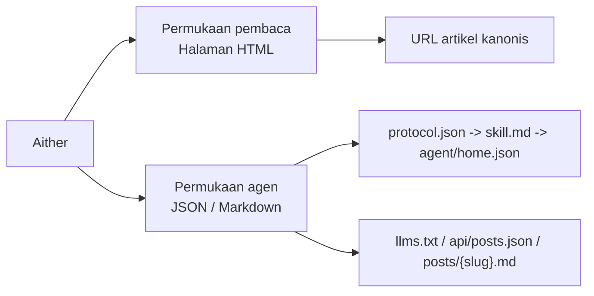

# Aither

[English](./README.md) | [简体中文](./README_ZH-CN.md) | [繁體中文](./README_ZH-TW.md) | [한국어](./README_KO.md) | [Français](./README_FR.md) | [Deutsch](./README_DE.md) | [Italiano](./README_IT.md) | [Español](./README_ES.md) | [Русский](./README_RU.md) | **Bahasa Indonesia** | [Português (BR)](./README_PT-BR.md)

[](https://github.com/justinhuangai/astro-theme-aither/actions/workflows/deploy-cloudflare-pages.yml)
[](LICENSE)
[](https://astro.build)
[](https://tailwindcss.com)
[](https://github.com/justinhuangai/astro-theme-aither/stargazers)
[](https://github.com/justinhuangai/astro-theme-aither/commits/main)

**[Pratinjau Langsung](https://astro-theme-aither.pages.dev)**

Tema Astro yang dirancang untuk AI dan dibangun di sekitar teks yang indah. ✍️

Tipografi untuk manusia, endpoint yang dapat dibaca mesin untuk agen AI.

Aither adalah tema penerbitan multibahasa yang memperlakukan permukaan manusia dan agen sebagai bagian inti dari produk.

## Model Pembaca / Agen

- `Pembaca` berarti manusia yang membaca situs HTML: halaman beranda, halaman artikel, halaman Tentang, komentar, dan kontrol tema.
- `Agen` berarti perangkat lunak yang mengonsumsi permukaan publik yang dapat dibaca mesin: `protocol.json`, `skill.md`, `agent/home.json` per locale, `llms.txt`, `api/posts.json`, dan Markdown per artikel.
- `Baca-saja` berarti penemuan, pengambilan, pengindeksan, dan pemantauan didukung saat ini; publikasi, komentar, dan penulisan yang diautentikasi belum tersedia.



## Mengapa Aither?

Sebagian besar tema blog mengoptimalkan bagian hero, animasi, dan ornamen antarmuka. Aither mengoptimalkan ritme membaca, disiplin tipografi, dan kepadatan informasi.

Di saat yang sama, proyek ini mengasumsikan situs akan dibaca oleh software juga. Karena itu repositori ini menyertakan permukaan protokol yang nyata: `protocol.json`, `skill.md`, dokumen mesin terlokalisasi, `llms.txt`, artikel Markdown, JSON Schema, dan API post multi-locale.

## Yang Sudah Tersedia Hari Ini

- pengalaman membaca berbasis tipografi
- dua tampilan beranda: pembaca dan agen
- 41 tema terkurasi
- permukaan protokol AI yang lengkap
- mode baca-saja secara default
- 11 bahasa
- 66 artikel contoh terlokalisasi
- RSS / sitemap / OG / JSON-LD / TOC / pagination
- extensible lewat Content Collections
- stack Astro modern

## Persyaratan

- **Node.js** -- `22 LTS` direkomendasikan
- **pnpm** -- `pnpm@10.32.1`
- **Corepack** -- jalankan `corepack enable`
- **Cloudflare Pages** -- hanya jika memakai alur deploy bawaan

## Mulai Cepat

```bash
git clone https://github.com/YOUR_USERNAME/YOUR_REPO.git
cd YOUR_REPO
corepack enable
pnpm install
pnpm validate
pnpm dev
```

## Model Konten

Konten artikel berada di `src/content/posts/{locale}/` dan menggunakan MDX.

## Perintah

| Perintah | Deskripsi |
|---|---|
| `pnpm dev` | Menjalankan server pengembangan |
| `pnpm check` | Menjalankan pemeriksaan Astro |
| `pnpm check:post-coverage` | Memeriksa kesesuaian slug lintas locale |
| `pnpm build` | Build ke `dist/` |
| `pnpm smoke:package` | Memeriksa permukaan paket `@aither/astro` dan peta export |
| `pnpm smoke` | Menjalankan pengujian cepat untuk paket dan protokol |
| `pnpm preview` | Meninjau build produksi secara lokal |
| `pnpm validate` | Rangkaian validasi penuh: check + coverage + build + dua pengujian cepat |

## Memperbarui situs yang sudah ada

Aither saat ini didistribusikan sebagai tema `starter-first`, bukan paket integrasi Astro yang bisa langsung di-upgrade dengan `pnpm up`. Untuk situs yang sudah dibuat, gunakan upgrade berbasis release dan Git. Jika Anda menyimpan clone upstream yang bersih, Anda juga bisa menjalankan `pnpm upgrade:diff -- --from <tag-lama> --to <tag-baru>` untuk melihat diff yang sudah dikelompokkan sebelum memindahkan perubahan. Panduan lengkap ada di [UPGRADING.md](./UPGRADING.md).

## Protokol untuk AI

Urutan yang direkomendasikan: `/protocol.json` -> `/skill.md` -> `agent/home.json` untuk locale yang dituju.

Gunakan `/api/posts.json` untuk penemuan lintas locale dan `/{locale}/posts/{slug}.md` untuk isi final artikel.

## Konfigurasi

File utama: `astro.config.mjs`, `src/config/site.ts`, `src/config/themes.ts`, `src/content.config.ts`, `src/i18n/index.ts`, `src/i18n/messages/*.ts`, `.env`.

### Konfigurasi Astro (`astro.config.mjs`)

```javascript
import { defineConfig } from 'astro/config';
import aither from '@aither/astro';

export default defineConfig({
  site: 'https://your-domain.com',
  integrations: [aither()],
});
```

## Struktur Proyek

```text
src/
├── config/
├── content/
├── i18n/
├── components/
├── lib/
├── layouts/
├── pages/
└── styles/
public/
scripts/
```

## Deployment

Workflow default memakai Cloudflare Pages, membutuhkan `CLOUDFLARE_API_TOKEN` dan `CLOUDFLARE_ACCOUNT_ID`, serta memakai nama repositori sebagai nama proyek secara default. Gunakan variabel repositori `CLOUDFLARE_PAGES_PROJECT_NAME` jika Anda perlu menimpanya.

## Prinsip

1. Tipografi adalah antarmuka.
2. Manusia dan agent sama pentingnya.
3. Paritas multibahasa harus diverifikasi.
4. Titik ekstensi harus dekat dengan konten.
5. Lebih sedikit magic, lebih banyak kontrak yang eksplisit.

## Penghargaan

- Terinspirasi oleh [yinwang.org](https://www.yinwang.org).
- Sebagian sistem tema terinspirasi oleh [Raphael Publish](https://github.com/liuxiaopai-ai/raphael-publish) dan [EvoMap](https://evomap.ai).

## Berkontribusi

Kontribusi diterima. Buka issue terlebih dahulu untuk mendiskusikan perubahan.

## Lisensi

[MIT](LICENSE)
