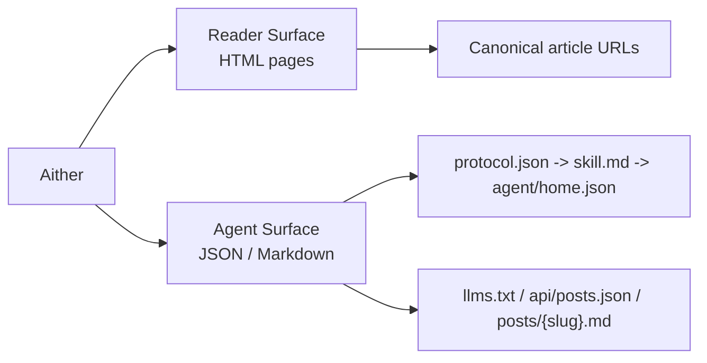

# Aither

[English](./README.md) | [简体中文](./README_ZH-HANS.md) | [繁體中文](./README_ZH-HANT.md) | [한국어](./README_KO.md) | [Français](./README_FR.md) | [Deutsch](./README_DE.md) | [Italiano](./README_IT.md) | [Español](./README_ES.md) | [Русский](./README_RU.md) | **Bahasa Indonesia** | [Português (BR)](./README_PT-BR.md)

[](https://github.com/justinhuangcode/astro-theme-aither/actions/workflows/deploy-cloudflare-pages.yml)
[](LICENSE)
[](https://astro.build)
[](https://tailwindcss.com)
[](https://github.com/justinhuangcode/astro-theme-aither/stargazers)
[](https://github.com/justinhuangcode/astro-theme-aither/commits/main)

**[Live Preview](https://astro-theme-aither.pages.dev)**

Tema Astro AI-native yang dibangun di sekitar teks yang indah. ✍️

Tipografi untuk manusia, endpoint machine-readable untuk agent AI.

Aither adalah tema publishing multibahasa yang memperlakukan permukaan manusia dan agent sebagai bagian inti dari produk.

## Model Pembaca / Agen

- `Reader` berarti manusia yang membaca situs HTML: halaman beranda, halaman artikel, halaman About, komentar, dan kontrol tema.
- `Agent` berarti software yang mengonsumsi permukaan publik machine-readable: `protocol.json`, `skill.md`, `agent/home.json` per locale, `llms.txt`, `api/posts.json`, dan Markdown per artikel.
- `Read-only` berarti discovery, pengambilan, indexing, dan monitoring didukung saat ini; publish, komentar, dan write yang diautentikasi belum tersedia.



## Mengapa Aither?

Sebagian besar tema blog mengoptimalkan hero, animasi, dan UI chrome. Aither mengoptimalkan ritme membaca, disiplin tipografi, dan kepadatan informasi.

Di saat yang sama, proyek ini mengasumsikan situs akan dibaca oleh software juga. Karena itu repositori ini menyertakan surface protokol yang nyata: `protocol.json`, `skill.md`, machine docs terlokalisasi, `llms.txt`, artikel Markdown, JSON Schema, dan API post multi-locale.

## Yang Sudah Tersedia Hari Ini

- pengalaman membaca berbasis tipografi
- dua tampilan beranda: reader dan agent
- 41 tema terkurasi
- surface AI-native lengkap
- mode read-only secara default
- 11 bahasa
- 66 sample post terlokalisasi
- RSS / sitemap / OG / JSON-LD / TOC / pagination
- extensible lewat Content Collections
- stack Astro modern

## Persyaratan

- **Node.js** -- `22 LTS` direkomendasikan
- **pnpm** -- `pnpm@10.32.1`
- **Corepack** -- jalankan `corepack enable`
- **Cloudflare Pages** -- hanya jika memakai workflow deploy bawaan

## Mulai Cepat

```bash
git clone https://github.com/YOUR_USERNAME/YOUR_REPO.git
cd YOUR_REPO
corepack enable
pnpm install
pnpm validate
pnpm dev
```

## Model Konten

Konten artikel berada di `src/content/posts/{locale}/` dan menggunakan MDX.

## Perintah

| Perintah | Deskripsi |
|---|---|
| `pnpm dev` | Menjalankan dev server |
| `pnpm check` | Menjalankan pemeriksaan Astro |
| `pnpm check:post-coverage` | Memeriksa parity slug lintas locale |
| `pnpm build` | Build ke `dist/` |
| `pnpm smoke` | Smoke test protocol |
| `pnpm preview` | Preview build produksi |
| `pnpm validate` | Rangkaian validasi penuh |

## Protokol AI-native

Urutan yang direkomendasikan: `/protocol.json` -> `/skill.md` -> locale-specific `agent/home.json`.

Gunakan `/api/posts.json` untuk discovery lintas locale dan `/{locale}/posts/{slug}.md` untuk body final artikel.

## Konfigurasi

File utama: `astro.config.mjs`, `src/config/site.ts`, `src/config/themes.ts`, `src/content.config.ts`, `src/i18n/index.ts`, `src/i18n/messages/*.ts`, `.env`.

## Struktur Proyek

```text
src/
├── config/
├── content/
├── i18n/
├── components/
├── lib/
├── layouts/
├── pages/
└── styles/
public/
scripts/
```

## Deployment

Workflow default memakai Cloudflare Pages dan membutuhkan `CLOUDFLARE_API_TOKEN` serta `CLOUDFLARE_ACCOUNT_ID`.

## Prinsip

1. Tipografi adalah antarmuka.
2. Manusia dan agent sama pentingnya.
3. Paritas multibahasa harus diverifikasi.
4. Titik ekstensi harus dekat dengan konten.
5. Lebih sedikit magic, lebih banyak kontrak yang eksplisit.

## Penghargaan

- Terinspirasi oleh [yinwang.org](https://www.yinwang.org).
- Sebagian sistem tema terinspirasi oleh [Raphael Publish](https://github.com/liuxiaopai-ai/raphael-publish).

## Berkontribusi

Kontribusi diterima. Buka issue terlebih dahulu untuk mendiskusikan perubahan.

## Lisensi

[MIT](LICENSE)
