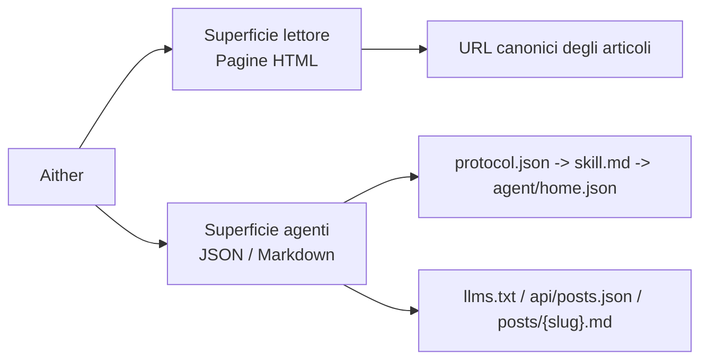

# Aither

[English](./README.md) | [简体中文](./README_ZH-HANS.md) | [繁體中文](./README_ZH-HANT.md) | [한국어](./README_KO.md) | [Français](./README_FR.md) | [Deutsch](./README_DE.md) | **Italiano** | [Español](./README_ES.md) | [Русский](./README_RU.md) | [Bahasa Indonesia](./README_ID.md) | [Português (BR)](./README_PT-BR.md)

[](https://github.com/justinhuangai/astro-theme-aither/actions/workflows/deploy-cloudflare-pages.yml)
[](LICENSE)
[](https://astro.build)
[](https://tailwindcss.com)
[](https://github.com/justinhuangai/astro-theme-aither/stargazers)
[](https://github.com/justinhuangai/astro-theme-aither/commits/main)

**[Anteprima live](https://astro-theme-aither.pages.dev)**

Un tema Astro AI-native costruito attorno a un testo bello da leggere. ✍️

Tipografia al centro per i lettori umani, endpoint leggibili dalle macchine per gli agenti AI.

Aither è un tema di publishing multilingue che tratta entrambe le superfici come capacità di prodotto di primo livello: pagine sobrie e leggibili per le persone, documenti di protocollo pubblici ed endpoint Markdown per gli agenti. Non è un semplice starter blog a cui è stata aggiunta l'etichetta AI in un secondo momento.

## Modello Lettore / Agente

- `Lettore` indica una persona che legge il sito HTML: home, pagine articolo, pagina About, commenti e controlli del tema.
- `Agente` indica software che consuma la superficie pubblica leggibile dalle macchine: `protocol.json`, `skill.md`, `agent/home.json` per locale, `llms.txt`, `api/posts.json` e Markdown per articolo.
- `Sola lettura` significa che oggi sono supportati discovery, lettura, indicizzazione e monitoraggio; pubblicazione, commenti e scritture autenticate non sono esposti.



## Perché Aither?

La maggior parte dei temi blog ottimizza sezioni hero, animazioni e ornamenti dell'interfaccia. Aither ottimizza ritmo di lettura, sobrietà tipografica e densità informativa.

Allo stesso tempo, il progetto assume che il sito sarà letto tanto dal software quanto dagli esseri umani. Per questo il repository include una vera superficie di protocollo: `protocol.json`, `skill.md`, documenti leggibili dalle macchine localizzati, `llms.txt`, corpi articolo in Markdown, JSON Schema e un'API dei post tra le varie lingue.

## Cosa include oggi

- **Esperienza di lettura tipografica** -- titoli Bricolage Grotesque, corpo testo di sistema, fallback CJK e font distribuiti localmente
- **Doppia vista in homepage** -- vista lettore e vista agente; gli umani vedono card, gli agenti vedono accesso diretto ai Markdown e `/for-agents/` spiega il protocollo
- **41 temi curati** -- Light / Dark / System più 41 stili nominati in `src/config/themes.ts`
- **Superficie AI-native completa** -- `/protocol.json`, `/skill.md`, `/agent/home.json` localizzati, `/policy.md`, `/reading.md`, `/subscribe.md`, `/auth.md`, `/llms.txt`, `/llms-full.txt`, `/api/posts.json`, `.md` per articolo, About Markdown, JSON Schema e `/.well-known/ai-plugin.json`
- **Sola lettura per scelta** -- gli agenti possono scoprire, leggere, indicizzare, riassumere, monitorare e citare il contenuto, ma non esistono ancora API di scrittura né flussi autenticati
- **11 lingue** -- UI localizzata, hreflang, route e feed in 11 locali
- **66 sample post localizzati** -- 6 slug iniziali replicati in 11 locali (`11 x 6 = 66`) e verificati da `pnpm check:post-coverage`
- **Base editoriale completa** -- OG dinamiche, RSS, sitemap, JSON-LD, URL canonici, tag, post fissati, paginazione, TOC e Giscus / Crisp / Google Analytics opzionali
- **Estendibile oltre i post** -- il routing supporta già altre collection tramite Astro Content Collections e `siteConfig.sections`
- **Stack Astro moderno** -- Astro 6, MDX, React 19 dove utile, Tailwind CSS v4 e una pipeline di validazione per contenuto, build e protocollo

## Requisiti

- **Node.js** -- `22 LTS` consigliato. Versioni minime: `20.19.1+` o `22.12.0+`
- **pnpm** -- il repository fissa `pnpm@10.32.1` tramite `packageManager`
- **Corepack** -- esegui `corepack enable` una volta per usare automaticamente la versione prevista di pnpm
- **Cloudflare Pages** -- serve solo se vuoi usare il flusso GitHub Actions incluso

## Avvio rapido

### Usa come template GitHub

1. Clicca **"Use this template"** su [GitHub](https://github.com/justinhuangai/astro-theme-aither)
2. Clona il tuo nuovo repository:

```bash
git clone https://github.com/YOUR_USERNAME/YOUR_REPO.git
cd YOUR_REPO
```

3. Attiva Corepack e installa le dipendenze:

```bash
corepack enable
pnpm install
```

4. Configura il sito:

```bash
# astro.config.mjs -- imposta l'URL del sito (solo qui)
site: 'https://your-domain.com'

# src/config/site.ts -- imposta nome, descrizione, link social, nav e footer
# l'URL viene letta automaticamente da astro.config.mjs
```

5. Configura le variabili d'ambiente (opzionale):

```bash
cp .env.example .env
# Inserisci i tuoi valori in .env (GA, Giscus, Crisp)
```

6. Valida lo starter prima di modifiche grandi:

```bash
pnpm validate
```

7. Avvia lo sviluppo:

```bash
pnpm dev
```

8. Se userai il flusso Cloudflare integrato, completa prima la sezione [Distribuzione](#distribuzione)

### Setup manuale

```bash
git clone https://github.com/justinhuangai/astro-theme-aither.git my-blog
cd my-blog
corepack enable
pnpm install
pnpm validate
pnpm dev
```

Buona pratica: per un nuovo sito, preferisci il flusso GitHub Template. Se cloni upstream manualmente, verifica prima che tutto funzioni in locale.

## Aggiornare siti esistenti

Aither oggi viene distribuito come tema `starter-first`, non come pacchetto di integrazione Astro installabile. Per i siti già creati, l'aggiornamento corretto passa dalle release e da Git, non da `pnpm up`. Se mantieni un clone upstream pulito, puoi anche eseguire `pnpm upgrade:diff -- --from <vecchio-tag> --to <nuovo-tag>` per vedere un diff classificato prima di portare le modifiche. La guida completa è in [UPGRADING.md](./UPGRADING.md).

## Modello dei contenuti

Crea file MDX in `src/content/posts/{locale}/`:

```markdown
---
title: Titolo del tuo post
date: "2026-01-01T16:00:00+08:00"
description: Descrizione opzionale per SEO
category: Technology
tags: [esempio, tags]
pinned: false
image: ./optional-cover.jpg
---

Your content here.
```

| Campo | Tipo | Obbligatorio | Default | Descrizione |
|---|---|---|---|---|
| `title` | string | Sì | -- | Titolo del post |
| `date` | date | Sì | -- | Data di pubblicazione, meglio ISO 8601 con timezone |
| `description` | string | No | -- | Per RSS e meta tag |
| `category` | string | No | `"General"` | Categoria |
| `tags` | string[] | No | -- | Tag |
| `pinned` | boolean | No | `false` | Fissa il post in alto |
| `image` | image | No | -- | Immagine di copertina |

Buone pratiche:

- Usa timestamp ISO 8601 completi con timezone, ad esempio `2026-03-19T16:27:43+08:00`
- Mantieni lo stesso slug in ogni locale per permettere a `pnpm check:post-coverage` di verificare la parità
- Tratta l'inglese come baseline e riusa lo stesso nome file in ogni lingua

## Comandi

| Comando | Descrizione |
|---|---|
| `pnpm dev` | Avvia il server di sviluppo |
| `pnpm check` | Esegue i controlli Astro e contenuto |
| `pnpm check:post-coverage` | Verifica la parità degli slug tra locali |
| `pnpm build` | Genera il sito statico in `dist/` |
| `pnpm smoke:package` | Verifica la superficie del pacchetto `@aither/astro` e la mappa degli export |
| `pnpm smoke` | Esegue i test di verifica del pacchetto e del protocollo AI |
| `pnpm preview` | Anteprima del build di produzione |
| `pnpm validate` | Check consigliato prima del push: `check`, `check:post-coverage`, `build` e entrambe le suite smoke |

## Protocollo AI-native

`/for-agents/` è la guida per gli umani, ma il contratto leggibile dalle macchine reale è il seguente:

| Endpoint | Ambito | Scopo |
|---|---|---|
| `/protocol.json` | Globale | Manifest leggero e link agli schema |
| `/skill.md` | Globale | Punto d'ingresso narrativo canonico |
| `/{locale}/agent/home.json` | Per locale | Stato corrente del sito e ultimi post |
| `/{locale}/policy.md` | Per locale | Regole, ordine di discovery e limiti |
| `/{locale}/reading.md` | Per locale | Flusso di lettura consigliato |
| `/{locale}/subscribe.md` | Per locale | Guida a polling e monitoraggio |
| `/{locale}/auth.md` | Per locale | Contratto auth riservato; il sito resta in sola lettura |
| `/{locale}/llms.txt` | Per locale | Indice compatto per LLM |
| `/{locale}/llms-full.txt` | Per locale | Contenuto inline completo per flussi in blocco |
| `/api/posts.json` | Tutte le locali | Metadati strutturati in tutte le lingue |
| `/{locale}/posts/{slug}.md` | Per locale | Corpo Markdown canonico di un articolo |
| `/{locale}/about.md` | Per locale | Pagina About in Markdown |
| `/.well-known/ai-plugin.json` | Globale | Metadati leggeri di discovery |
| `/schemas/agent-protocol.schema.json` | Globale | JSON Schema di `protocol.json` |
| `/schemas/agent-home.schema.json` | Globale | JSON Schema di `agent/home.json` |

La locale predefinita `en` non ha prefisso. Il Markdown inglese vive quindi in `/posts/{slug}.md`, quello italiano in `/it/posts/{slug}.md`.

Buone pratiche:

1. Parti da `/protocol.json`, poi leggi `/skill.md`, poi recupera `agent/home.json`
2. Usa `/api/posts.json` per discovery multi-locale e gli endpoint `.md` per il recupero finale
3. Cita l'URL HTML canonico quando rimandi a utenti umani
4. Refetcha gli endpoint se la freschezza conta
5. Esegui almeno `pnpm smoke` quando modifichi il protocollo

## Configurazione

File principali:

- `astro.config.mjs` -- URL di produzione e default condivisi `@aither/astro` per integrazioni, Vite e routing delle locali
- `src/config/site.ts` -- metadati del sito, nav/footer, paginazione, timezone, controlli del tema, link social e sections opzionali
- `src/config/themes.ts` -- catalogo dei 41 temi e label localizzate
- `src/content.config.ts` -- schema Zod e registrazione delle collection
- `src/i18n/index.ts` e `src/i18n/messages/*.ts` -- locali, helper di routing e testi tradotti
- `.env` -- Google Analytics, Crisp e Giscus opzionali

### Impostazioni del sito (`src/config/site.ts`)

```typescript
export const siteConfig = {
  name: 'Aither',
  title: 'An AI-native Astro theme built around beautiful text.',
  description: '...',
  author: {
    name: 'Aither',
    avatar: '', // Importa da src/assets/ per l'ottimizzazione oppure usa una URL diretta
  },
  // l'URL viene letta automaticamente da astro.config.mjs — non serve ripeterla qui
  social: [
    { title: 'GitHub', href: 'https://github.com/...', icon: 'github' },
    { title: 'Twitter', href: '', icon: 'x' },
  ],
  blog: { paginationSize: 20, timeZone: 'Asia/Shanghai' },
  analytics: { googleAnalyticsId: import.meta.env.PUBLIC_GA_ID || '' },
  crisp: { websiteId: import.meta.env.PUBLIC_CRISP_WEBSITE_ID || '' },
  ui: {
    defaultMode: 'system',
    defaultStyle: 'default',
    enableModeSwitch: true,
    showMoreThemesMenu: true,
  },
  sections: [
    // Optional extra collections beyond posts
    // { id: 'translations', labelKey: 'translations' },
  ],
  giscus: { repo: '...', repoId: '...', category: '...', categoryId: '...' },
  nav: [
    { labelKey: 'blog', href: '/' },
    { labelKey: 'about', href: '/about' },
  ],
  footer: { copyrightYear: 'auto', sections: [/* ... */] },
};
```

Imposta `ui.showMoreThemesMenu` su `false` se vuoi mantenere Light / Dark / System ma nascondere il picker completo.

### Sezioni di contenuto aggiuntive

Il progetto è già pronto per più di una collection:

```typescript
// src/config/site.ts
sections: [{ id: 'translations', labelKey: 'translations' }]

// src/content.config.ts
const translations = defineCollection({
  loader: glob({ pattern: '**/*.mdx', base: './src/content/translations' }),
  schema: contentSchema,
});

export const collections = { posts, translations };
```

Poi crea il contenuto in `src/content/translations/{locale}/`. Le route vengono generate automaticamente.

### Configurazione Astro (`astro.config.mjs`)

```javascript
import { defineConfig } from 'astro/config';
import aither from '@aither/astro';

export default defineConfig({
  site: 'https://your-domain.com',
  integrations: [aither()],
});
```

### Variabili d'ambiente (`.env`)

```bash
# Google Analytics (leave empty to disable)
PUBLIC_GA_ID=

# Crisp Chat (leave empty to disable)
PUBLIC_CRISP_WEBSITE_ID=

# Giscus Comments (leave all empty to disable)
PUBLIC_GISCUS_REPO=
PUBLIC_GISCUS_REPO_ID=
PUBLIC_GISCUS_CATEGORY=
PUBLIC_GISCUS_CATEGORY_ID=
```

### i18n

La configurazione linguistica si trova in `src/i18n/index.ts`, le traduzioni in `src/i18n/messages/*.ts`.

| Codice | Lingua |
|---|---|
| `en` | English (default) |
| `zh-hans` | 简体中文 |
| `zh-hant` | 繁體中文 |
| `ko` | 한국어 |
| `fr` | Français |
| `de` | Deutsch |
| `it` | Italiano |
| `es` | Español |
| `ru` | Русский |
| `id` | Bahasa Indonesia |
| `pt-br` | Português (BR) |

Buona pratica: tratta l'inglese come baseline canonica per gli slug ed esegui `pnpm check:post-coverage` prima del deploy.

## Struttura del progetto

```text
src/
├── config/
│   ├── site.ts                     # Metadati del sito, nav/footer, controlli tema e sezioni opzionali
│   └── themes.ts                   # 41 temi curati + etichette localizzate
├── content.config.ts               # schema delle Content Collections (Zod)
├── content/
│   └── posts/{locale}/*.mdx        # contenuti dei post multilingue
├── i18n/
│   ├── index.ts                    # definizioni delle lingue e utilità di routing
│   └── messages/*.ts               # traduzioni dell'interfaccia per tutte le lingue
├── components/
│   ├── pages/                      # interfaccia delle pagine: home, articolo, about, for-agents
│   ├── AIAccessList.astro          # Elenco Markdown degli articoli per agenti
│   ├── Navbar.astro                # Navigazione, selettore lingua e controlli tema
│   ├── ModeSwitcher.astro          # Light/Dark/System + selettore tema personalizzato
│   ├── TableOfContents.astro       # Indice guidato dai titoli
│   └── Giscus.astro                # Commenti opzionali
├── lib/
│   ├── agent-protocol.ts           # Generazione del manifesto di protocollo e dei documenti per agenti
│   ├── markdown-endpoint.ts        # Utilità di risposta Markdown
│   ├── og-image.ts                 # Generazione dinamica delle immagini OG
│   ├── posts.ts                    # Caricamento e ordinamento dei contenuti per locale
│   ├── site-content.ts             # Utilità per percorsi, paginazione, RSS e llms.txt
│   └── theme.ts                    # Stato e utilità delle preferenze del tema
├── layouts/
│   └── Layout.astro                # SEO, hreflang, JSON-LD, alternates e guscio globale
├── pages/
│   ├── index.astro                 # Home (locale predefinita)
│   ├── about.astro                 # Pagina About
│   ├── for-agents.astro            # Pagina introduttiva del protocollo per umani
│   ├── page/[num].astro            # Elenco paginato della home
│   ├── posts/
│   │   ├── [slug].astro            # Dettaglio articolo
│   │   └── [slug].md.ts            # Endpoint Markdown per articolo
│   ├── agent/home.json.ts          # Stato aggregato leggibile dalle macchine
│   ├── protocol.json.ts            # Manifest strutturato
│   ├── skill.md.ts                 # Documento narrativo canonico del protocollo
│   ├── policy.md.ts                # Regole per agenti e limiti di sicurezza
│   ├── reading.md.ts               # Flusso di recupero consigliato
│   ├── subscribe.md.ts             # Guida al monitoraggio
│   ├── auth.md.ts                  # Contratto di autenticazione riservato
│   ├── llms.txt.ts                 # Indice compatto per LLM
│   ├── llms-full.txt.ts            # Contenuto inline completo per LLM
│   ├── api/posts.json.ts           # Metadati dei post tra le varie lingue
│   ├── schemas/*.json.ts           # JSON Schema per gli endpoint del protocollo
│   ├── [section]/...               # Route aggiuntive generate automaticamente
│   └── [locale]/...                # Controparti localizzate delle route principali
├── styles/
│   ├── fonts.css                   # Font Bricolage Grotesque locali
│   └── global.css                  # Token Tailwind v4, tipografia e variabili tema
public/
├── .well-known/ai-plugin.json      # Metadati pubblici di scoperta per le macchine
├── favicon.svg
├── logo.svg / logo-dark.svg
└── og.png
scripts/
├── check-post-coverage.mjs         # Impone la parità degli slug tra le varie lingue
└── smoke-agent-protocol.mjs        # Valida gli artefatti di protocollo generati
```

## Distribuzione

### Cloudflare Pages (predefinito)

Il flusso `.github/workflows/deploy-cloudflare-pages.yml` è orientato a Cloudflare Pages e valida il sito prima del deploy.

1. Crea un progetto Cloudflare Pages. Il flusso usa di default il nome del repository, oppure `CLOUDFLARE_PAGES_PROJECT_NAME` se vuoi sovrascriverlo
2. Aggiungi `CLOUDFLARE_API_TOKEN` e `CLOUDFLARE_ACCOUNT_ID` nei GitHub Secrets
3. Aggiorna `site` in `astro.config.mjs`
4. Esegui `pnpm validate`
5. Fai push su `main`

Buona pratica: tieni allineati nome del repository e progetto Pages, oppure imposta la variabile di repository `CLOUDFLARE_PAGES_PROJECT_NAME` se ti serve un target diverso.

### Altre piattaforme

L'output è HTML statico in `dist/`:

```bash
pnpm build
# Carica dist/ su Netlify, Vercel, GitHub Pages o qualunque host statico
```

## Principi

1. **La tipografia è l'interfaccia** -- il buon testo non dovrebbe lottare contro il tema.
2. **Umani e agenti contano allo stesso modo** -- il protocollo pubblico è parte del prodotto.
3. **La parità multilingue va verificata** -- non va data per scontata.
4. **I punti di estensione restano vicini al contenuto** -- tramite Collections e configurazione.
5. **Meno magia, più chiarezza** -- output statico, documenti espliciti e contratti chiari.

## Ringraziamenti

- Ispirato da [yinwang.org](https://www.yinwang.org).
- Parti del sistema di temi si ispirano a [Raphael Publish](https://github.com/liuxiaopai-ai/raphael-publish) e a [EvoMap](https://evomap.ai).

## Contribuire

I contributi sono benvenuti. Apri prima una issue per discutere il cambiamento.

## Licenza

[MIT](LICENSE)
