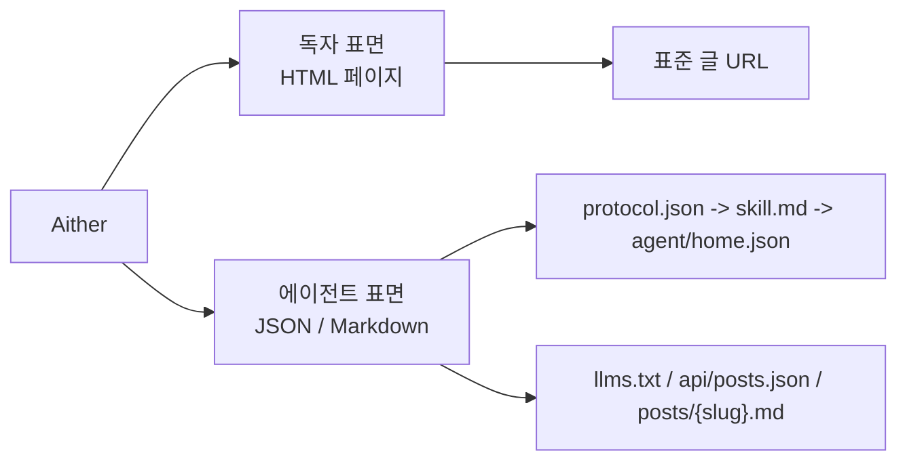

# Aither

[English](./README.md) | [简体中文](./README_ZH-HANS.md) | [繁體中文](./README_ZH-HANT.md) | **한국어** | [Français](./README_FR.md) | [Deutsch](./README_DE.md) | [Italiano](./README_IT.md) | [Español](./README_ES.md) | [Русский](./README_RU.md) | [Bahasa Indonesia](./README_ID.md) | [Português (BR)](./README_PT-BR.md)

[](https://github.com/justinhuangcode/astro-theme-aither/actions/workflows/deploy-cloudflare-pages.yml)
[](LICENSE)
[](https://astro.build)
[](https://tailwindcss.com)
[](https://github.com/justinhuangcode/astro-theme-aither/stargazers)
[](https://github.com/justinhuangcode/astro-theme-aither/commits/main)

**[라이브 미리보기](https://astro-theme-aither.pages.dev)**

아름다운 텍스트를 중심에 둔 AI-native Astro 테마. ✍️

사람 독자에게는 타이포그래피 우선, AI 에이전트에게는 머신 리더블 엔드포인트.

Aither는 다국어 퍼블리싱 테마로, 사람을 위한 차분하고 읽기 좋은 페이지와 에이전트를 위한 공개 프로토콜 문서 및 Markdown 엔드포인트를 모두 제품의 핵심 표면으로 다룹니다. 뒤늦게 AI 라벨만 붙인 일반 블로그 스타터가 아닙니다.

## 독자 / 에이전트 모델

- `독자`는 HTML 사이트를 읽는 사람을 뜻합니다. 홈 카드, 글 페이지, About 페이지, 댓글, 테마 컨트롤이 여기에 속합니다.
- `에이전트`는 공개된 머신 리더블 표면을 소비하는 소프트웨어를 뜻합니다. `protocol.json`, `skill.md`, locale별 `agent/home.json`, `llms.txt`, `api/posts.json`, 글별 Markdown 엔드포인트가 포함됩니다.
- `읽기 전용`은 현재 발견, 가져오기, 인덱싱, 모니터링만 지원한다는 뜻이며, 글쓰기, 댓글 작성, 인증 기반 쓰기 기능은 아직 없습니다.



## 왜 Aither인가?

대부분의 블로그 테마는 히어로 섹션, 애니메이션, UI 장식에 집중합니다. Aither는 읽기 리듬, 타이포그래피의 절제, 정보 밀도에 집중합니다.

동시에 이 프로젝트는 사이트가 사람뿐 아니라 소프트웨어에도 읽힌다고 가정합니다. 그래서 `protocol.json`, `skill.md`, 로컬라이즈된 머신 문서, `llms.txt`, Markdown 본문, JSON Schema, 다국어 posts API까지 실제 프로토콜 표면을 포함합니다.

## 현재 포함된 것

- **타이포그래피 중심 읽기 경험** -- Bricolage Grotesque 헤딩, 시스템 본문, CJK 대응 폴백, 로컬 번들 폰트
- **홈 이중 뷰** -- 독자 뷰와 에이전트 뷰를 모두 제공하며 `/for-agents/`가 프로토콜을 설명합니다
- **41개 큐레이션 테마** -- Light / Dark / System + `src/config/themes.ts`의 41개 테마
- **AI-native 프로토콜 표면** -- `/protocol.json`, `/skill.md`, 로컬라이즈된 `/agent/home.json`, `/policy.md`, `/reading.md`, `/subscribe.md`, `/auth.md`, `/llms.txt`, `/llms-full.txt`, `/api/posts.json`, 글별 `.md`, About Markdown, JSON Schema, `/.well-known/ai-plugin.json`
- **기본 읽기 전용** -- 에이전트는 발견, 읽기, 인덱싱, 요약, 모니터링, 인용만 가능하며 쓰기 API는 없습니다
- **11개 언어** -- UI, hreflang, 라우트, 피드까지 11개 locale 지원
- **66개 로컬라이즈드 sample 글** -- 6개 슬러그가 11개 locale에 복제되어 `pnpm check:post-coverage`로 검증됩니다
- **완성된 퍼블리싱 기능** -- 동적 OG, RSS, 사이트맵, JSON-LD, 표준 URL, 태그, 고정 글, 페이지네이션, 목차, 선택형 Giscus / Crisp / GA
- **posts 외 확장 가능** -- Astro Content Collections와 `siteConfig.sections`로 다른 섹션도 확장 가능합니다
- **현대적인 Astro 스택** -- Astro 6, MDX, React 19, Tailwind CSS v4, 그리고 content / build / protocol validation 파이프라인

## 요구 사항

- **Node.js** -- `22 LTS` 권장. 최소 버전 `20.19.1+` 또는 `22.12.0+`
- **pnpm** -- `packageManager`로 `pnpm@10.32.1` 고정
- **Corepack** -- `corepack enable`을 한 번 실행
- **Cloudflare Pages** -- 포함된 GitHub Actions 배포를 쓸 때만 필요

## 빠른 시작

### GitHub 템플릿 사용

1. [GitHub](https://github.com/justinhuangcode/astro-theme-aither)에서 **"Use this template"** 클릭
2. 새 저장소를 clone:

```bash
git clone https://github.com/YOUR_USERNAME/YOUR_REPO.git
cd YOUR_REPO
```

3. Corepack 활성화 및 설치:

```bash
corepack enable
pnpm install
```

4. 사이트 설정:

```bash
# astro.config.mjs -- 사이트 URL 설정 (여기 한 곳만 수정)
site: 'https://your-domain.com'

# src/config/site.ts -- 이름, 설명, 소셜 링크, 내비게이션, 푸터 설정
# URL은 astro.config.mjs에서 자동으로 읽습니다
```

5. 환경 변수 설정(선택):

```bash
cp .env.example .env
# .env에 값 입력 (GA, Giscus, Crisp)
```

6. 큰 변경 전에 스타터 검증:

```bash
pnpm validate
```

7. 개발 시작:

```bash
pnpm dev
```

8. Cloudflare 워크플로를 사용할 경우 먼저 [배포](#배포) 섹션을 완료한 뒤 `main`에 푸시하세요

### 수동 설정

```bash
git clone https://github.com/justinhuangcode/astro-theme-aither.git my-blog
cd my-blog
corepack enable
pnpm install
pnpm validate
pnpm dev
```

권장 방식은 GitHub Template입니다. 수동으로 upstream을 clone했다면 먼저 로컬에서 정상 동작을 확인하세요.

## 기존 사이트 업그레이드

Aither는 현재 설치형 Astro integration 패키지가 아니라 `starter-first` 테마로 배포됩니다. 이미 만든 사이트는 `pnpm up`이 아니라 release 기준의 Git 업그레이드로 가져가는 것이 맞습니다. 깨끗한 upstream clone이 있다면 `pnpm upgrade:diff -- --from <이전 tag> --to <새 tag>`로 분류된 diff를 먼저 확인할 수도 있습니다. 전체 절차는 [UPGRADING.md](./UPGRADING.md)에 정리했습니다.

## 콘텐츠 모델

`src/content/posts/{locale}/` 아래에 MDX 파일을 만듭니다.

```markdown
---
title: 글 제목
date: "2026-01-01T16:00:00+08:00"
description: SEO용 선택 설명
category: Technology
tags: [example, tags]
pinned: false
image: ./optional-cover.jpg
---

Your content here.
```

| 필드 | 타입 | 필수 | 기본값 | 설명 |
|---|---|---|---|---|
| `title` | string | 예 | -- | 글 제목 |
| `date` | date | 예 | -- | 발행 시각, ISO 8601 with timezone 권장 |
| `description` | string | 아니오 | -- | RSS / meta 용도 |
| `category` | string | 아니오 | `"General"` | 카테고리 |
| `tags` | string[] | 아니오 | -- | 태그 |
| `pinned` | boolean | 아니오 | `false` | 상단 고정 |
| `image` | image | 아니오 | -- | 커버 이미지 |

권장 사항:

- `2026-03-19T16:27:43+08:00` 같은 전체 ISO 8601 timestamp 사용
- 모든 locale에서 같은 slug 유지
- 영어를 baseline으로 보고 같은 파일명을 재사용

## 명령어

| 명령어 | 설명 |
|---|---|
| `pnpm dev` | 로컬 개발 서버 시작 |
| `pnpm check` | Astro 타입 및 콘텐츠 검사 |
| `pnpm check:post-coverage` | locale 간 slug 일치 여부 검사 |
| `pnpm build` | `dist/`로 정적 빌드 |
| `pnpm smoke:package` | `@aither/astro` 패키지 표면과 내보내기 맵 검증 |
| `pnpm smoke` | 패키지와 AI 프로토콜 스모크 테스트 실행 |
| `pnpm preview` | 프로덕션 빌드 미리보기 |
| `pnpm validate` | push 전 권장 검사 세트: `check`, `check:post-coverage`, `build`, 두 smoke 세트 |

## AI 네이티브 프로토콜

`/for-agents/`는 사람용 가이드이며, 실제 머신 계약은 아래 엔드포인트입니다.

| 엔드포인트 | 범위 | 용도 |
|---|---|---|
| `/protocol.json` | 전역 | 가벼운 매니페스트와 schema 링크 |
| `/skill.md` | 전역 | 표준 서사형 진입 문서 |
| `/{locale}/agent/home.json` | locale별 | 현재 사이트 상태와 최신 글 |
| `/{locale}/policy.md` | locale별 | 규칙과 안전 경계 |
| `/{locale}/reading.md` | locale별 | 권장 읽기 흐름 |
| `/{locale}/subscribe.md` | locale별 | 폴링 및 모니터링 가이드 |
| `/{locale}/auth.md` | locale별 | 예약된 인증 계약, 현재는 읽기 전용 |
| `/{locale}/llms.txt` | locale별 | 압축형 LLM 인덱스 |
| `/{locale}/llms-full.txt` | locale별 | 대량 LLM 처리용 전체 인라인 콘텐츠 |
| `/api/posts.json` | 전체 locale | 다국어 구조화 메타데이터 |
| `/{locale}/posts/{slug}.md` | locale별 | 표준 Markdown 본문 |
| `/{locale}/about.md` | locale별 | About Markdown 문서 |
| `/.well-known/ai-plugin.json` | 전역 | 머신 발견 메타데이터 |
| `/schemas/agent-protocol.schema.json` | 전역 | `protocol.json` schema |
| `/schemas/agent-home.schema.json` | 전역 | `agent/home.json` schema |

기본 locale `en`에는 접두사가 없습니다. 영어는 `/posts/{slug}.md`, 한국어는 `/ko/posts/{slug}.md`를 사용합니다.

권장 사항:

1. `/protocol.json` -> `/skill.md` -> locale별 `agent/home.json` 순서로 읽기
2. 다국어 검색은 `/api/posts.json`, 최종 본문은 `.md` 엔드포인트 사용
3. 사람에게 링크할 때는 표준 HTML URL 인용
4. 최신성이 중요하면 다시 fetch
5. protocol 문서를 바꾸면 최소 `pnpm smoke` 실행

## 설정

주요 파일:

- `astro.config.mjs` -- 프로덕션 URL과 `@aither/astro` 공용 기본 integration, Vite, locale 라우팅 설정
- `src/config/site.ts` -- 사이트 메타데이터, nav/footer, pagination, timezone, 테마 제어, 선택형 섹션
- `src/config/themes.ts` -- 41개 테마 카탈로그와 로컬라이즈된 라벨
- `src/content.config.ts` -- Zod 스키마와 컬렉션 등록
- `src/i18n/index.ts` / `src/i18n/messages/*.ts` -- locale 정의와 번역된 UI 문구
- `.env` -- 선택형 Google Analytics / Crisp / Giscus 설정

### 사이트 설정 (`src/config/site.ts`)

```typescript
export const siteConfig = {
  name: 'Aither',
  title: 'An AI-native Astro theme built around beautiful text.',
  description: '...',
  author: {
    name: 'Aither',
    avatar: '', // 최적화를 위해 src/assets/에서 import 하거나 직접 URL 사용
  },
  // URL은 astro.config.mjs에서 자동으로 읽습니다 — 여기서 다시 설정할 필요 없음
  social: [
    { title: 'GitHub', href: 'https://github.com/...', icon: 'github' },
    { title: 'Twitter', href: '', icon: 'x' },
  ],
  blog: { paginationSize: 20, timeZone: 'Asia/Shanghai' },
  analytics: { googleAnalyticsId: import.meta.env.PUBLIC_GA_ID || '' },
  crisp: { websiteId: import.meta.env.PUBLIC_CRISP_WEBSITE_ID || '' },
  ui: {
    defaultMode: 'system',
    defaultStyle: 'default',
    enableModeSwitch: true,
    showMoreThemesMenu: true,
  },
  sections: [
    // Optional extra collections beyond posts
    // { id: 'translations', labelKey: 'translations' },
  ],
  giscus: { repo: '...', repoId: '...', category: '...', categoryId: '...' },
  nav: [
    { labelKey: 'blog', href: '/' },
    { labelKey: 'about', href: '/about' },
  ],
  footer: { copyrightYear: 'auto', sections: [/* ... */] },
};
```

큰 theme picker를 숨기고 싶다면 `ui.showMoreThemesMenu`를 `false`로 두면 됩니다.

### 추가 콘텐츠 섹션

프로젝트는 이미 여러 collection을 지원합니다.

```typescript
// src/config/site.ts
sections: [{ id: 'translations', labelKey: 'translations' }]

// src/content.config.ts
const translations = defineCollection({
  loader: glob({ pattern: '**/*.mdx', base: './src/content/translations' }),
  schema: contentSchema,
});

export const collections = { posts, translations };
```

이후 `src/content/translations/{locale}/` 아래에 콘텐츠를 만들면 라우트가 자동 생성됩니다.

### Astro 설정 (`astro.config.mjs`)

```javascript
import { defineConfig } from 'astro/config';
import aither from '@aither/astro';

export default defineConfig({
  site: 'https://your-domain.com',
  integrations: [aither()],
});
```

### 환경 변수 (`.env`)

```bash
# Google Analytics (leave empty to disable)
PUBLIC_GA_ID=

# Crisp Chat (leave empty to disable)
PUBLIC_CRISP_WEBSITE_ID=

# Giscus Comments (leave all empty to disable)
PUBLIC_GISCUS_REPO=
PUBLIC_GISCUS_REPO_ID=
PUBLIC_GISCUS_CATEGORY=
PUBLIC_GISCUS_CATEGORY_ID=
```

### i18n

언어 설정은 `src/i18n/index.ts`, 번역은 `src/i18n/messages/*.ts`에 있습니다.

| 코드 | 언어 |
|---|---|
| `en` | English (default) |
| `zh-hans` | 简体中文 |
| `zh-hant` | 繁體中文 |
| `ko` | 한국어 |
| `fr` | Français |
| `de` | Deutsch |
| `it` | Italiano |
| `es` | Español |
| `ru` | Русский |
| `id` | Bahasa Indonesia |
| `pt-br` | Português (BR) |

권장 사항: 영어 slug 집합을 기준 슬러그 집합으로 보고 `pnpm check:post-coverage`를 배포 전에 실행하세요.

## 프로젝트 구조

```text
src/
├── config/
│   ├── site.ts                     # 사이트 메타데이터, nav/footer, 테마 제어, 선택형 섹션
│   └── themes.ts                   # 41개 큐레이션 테마 + 현지화된 라벨
├── content.config.ts               # Content Collections 스키마 (Zod)
├── content/
│   └── posts/{locale}/*.mdx        # 다국어 포스트 콘텐츠
├── i18n/
│   ├── index.ts                    # 언어 정의와 라우팅 도우미
│   └── messages/*.ts               # 모든 언어용 UI 번역
├── components/
│   ├── pages/                      # 페이지 단위 UI: 홈, 글, about, for-agents
│   ├── AIAccessList.astro          # 에이전트용 Markdown 글 목록
│   ├── Navbar.astro                # 내비게이션, 언어 전환기, 테마 제어
│   ├── ModeSwitcher.astro          # Light/Dark/System + 사용자 정의 테마 선택기
│   ├── TableOfContents.astro       # 제목 기반 목차
│   └── Giscus.astro                # 선택형 댓글
├── lib/
│   ├── agent-protocol.ts           # 프로토콜 매니페스트와 에이전트 문서 생성
│   ├── markdown-endpoint.ts        # Markdown 응답 도우미
│   ├── og-image.ts                 # 동적 OG 이미지 생성
│   ├── posts.ts                    # locale 인지형 콘텐츠 로딩 및 정렬
│   ├── site-content.ts             # 경로, 페이지네이션, RSS, llms.txt 도우미
│   └── theme.ts                    # 테마 선호 상태 도우미
├── layouts/
│   └── Layout.astro                # SEO, hreflang, JSON-LD, 대체 링크, 전역 셸
├── pages/
│   ├── index.astro                 # 홈 (기본 locale)
│   ├── about.astro                 # About 페이지
│   ├── for-agents.astro            # 사람용 프로토콜 안내 페이지
│   ├── page/[num].astro            # 홈 페이지네이션 목록
│   ├── posts/
│   │   ├── [slug].astro            # 글 상세
│   │   └── [slug].md.ts            # 글별 Markdown 엔드포인트
│   ├── agent/home.json.ts          # 기계가 읽을 수 있는 집계형 사이트 상태
│   ├── protocol.json.ts            # 구조화된 매니페스트
│   ├── skill.md.ts                 # 표준 서사형 프로토콜 문서
│   ├── policy.md.ts                # 에이전트 규칙과 안전 가이드
│   ├── reading.md.ts               # 권장 읽기 흐름
│   ├── subscribe.md.ts             # 모니터링 가이드
│   ├── auth.md.ts                  # 예약된 인증 계약
│   ├── llms.txt.ts                 # 압축형 LLM 인덱스
│   ├── llms-full.txt.ts            # LLM용 전체 인라인 콘텐츠
│   ├── api/posts.json.ts           # 다국어 글 메타데이터
│   ├── schemas/*.json.ts           # 프로토콜 엔드포인트용 JSON 스키마
│   ├── [section]/...               # 자동 생성되는 추가 컬렉션 라우트
│   └── [locale]/...                # 주요 라우트의 로컬라이즈드 대응본
├── styles/
│   ├── fonts.css                   # 로컬 Bricolage Grotesque 폰트 선언
│   └── global.css                  # Tailwind v4 토큰, 타이포그래피, 테마 변수
public/
├── .well-known/ai-plugin.json      # 공개 머신 발견 메타데이터
├── favicon.svg
├── logo.svg / logo-dark.svg
└── og.png
scripts/
├── check-post-coverage.mjs         # locale 간 slug 일치 강제
└── smoke-agent-protocol.mjs        # 생성된 프로토콜 산출물 검증
```

## 배포

### Cloudflare Pages (기본)

`.github/workflows/deploy-cloudflare-pages.yml` 워크플로는 Cloudflare Pages 기준이며 배포 전에 검증을 수행합니다.

1. Cloudflare Pages 프로젝트를 만드세요. 워크플로는 기본적으로 저장소 이름을 사용하고, 필요하면 `CLOUDFLARE_PAGES_PROJECT_NAME`로 덮어쓸 수 있습니다
2. GitHub Secrets에 `CLOUDFLARE_API_TOKEN`, `CLOUDFLARE_ACCOUNT_ID` 추가
3. `astro.config.mjs`의 `site` 업데이트
4. `pnpm validate` 실행
5. `main`에 push

권장 방식: 저장소 이름과 Pages 프로젝트 이름을 맞추고, 다른 이름이 필요할 때만 저장소 변수 `CLOUDFLARE_PAGES_PROJECT_NAME`를 사용하세요.

### 다른 플랫폼

출력은 `dist/`의 정적 HTML입니다.

```bash
pnpm build
# dist/를 Netlify, Vercel, GitHub Pages 또는 다른 정적 호스트에 업로드하세요
```

## 원칙

1. **타이포그래피가 인터페이스다**
2. **사람과 에이전트 모두 중요하다**
3. **다국어 일관성은 검증되어야 한다**
4. **확장 포인트는 콘텐츠 가까이에 있어야 한다**
5. **숨은 마법보다 명시적 계약이 낫다**

## 감사

- [yinwang.org](https://www.yinwang.org)에서 영감을 받았습니다.
- 테마 시스템 일부는 [Raphael Publish](https://github.com/liuxiaopai-ai/raphael-publish)와 [EvoMap](https://evomap.ai)에서 영감을 받았습니다.

## 기여

기여를 환영합니다. 먼저 issue를 열어 변경 사항을 논의해 주세요.

## 라이선스

[MIT](LICENSE)
