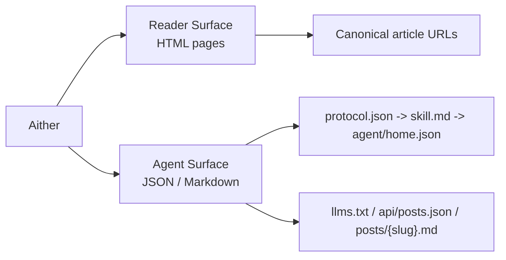

# Aither

[English](./README.md) | [简体中文](./README_ZH-HANS.md) | [繁體中文](./README_ZH-HANT.md) | [한국어](./README_KO.md) | [Français](./README_FR.md) | [Deutsch](./README_DE.md) | [Italiano](./README_IT.md) | [Español](./README_ES.md) | [Русский](./README_RU.md) | [Bahasa Indonesia](./README_ID.md) | **Português (BR)**

[](https://github.com/justinhuangcode/astro-theme-aither/actions/workflows/deploy-cloudflare-pages.yml)
[](LICENSE)
[](https://astro.build)
[](https://tailwindcss.com)
[](https://github.com/justinhuangcode/astro-theme-aither/stargazers)
[](https://github.com/justinhuangcode/astro-theme-aither/commits/main)

**[Preview ao vivo](https://astro-theme-aither.pages.dev)**

Um tema Astro AI-native construído em torno de texto bonito. ✍️

Tipografia em primeiro lugar para humanos, endpoints legíveis por máquina para agentes de IA.

Aither é um tema de publicação multilíngue que trata as duas superfícies como produto de verdade: páginas calmas e legíveis para pessoas, e documentos públicos de protocolo com endpoints Markdown para agentes.

## Modelo Leitor / Agente

- `Reader` significa uma pessoa lendo o site HTML: home, páginas de artigo, página About, comentários e controles de tema.
- `Agent` significa software consumindo a superfície pública machine-readable: `protocol.json`, `skill.md`, `agent/home.json` por locale, `llms.txt`, `api/posts.json` e Markdown por artigo.
- `Read-only` significa que hoje há suporte para descoberta, leitura, indexação e monitoramento; publicação, comentários e escrita autenticada não estão expostos.



## Por que Aither?

A maioria dos temas de blog otimiza hero sections, animações e chrome visual. Aither otimiza ritmo de leitura, sobriedade tipográfica e densidade de informação.

Ao mesmo tempo, o projeto assume que o site será lido tanto por software quanto por pessoas. Por isso o repositório inclui uma superfície real de protocolo: `protocol.json`, `skill.md`, documentos machine-readable localizados, `llms.txt`, corpos em Markdown, JSON Schema e uma API de posts cross-locale.

## O que já vem incluído

- **Leitura focada em tipografia**
- **Duas visões na home**
- **41 temas curados**
- **Superfície AI-native completa**
- **Modo read-only por padrão**
- **11 idiomas**
- **66 sample posts localizados**
- **Base editorial completa**
- **Extensível além de posts**
- **Stack Astro moderna**

## Requisitos

- **Node.js** -- `22 LTS` recomendado. Mínimo `20.19.1+` ou `22.12.0+`
- **pnpm** -- `pnpm@10.32.1` fixado via `packageManager`
- **Corepack** -- execute `corepack enable` uma vez
- **Cloudflare Pages** -- só se você usar o workflow incluído

## Início Rápido

### Usar como template do GitHub

1. Clique em **"Use this template"** no [GitHub](https://github.com/justinhuangcode/astro-theme-aither)
2. Clone o novo repositório:

```bash
git clone https://github.com/YOUR_USERNAME/YOUR_REPO.git
cd YOUR_REPO
```

3. Ative o Corepack e instale dependências:

```bash
corepack enable
pnpm install
```

4. Configure o site:

```bash
# astro.config.mjs -- set your site URL (only place you need to set it)
site: 'https://your-domain.com'

# src/config/site.ts -- set name, description, social links, nav, footer
# (url is automatically read from astro.config.mjs)
```

5. Configure variáveis de ambiente (opcional):

```bash
cp .env.example .env
# Edit .env with your values (GA, Giscus, Crisp)
```

6. Valide antes de grandes mudanças:

```bash
pnpm validate
```

7. Inicie o desenvolvimento:

```bash
pnpm dev
```

## Modelo de conteúdo

Crie arquivos MDX em `src/content/posts/{locale}/`.

## Comandos

| Comando | Descrição |
|---|---|
| `pnpm dev` | Inicia o servidor local |
| `pnpm check` | Executa checagens do Astro |
| `pnpm check:post-coverage` | Verifica paridade de slugs |
| `pnpm build` | Gera `dist/` |
| `pnpm smoke` | Executa smoke tests do protocolo |
| `pnpm preview` | Faz preview do build |
| `pnpm validate` | Executa check + coverage + build + smoke |

## Protocolo AI-native

A ordem recomendada é: `protocol.json` -> `skill.md` -> `agent/home.json` -> `policy.md` / `reading.md` / `subscribe.md`.

Use `/api/posts.json` para descoberta multi-locale e `/{locale}/posts/{slug}.md` para recuperar o corpo final do artigo.

## Configuração

Arquivos principais:

- `astro.config.mjs`
- `src/config/site.ts`
- `src/config/themes.ts`
- `src/content.config.ts`
- `src/i18n/index.ts`
- `src/i18n/messages/*.ts`
- `.env`

## Estrutura do Projeto

```text
src/
├── config/
├── content/
├── i18n/
├── components/
├── lib/
├── layouts/
├── pages/
└── styles/
public/
scripts/
```

## Implantação

O workflow padrão usa Cloudflare Pages e espera `CLOUDFLARE_API_TOKEN`, `CLOUDFLARE_ACCOUNT_ID` e um projeto configurado.

## Princípios

1. Tipografia é a interface.
2. Humanos e agentes importam igualmente.
3. Paridade multilíngue deve ser verificada.
4. Extensões devem ficar próximas do conteúdo.
5. Menos mágica, mais clareza.

## Agradecimentos

- Inspirado por [yinwang.org](https://www.yinwang.org).
- Partes do sistema de temas se inspiram em [Raphael Publish](https://github.com/liuxiaopai-ai/raphael-publish).

## Contribuindo

Contribuições são bem-vindas. Abra uma issue antes de propor mudanças.

## Licença

[MIT](LICENSE)
