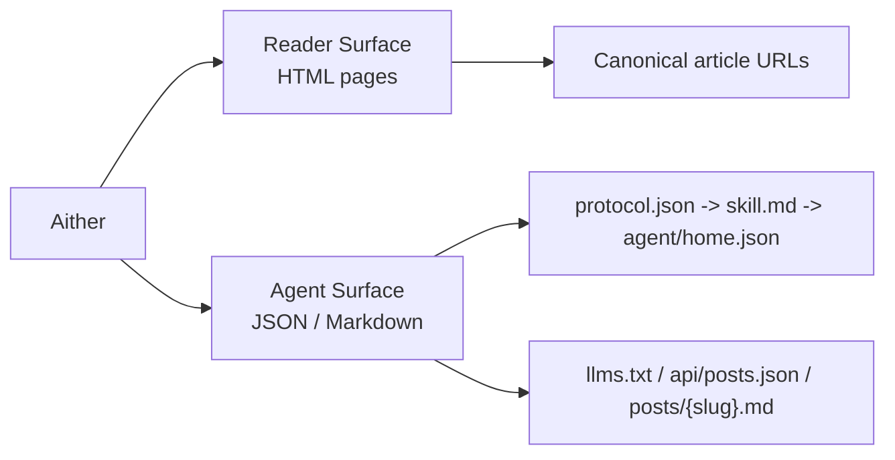

# Aither

[English](./README.md) | [简体中文](./README_ZH-HANS.md) | [繁體中文](./README_ZH-HANT.md) | [한국어](./README_KO.md) | [Français](./README_FR.md) | [Deutsch](./README_DE.md) | [Italiano](./README_IT.md) | [Español](./README_ES.md) | **Русский** | [Bahasa Indonesia](./README_ID.md) | [Português (BR)](./README_PT-BR.md)

[](https://github.com/justinhuangcode/astro-theme-aither/actions/workflows/deploy-cloudflare-pages.yml)
[](LICENSE)
[](https://astro.build)
[](https://tailwindcss.com)
[](https://github.com/justinhuangcode/astro-theme-aither/stargazers)
[](https://github.com/justinhuangcode/astro-theme-aither/commits/main)

**[Live Preview](https://astro-theme-aither.pages.dev)**

AI-native тема Astro, построенная вокруг красивого текста. ✍️

Типографика для людей, машиночитаемые endpoints для AI-агентов.

Aither — это мультиязычная publishing-тема, в которой и человекочитаемая часть, и agent-facing протоколы являются частью продукта.

## Модель Читателя / Агента

- `Reader` означает человека, который читает HTML-сайт: главная страница, страницы статей, About, комментарии и переключатели темы.
- `Agent` означает софт, который потребляет публичную machine-readable поверхность: `protocol.json`, `skill.md`, locale-specific `agent/home.json`, `llms.txt`, `api/posts.json` и Markdown для каждой статьи.
- `Read-only` означает, что сейчас поддерживаются discovery, чтение, индексирование и мониторинг; публикация, комментарии и аутентифицированная запись не поддерживаются.



## Почему Aither?

Большинство блоговых тем оптимизируют hero-блоки, анимации и декоративный UI. Aither оптимизирует ритм чтения, типографическую сдержанность и плотность информации.

Одновременно проект исходит из того, что сайт будет читаться не только людьми, но и софтом. Поэтому в репозитории есть полноценная protocol surface: `protocol.json`, `skill.md`, локализованные machine docs, `llms.txt`, Markdown-версии статей, JSON Schema и multi-locale posts API.

## Что уже входит

- типографика как основной интерфейс
- две домашние поверхности: для читателя и для агента
- 41 тема
- полный AI-native протокол
- read-only режим по умолчанию
- 11 языков
- 66 локализованных sample posts
- RSS / sitemap / OG / JSON-LD / TOC / pagination
- расширяемость через Content Collections
- современный стек Astro

## Требования

- **Node.js** -- `22 LTS` рекомендуется
- **pnpm** -- `pnpm@10.32.1`
- **Corepack** -- выполните `corepack enable`
- **Cloudflare Pages** -- только если используете встроенный workflow деплоя

## Быстрый старт

### Использовать как GitHub template

```bash
git clone https://github.com/YOUR_USERNAME/YOUR_REPO.git
cd YOUR_REPO
corepack enable
pnpm install
pnpm validate
pnpm dev
```

## Модель контента

Посты лежат в `src/content/posts/{locale}/` и используют MDX.

## Команды

| Команда | Описание |
|---|---|
| `pnpm dev` | Локальный dev server |
| `pnpm check` | Проверка Astro и контента |
| `pnpm check:post-coverage` | Проверка паритета slug между locale |
| `pnpm build` | Сборка в `dist/` |
| `pnpm smoke` | Smoke tests протокола |
| `pnpm preview` | Локальный preview production build |
| `pnpm validate` | Полный рекомендуемый прогон |

## AI-нативный протокол

Рекомендуемый порядок чтения: `/protocol.json` -> `/skill.md` -> locale-specific `agent/home.json`.

Для discovery по всем языкам используйте `/api/posts.json`, а для конечного текста статьи — `/{locale}/posts/{slug}.md`.

## Конфигурация

Ключевые файлы: `astro.config.mjs`, `src/config/site.ts`, `src/config/themes.ts`, `src/content.config.ts`, `src/i18n/index.ts`, `src/i18n/messages/*.ts`, `.env`.

## Структура проекта

```text
src/
├── config/
├── content/
├── i18n/
├── components/
├── lib/
├── layouts/
├── pages/
└── styles/
public/
scripts/
```

## Развёртывание

По умолчанию используется Cloudflare Pages workflow с обязательными secrets `CLOUDFLARE_API_TOKEN` и `CLOUDFLARE_ACCOUNT_ID`.

## Принципы

1. Типографика — это интерфейс.
2. Люди и агенты одинаково важны.
3. Мультиязычный паритет нужно проверять.
4. Точки расширения должны жить рядом с контентом.
5. Меньше магии, больше явных контрактов.

## Благодарности

- Вдохновлено [yinwang.org](https://www.yinwang.org).
- Часть системы тем вдохновлена [Raphael Publish](https://github.com/liuxiaopai-ai/raphael-publish).

## Вклад

Контрибьюции приветствуются. Сначала откройте issue для обсуждения.

## Лицензия

[MIT](LICENSE)
