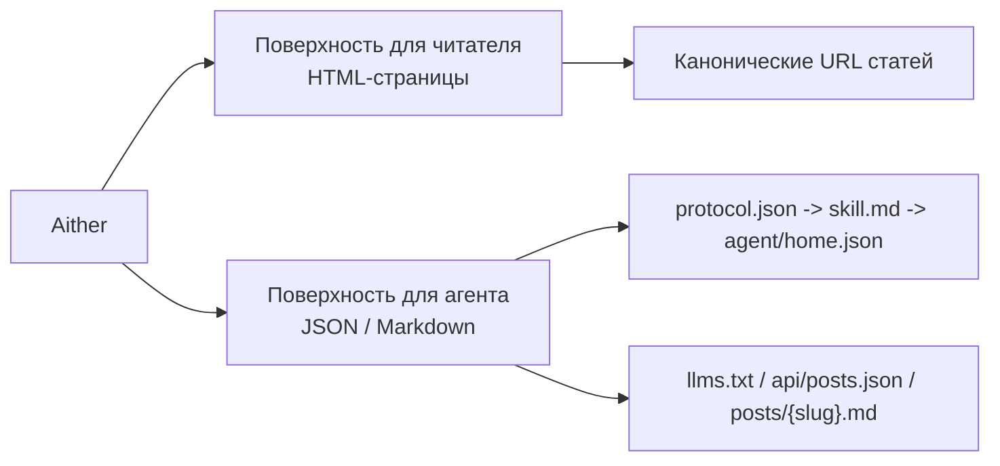

# Aither

[English](./README.md) | [简体中文](./README_ZH-HANS.md) | [繁體中文](./README_ZH-HANT.md) | [한국어](./README_KO.md) | [Français](./README_FR.md) | [Deutsch](./README_DE.md) | [Italiano](./README_IT.md) | [Español](./README_ES.md) | **Русский** | [Bahasa Indonesia](./README_ID.md) | [Português (BR)](./README_PT-BR.md)

[](https://github.com/justinhuangai/astro-theme-aither/actions/workflows/deploy-cloudflare-pages.yml)
[](LICENSE)
[](https://astro.build)
[](https://tailwindcss.com)
[](https://github.com/justinhuangai/astro-theme-aither/stargazers)
[](https://github.com/justinhuangai/astro-theme-aither/commits/main)

**[Онлайн-просмотр](https://astro-theme-aither.pages.dev)**

Тема Astro, рассчитанная на ИИ и построенная вокруг красивого текста. ✍️

Типографика для людей, машиночитаемые эндпоинты для ИИ-агентов.

Aither — это мультиязычная тема публикации, в которой и человекочитаемая часть, и протоколы для агентов являются частью продукта.

## Модель Читателя / Агента

- `Читатель` означает человека, который читает HTML-сайт: главная страница, страницы статей, страница «О сайте», комментарии и переключатели темы.
- `Агент` означает софт, который потребляет публичную машиночитаемую поверхность: `protocol.json`, `skill.md`, `agent/home.json` для каждой языковой версии, `llms.txt`, `api/posts.json` и Markdown для каждой статьи.
- `Только чтение` означает, что сейчас поддерживаются обнаружение, чтение, индексирование и мониторинг; публикация, комментарии и аутентифицированная запись не поддерживаются.



## Почему Aither?

Большинство блоговых тем оптимизируют стартовые блоки, анимацию и визуальный декор. Aither оптимизирует ритм чтения, типографическую сдержанность и плотность информации.

Одновременно проект исходит из того, что сайт будет читаться не только людьми, но и софтом. Поэтому в репозитории есть полноценная поверхность протокола: `protocol.json`, `skill.md`, локализованные машиночитаемые документы, `llms.txt`, Markdown-версии статей, JSON Schema и API постов для всех языковых версий.

## Что уже входит

- типографика как основной интерфейс
- две домашние поверхности: для читателя и для агента
- 41 тема
- полный протокол для ИИ
- режим только чтения по умолчанию
- 11 языков
- 66 локализованных примерных постов
- RSS / sitemap / OG / JSON-LD / TOC / pagination
- расширяемость через Content Collections
- современный стек Astro

## Требования

- **Node.js** -- `22 LTS` рекомендуется
- **pnpm** -- `pnpm@10.32.1`
- **Corepack** -- выполните `corepack enable`
- **Cloudflare Pages** -- только если используете встроенный процесс деплоя

## Быстрый старт

### Использовать как GitHub template

```bash
git clone https://github.com/YOUR_USERNAME/YOUR_REPO.git
cd YOUR_REPO
corepack enable
pnpm install
pnpm validate
pnpm dev
```

## Модель контента

Посты лежат в `src/content/posts/{locale}/` и используют MDX.

## Команды

| Команда | Описание |
|---|---|
| `pnpm dev` | Локальный сервер разработки |
| `pnpm check` | Проверка Astro и контента |
| `pnpm check:post-coverage` | Проверка паритета slug между locale |
| `pnpm build` | Сборка в `dist/` |
| `pnpm smoke:package` | Проверка поверхности пакета `@aither/astro` и карты exports |
| `pnpm smoke` | Дымовые тесты пакета и протокола |
| `pnpm preview` | Локальный предпросмотр производственной сборки |
| `pnpm validate` | Полный рекомендуемый прогон: check + coverage + build + две проверки smoke |

## Обновление существующих сайтов

Сейчас Aither распространяется как тема формата `starter-first`, а не как устанавливаемый пакет Astro integration. Для уже созданных сайтов правильный путь обновления идёт через release и Git, а не через `pnpm up`. Если у вас есть чистый upstream-клон, можно сначала запустить `pnpm upgrade:diff -- --from <старый-tag> --to <новый-tag>` и посмотреть сгруппированный diff. Полный процесс описан в [UPGRADING.md](./UPGRADING.md).

## AI-нативный протокол

Рекомендуемый порядок чтения: `/protocol.json` -> `/skill.md` -> `agent/home.json` для нужной locale.

Для обнаружения по всем языкам используйте `/api/posts.json`, а для конечного текста статьи — `/{locale}/posts/{slug}.md`.

## Конфигурация

Ключевые файлы: `astro.config.mjs`, `src/config/site.ts`, `src/config/themes.ts`, `src/content.config.ts`, `src/i18n/index.ts`, `src/i18n/messages/*.ts`, `.env`.

### Конфигурация Astro (`astro.config.mjs`)

```javascript
import { defineConfig } from 'astro/config';
import aither from '@aither/astro';

export default defineConfig({
  site: 'https://your-domain.com',
  integrations: [aither()],
});
```

## Структура проекта

```text
src/
├── config/
├── content/
├── i18n/
├── components/
├── lib/
├── layouts/
├── pages/
└── styles/
public/
scripts/
```

## Развёртывание

По умолчанию процесс Cloudflare Pages требует secrets `CLOUDFLARE_API_TOKEN` и `CLOUDFLARE_ACCOUNT_ID` и использует имя репозитория как имя проекта. Если нужен другой проект, задайте переменную репозитория `CLOUDFLARE_PAGES_PROJECT_NAME`.

## Принципы

1. Типографика — это интерфейс.
2. Люди и агенты одинаково важны.
3. Мультиязычный паритет нужно проверять.
4. Точки расширения должны жить рядом с контентом.
5. Меньше магии, больше явных контрактов.

## Благодарности

- Вдохновлено [yinwang.org](https://www.yinwang.org).
- Часть системы тем вдохновлена [Raphael Publish](https://github.com/liuxiaopai-ai/raphael-publish) и [EvoMap](https://evomap.ai).

## Вклад

Контрибьюции приветствуются. Сначала откройте issue для обсуждения.

## Лицензия

[MIT](LICENSE)
