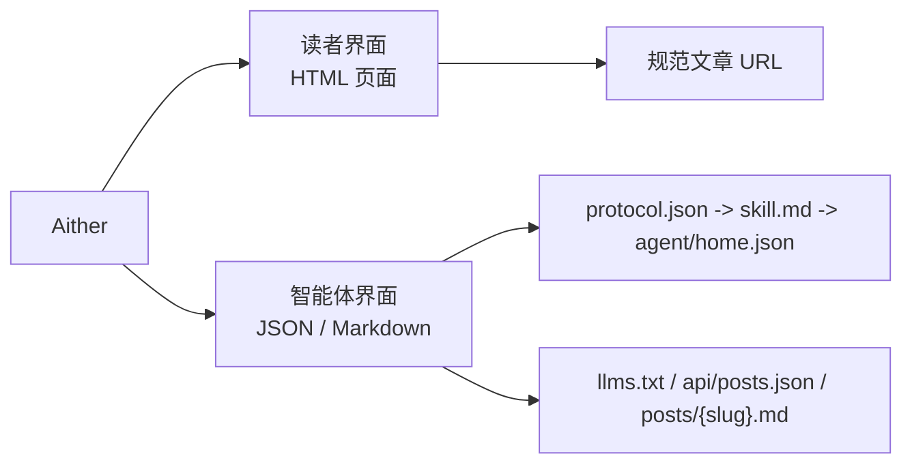

# Aither

[English](./README.md) | **简体中文** | [繁體中文](./README_ZH-HANT.md) | [한국어](./README_KO.md) | [Français](./README_FR.md) | [Deutsch](./README_DE.md) | [Italiano](./README_IT.md) | [Español](./README_ES.md) | [Русский](./README_RU.md) | [Bahasa Indonesia](./README_ID.md) | [Português (BR)](./README_PT-BR.md)

[](https://github.com/justinhuangcode/astro-theme-aither/actions/workflows/deploy-cloudflare-pages.yml)
[](LICENSE)
[](https://astro.build)
[](https://tailwindcss.com)
[](https://github.com/justinhuangcode/astro-theme-aither/stargazers)
[](https://github.com/justinhuangcode/astro-theme-aither/commits/main)

**[在线预览](https://astro-theme-aither.pages.dev)**

一个围绕优美文字构建的 AI 原生 Astro 主题。✍️

面向人类读者强调排版，面向 AI 智能体提供机器可读端点。

Aither 是一个多语言发布主题，把两种表面都当作一等产品能力来设计：对人类，是安静、克制、可读的页面；对智能体，是公开、明确、可抓取的协议文档和 Markdown 端点。它不是一个后来才补上 AI 标签的通用博客模板。

## 读者 / 智能体模型

- `读者` 指阅读 HTML 站点的人类用户：首页卡片、文章页、About 页、评论和主题切换都属于这一侧。
- `智能体` 指消费公开机器可读端点的软件客户端：`protocol.json`、`skill.md`、按 locale 的 `agent/home.json`、`llms.txt`、`api/posts.json` 以及单篇文章 Markdown。
- `只读` 表示当前支持发现、抓取、索引和监控；不提供发布、评论或认证写入能力。



## 为什么选择 Aither？

大多数博客主题优先堆 hero、动画和 UI 装饰。Aither 优先的是阅读节奏、排版克制和信息密度，让文字本身成为设计。

同时，它默认你的站点会被软件读取，就像会被人类阅读一样。因此仓库直接内置了一套真实协议表面：`protocol.json`、`skill.md`、本地化机器文档、`llms.txt`、Markdown 正文端点、JSON Schema，以及跨语言文章 API。

## 当前包含的能力

- **以排版为中心的阅读体验** -- Bricolage Grotesque 标题、系统字体正文、CJK 友好回退，以及本地打包字体资源，不依赖远程字体 CDN 也能保持质感
- **首页双入口** -- 首页同时提供读者视图和智能体视图；人类看到文章卡片，智能体直接看到 Markdown 入口，`/for-agents/` 则用自然语言解释协议
- **41 套主题** -- 除 Light / Dark / System 外，还内置 41 个命名主题，定义在 `src/config/themes.ts` 中；如果你想保留模式切换但隐藏完整主题菜单，也可以直接配置
- **AI 原生协议** -- `/protocol.json`、`/skill.md`、本地化 `/agent/home.json`、`/policy.md`、`/reading.md`、`/subscribe.md`、`/auth.md`、`/llms.txt`、`/llms-full.txt`、`/api/posts.json`、每篇文章的 `.md`、About Markdown、JSON Schema，以及 `/.well-known/ai-plugin.json`
- **默认只读** -- 智能体可以发现、抓取、索引、总结、轮询和引用内容，但当前没有一方写入 API、评论 API，也没有智能体身份认证写操作
- **11 语言发布** -- English、简体中文、繁體中文、한국어、Français、Deutsch、Italiano、Español、Русский、Bahasa Indonesia、Português (BR)，包含本地化 UI、hreflang、路由和 RSS
- **66 篇本地化 sample** -- 6 个示例 slug 在 11 个 locale 中全部镜像，`11 x 6 = 66`，并由 `pnpm check:post-coverage` 强制校验
- **完整发布能力** -- 动态 OG 图片、RSS、站点地图、JSON-LD、规范 URL、标签、置顶、分页、目录，以及可选的 Giscus / Crisp / Google Analytics
- **不仅限于 posts** -- 路由系统已经支持通过 Astro Content Collections 和 `siteConfig.sections` 扩展更多内容集合，不只是默认的 `posts`
- **现代 Astro 栈** -- Astro 6、MDX、按需使用的 React 19、Tailwind CSS v4 tokens，以及在部署前同时校验内容覆盖、构建产物和协议产物的验证流水线

## 环境要求

- **Node.js** -- 推荐 `22 LTS`。最低支持版本为 `20.19.1+` 或 `22.12.0+`
- **pnpm** -- 仓库通过 `packageManager` 固定 `pnpm@10.32.1`
- **Corepack** -- 先执行一次 `corepack enable`，自动使用固定的 pnpm 版本
- **Cloudflare Pages** -- 仅在你要使用内置 GitHub Actions 部署工作流时需要

## 快速开始

### 使用 GitHub 模板

1. 在 [GitHub](https://github.com/justinhuangcode/astro-theme-aither) 上点击 **"Use this template"**
2. 克隆你的新仓库：

```bash
git clone https://github.com/YOUR_USERNAME/YOUR_REPO.git
cd YOUR_REPO
```

3. 启用 Corepack 并安装依赖：

```bash
corepack enable
pnpm install
```

4. 配置站点：

```bash
# astro.config.mjs -- 设置你的站点 URL（唯一需要设置 URL 的地方）
site: 'https://your-domain.com'

# src/config/site.ts -- 设置站点名称、描述、社交链接、导航、页脚
# url 会自动从 astro.config.mjs 读取
```

5. 配置环境变量（可选）：

```bash
cp .env.example .env
# 按需填写 GA、Giscus、Crisp 等配置
```

6. 在开始大改之前，先验证 starter：

```bash
pnpm validate
```

7. 启动本地开发：

```bash
pnpm dev
```

8. 准备部署时，如果你要使用内置 Cloudflare Pages 工作流，请先完成[部署](#部署)章节里的设置，再推送到 `main`

### 手动方式

```bash
git clone https://github.com/justinhuangcode/astro-theme-aither.git my-blog
cd my-blog
corepack enable
pnpm install
pnpm validate
pnpm dev
```

最佳实践：新站点优先使用 GitHub Template。若你是手动克隆上游仓库，先确认本地运行正常，再创建自己的仓库或导入到新仓库，不要在还没验证成功前就删掉 `.git`。

## 升级已有站点

Aither 当前是 `starter-first` 主题，不是可直接安装并通过 `pnpm up` 升级的 Astro integration 包。已经基于它建站的项目，应按 release 用 Git 升级；如果你有一份干净的上游克隆，也可以先运行 `pnpm upgrade:diff -- --from <旧 tag> --to <新 tag>` 看分类后的差异。完整流程见 [UPGRADING.md](./UPGRADING.md)。

## 内容模型

在 `src/content/posts/{locale}/` 中创建 MDX 文件：

```markdown
---
title: 示例文章标题
date: "2026-01-01T16:00:00+08:00"
description: 可选的 SEO 描述
category: Technology
tags: [可选, 标签]
pinned: false
image: ./optional-cover.jpg
---

在这里写正文内容。
```

| 字段 | 类型 | 必填 | 默认值 | 说明 |
|---|---|---|---|---|
| `title` | string | 是 | -- | 文章标题 |
| `date` | date | 是 | -- | 发布时间，建议使用带时区的 ISO 8601 |
| `description` | string | 否 | -- | 用于 RSS 和 meta 标签 |
| `category` | string | 否 | `"General"` | 分类 |
| `tags` | string[] | 否 | -- | 标签 |
| `pinned` | boolean | 否 | `false` | 设为 `true` 后置顶 |
| `image` | image | 否 | -- | 封面图，可用相对路径或导入 |

最佳实践：

- 尽量使用完整的带时区 ISO 8601 时间，例如 `2026-03-19T16:27:43+08:00`
- 每个 locale 保持相同 slug，方便 `pnpm check:post-coverage` 以英文基线校验覆盖率
- 把英文作为基准集合，本地化时在各语言目录下使用相同文件名

## 命令

| 命令 | 说明 |
|---|---|
| `pnpm dev` | 启动本地开发服务器 |
| `pnpm check` | 运行 Astro 类型与内容校验 |
| `pnpm check:post-coverage` | 校验所有 locale 是否拥有相同 slug |
| `pnpm build` | 构建静态站点到 `dist/` |
| `pnpm smoke:package` | 校验 `@aither/astro` 包层接口和导出映射 |
| `pnpm smoke` | 运行包层与 AI 协议构建产物的冒烟测试 |
| `pnpm preview` | 本地预览生产构建 |
| `pnpm validate` | 推荐的推送前检查：串行执行 `check`、`check:post-coverage`、`build` 以及两套冒烟测试 |

## AI 原生协议

`/for-agents/` 是给人看的说明页，但真正的机器契约如下：

| 端点 | 范围 | 用途 |
|---|---|---|
| `/protocol.json` | 全局 | 轻量清单和 schema 链接 |
| `/skill.md` | 全局 | 智能体的规范叙事入口 |
| `/{locale}/agent/home.json` | 每个 locale | 当前站点状态和最新文章 |
| `/{locale}/policy.md` | 每个 locale | 规则、发现顺序和安全边界 |
| `/{locale}/reading.md` | 每个 locale | 推荐读取流程 |
| `/{locale}/subscribe.md` | 每个 locale | 轮询和订阅建议 |
| `/{locale}/auth.md` | 每个 locale | 预留的认证契约；当前仍是只读 |
| `/{locale}/llms.txt` | 每个 locale | 给 LLM 的轻量索引 |
| `/{locale}/llms-full.txt` | 每个 locale | 给批量 LLM 工作流的完整内联内容 |
| `/api/posts.json` | 全部 locale | 跨语言结构化文章元数据 |
| `/{locale}/posts/{slug}.md` | 每个 locale | 单篇文章的规范 Markdown 正文 |
| `/{locale}/about.md` | 每个 locale | About 页面 Markdown |
| `/.well-known/ai-plugin.json` | 全局 | 轻量机器发现元数据 |
| `/schemas/agent-protocol.schema.json` | 全局 | `protocol.json` 的 JSON Schema |
| `/schemas/agent-home.schema.json` | 全局 | `agent/home.json` 的 JSON Schema |

默认 locale `en` 不带前缀。例如英文文章 Markdown 是 `/posts/{slug}.md`，简体中文则是 `/zh-hans/posts/{slug}.md`。

最佳实践：

1. 先读 `/protocol.json`，再读 `/skill.md`，再获取对应 locale 的 `agent/home.json`
2. 跨语言发现用 `/api/posts.json`，最终抓正文用单篇 `.md` 端点
3. 回链给人类时引用规范 HTML 页面，不要引用 Markdown 端点
4. 如果信息新鲜度重要，就重新抓取，不要假设缓存永远正确
5. 只要改动了 `protocol.json`、`skill.md`、`agent/home.json` 或任一面向智能体的 Markdown 文档，最低也应跑一次 `pnpm smoke`

## 配置

主要配置入口如下：

- `astro.config.mjs` -- 生产站点 URL，以及共享的 `@aither/astro` 集成、Vite 与 locale 路由默认值
- `src/config/site.ts` -- 站点元信息、导航、页脚、分页、时区、主题控制、社交链接，以及可选内容 sections
- `src/config/themes.ts` -- 41 套主题目录和本地化主题标签
- `src/content.config.ts` -- Zod 内容 schema 与 collection 注册
- `src/i18n/index.ts` 与 `src/i18n/messages/*.ts` -- locale 定义、路由 helper 和翻译文案
- `.env` -- 可选的 Google Analytics、Crisp 与 Giscus 配置

### 站点设置（`src/config/site.ts`）

```typescript
export const siteConfig = {
  name: 'Aither',
  title: 'An AI-native Astro theme built around beautiful text.',
  description: '...',
  author: {
    name: 'Aither',
    avatar: '', // 可从 src/assets/ 导入，也可直接使用 URL
  },
  // url 会自动从 astro.config.mjs 读取，无需在这里重复设置
  social: [
    { title: 'GitHub', href: 'https://github.com/...', icon: 'github' },
    { title: 'Twitter', href: '', icon: 'x' },
  ],
  blog: { paginationSize: 20, timeZone: 'Asia/Shanghai' },
  analytics: { googleAnalyticsId: import.meta.env.PUBLIC_GA_ID || '' },
  crisp: { websiteId: import.meta.env.PUBLIC_CRISP_WEBSITE_ID || '' },
  ui: {
    defaultMode: 'system',
    defaultStyle: 'default',
    enableModeSwitch: true,
    showMoreThemesMenu: true,
  },
  sections: [
    // 可选：除 posts 外的其他内容集合
    // { id: 'translations', labelKey: 'translations' },
  ],
  giscus: { repo: '...', repoId: '...', category: '...', categoryId: '...' },
  nav: [
    { labelKey: 'blog', href: '/' },
    { labelKey: 'about', href: '/about' },
  ],
  footer: { copyrightYear: 'auto', sections: [/* ... */] },
};
```

如果你希望保留 Light / Dark / System 切换，但不想展示完整主题菜单，可以把 `ui.showMoreThemesMenu` 设为 `false`。

### 扩展内容 sections

项目已经支持不止一个 collection。新增 section 的方式如下：

```typescript
// src/config/site.ts
sections: [{ id: 'translations', labelKey: 'translations' }]

// src/content.config.ts
const translations = defineCollection({
  loader: glob({ pattern: '**/*.mdx', base: './src/content/translations' }),
  schema: contentSchema,
});

export const collections = { posts, translations };
```

然后在 `src/content/translations/{locale}/` 下创建内容。列表页和详情页会自动生成到 `/translations/`、`/{locale}/translations/` 及其 slug 路由。

### Astro 配置（`astro.config.mjs`）

```javascript
import { defineConfig } from 'astro/config';
import aither from '@aither/astro';

export default defineConfig({
  site: 'https://your-domain.com',
  integrations: [aither()],
});
```

### 环境变量（`.env`）

```bash
# Google Analytics（留空则关闭）
PUBLIC_GA_ID=

# Crisp Chat（留空则关闭）
PUBLIC_CRISP_WEBSITE_ID=

# Giscus Comments（全部留空则关闭）
PUBLIC_GISCUS_REPO=
PUBLIC_GISCUS_REPO_ID=
PUBLIC_GISCUS_CATEGORY=
PUBLIC_GISCUS_CATEGORY_ID=
```

### i18n

语言配置在 `src/i18n/index.ts`，翻译文案在 `src/i18n/messages/*.ts`。

| 代码 | 语言 |
|---|---|
| `en` | English（默认） |
| `zh-hans` | 简体中文 |
| `zh-hant` | 繁體中文 |
| `ko` | 한국어 |
| `fr` | Français |
| `de` | Deutsch |
| `it` | Italiano |
| `es` | Español |
| `ru` | Русский |
| `id` | Bahasa Indonesia |
| `pt-br` | Português (BR) |

默认 locale `en` 没有 URL 前缀，其余语言使用各自代码前缀，例如 `/zh-hans/`、`/ko/`。

最佳实践：把英文 slug 集合作为规范基线，并在部署前用 `pnpm check:post-coverage` 抓出缺失的本地化文章。

## 项目结构

```text
src/
├── config/
│   ├── site.ts                     # 站点元信息、导航、页脚、主题控制、可选 sections
│   └── themes.ts                   # 41 套主题及其本地化标签
├── content.config.ts               # Content Collections schema（Zod）
├── content/
│   └── posts/{locale}/*.mdx        # 多语言文章内容
├── i18n/
│   ├── index.ts                    # locale 定义与路由 helper
│   └── messages/*.ts               # 各语言 UI 文案
├── components/
│   ├── pages/                      # 页面级界面：首页、文章、About、for-agents
│   ├── AIAccessList.astro          # 智能体视图下的 Markdown 文章列表
│   ├── Navbar.astro                # 导航、语言切换、主题控制
│   ├── ModeSwitcher.astro          # Light/Dark/System + 自定义主题选择器
│   ├── TableOfContents.astro       # 基于标题生成目录
│   └── Giscus.astro                # 可选评论组件
├── lib/
│   ├── agent-protocol.ts           # 协议清单与智能体文档生成
│   ├── markdown-endpoint.ts        # Markdown 响应辅助工具
│   ├── og-image.ts                 # 动态 OG 图片生成
│   ├── posts.ts                    # 按 locale 获取与排序内容
│   ├── site-content.ts             # 路径、分页、RSS、llms.txt 等辅助工具
│   └── theme.ts                    # 主题偏好状态管理
├── layouts/
│   └── Layout.astro                # SEO、hreflang、JSON-LD、替代链接与全局壳层
├── pages/
│   ├── index.astro                 # 默认 locale 首页
│   ├── about.astro                 # About 页面
│   ├── for-agents.astro            # 面向人类的协议说明页
│   ├── page/[num].astro            # 首页分页
│   ├── posts/
│   │   ├── [slug].astro            # 文章详情页
│   │   └── [slug].md.ts            # 单篇 Markdown 端点
│   ├── agent/home.json.ts          # 聚合机器可读站点状态
│   ├── protocol.json.ts            # 结构化清单
│   ├── skill.md.ts                 # 规范叙事式协议文档
│   ├── policy.md.ts                # 智能体规则与安全约束
│   ├── reading.md.ts               # 推荐抓取流程
│   ├── subscribe.md.ts             # 监控与订阅建议
│   ├── auth.md.ts                  # 预留认证契约
│   ├── llms.txt.ts                 # 紧凑型 LLM 索引
│   ├── llms-full.txt.ts            # 全量 LLM 内容聚合
│   ├── api/posts.json.ts           # 跨语言文章元数据
│   ├── schemas/*.json.ts           # 协议端点 JSON Schema
│   ├── [section]/...               # 自动生成的额外 collection 路由
│   └── [locale]/...                # 各主要页面的本地化路由
├── styles/
│   ├── fonts.css                   # 本地 Bricolage Grotesque 字体声明
│   └── global.css                  # Tailwind v4 设计令牌、排版与主题变量
public/
├── .well-known/ai-plugin.json      # 公开机器发现元数据
├── favicon.svg
├── logo.svg / logo-dark.svg
└── og.png
scripts/
├── check-post-coverage.mjs         # 校验各 locale slug 一致性
└── smoke-agent-protocol.mjs        # 校验生成后的协议产物
```

## 部署

### Cloudflare Pages（默认）

内置工作流 `.github/workflows/deploy-cloudflare-pages.yml` 是一条偏 Cloudflare Pages 的部署路径，并且会在部署前先完成校验。

1. 创建一个 Cloudflare Pages 项目。工作流默认使用仓库名；如果需要覆盖，设置仓库变量 `CLOUDFLARE_PAGES_PROJECT_NAME`
2. 在 GitHub Secrets 中添加 `CLOUDFLARE_API_TOKEN` 和 `CLOUDFLARE_ACCOUNT_ID`
3. 在 `astro.config.mjs` 中把 `site` 改成你的生产域名
4. 运行 `pnpm validate`
5. 推送到 `main`，让 GitHub Actions 自动构建并部署

最佳实践：尽量让仓库名和 Pages 项目名保持一致；如果必须不同，再通过仓库变量 `CLOUDFLARE_PAGES_PROJECT_NAME` 覆盖。

### 其他平台

产物是 `dist/` 下的静态 HTML，因此可以部署到任意静态托管平台：

```bash
pnpm build
# 将 dist/ 上传到 Netlify、Vercel、GitHub Pages 或任意静态主机
```

## 原则

1. **排版就是界面** -- 好的文字不应该和主题互相抢戏。
2. **人类与智能体同样重要** -- 公共协议是产品的一部分，不是后补说明。
3. **多语言一致性需要被校验** -- locale 覆盖不是假设，而是显式检查。
4. **扩展点应贴近内容层** -- 用 Content Collections 和配置扩展 sections，而不是额外套一层应用系统。
5. **保持克制** -- 静态输出、明确文档和清晰契约，比隐藏魔法更可靠。

## 致谢

- 灵感来自 [yinwang.org](https://www.yinwang.org)。
- 部分主题系统灵感来自 [Raphael Publish](https://github.com/liuxiaopai-ai/raphael-publish) 和 [EvoMap](https://evomap.ai)。

## 贡献

欢迎贡献。请先开 issue 讨论你想修改的内容。

## 许可证

[MIT](LICENSE)
