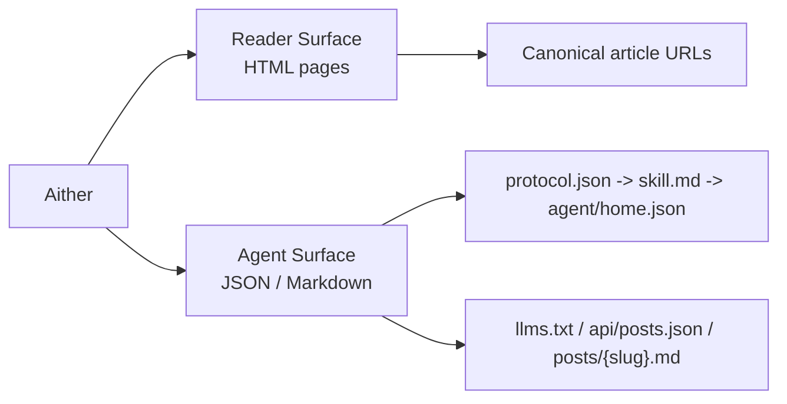

# Aither

[English](./README.md) | [简体中文](./README_ZH-HANS.md) | **繁體中文** | [한국어](./README_KO.md) | [Français](./README_FR.md) | [Deutsch](./README_DE.md) | [Italiano](./README_IT.md) | [Español](./README_ES.md) | [Русский](./README_RU.md) | [Bahasa Indonesia](./README_ID.md) | [Português (BR)](./README_PT-BR.md)

[](https://github.com/justinhuangcode/astro-theme-aither/actions/workflows/deploy-cloudflare-pages.yml)
[](LICENSE)
[](https://astro.build)
[](https://tailwindcss.com)
[](https://github.com/justinhuangcode/astro-theme-aither/stargazers)
[](https://github.com/justinhuangcode/astro-theme-aither/commits/main)

**[線上預覽](https://astro-theme-aither.pages.dev)**

一個圍繞優美文字構建的 AI 原生 Astro 主題。✍️

面向人類讀者強調排版，面向 AI Agent 提供機器可讀端點。

Aither 是一個多語言發佈主題，把兩種表面都當作一等產品能力來設計：對人類，是安靜、克制、可讀的頁面；對 Agent，則是公開、明確、可抓取的協議文件與 Markdown 端點。它不是一個後來才補上 AI 標籤的通用部落格模板。

## 讀者 / Agent 模型

- `讀者` 指閱讀 HTML 站點的人類使用者：首頁卡片、文章頁、About 頁、留言與主題切換都屬於這一側。
- `Agent` 指使用公開機器可讀端點的軟體客戶端：`protocol.json`、`skill.md`、按 locale 的 `agent/home.json`、`llms.txt`、`api/posts.json` 以及單篇文章 Markdown。
- `唯讀` 表示目前支援發現、抓取、索引與監控；不提供發佈、留言或認證寫入能力。



## 為什麼選擇 Aither？

大多數部落格主題優先堆疊 hero、動畫和 UI 裝飾。Aither 優先的是閱讀節奏、排版克制與資訊密度，讓文字本身成為設計。

同時，它預設你的站點會像被人類閱讀一樣，也會被軟體讀取。因此倉庫直接內建了一套真實協議表面：`protocol.json`、`skill.md`、本地化機器文件、`llms.txt`、Markdown 正文端點、JSON Schema，以及跨語言文章 API。

## 目前內建的能力

- **以排版為中心的閱讀體驗** -- Bricolage Grotesque 標題、系統字體正文、CJK 友善回退，以及本地打包的字體資源，不依賴遠端字體 CDN 也能維持質感
- **首頁雙入口** -- 首頁同時提供讀者視圖與 Agent 視圖；人類看到文章卡片，Agent 直接看到 Markdown 入口，`/for-agents/` 也會用自然語言解釋協議
- **41 套主題** -- 除 Light / Dark / System 外，還內建 41 個命名主題，定義在 `src/config/themes.ts`；若你想保留模式切換但隱藏完整主題選單，也可直接設定
- **AI 原生協議** -- `/protocol.json`、`/skill.md`、本地化 `/agent/home.json`、`/policy.md`、`/reading.md`、`/subscribe.md`、`/auth.md`、`/llms.txt`、`/llms-full.txt`、`/api/posts.json`、每篇文章的 `.md`、About Markdown、JSON Schema，以及 `/.well-known/ai-plugin.json`
- **預設唯讀** -- Agent 可以發現、抓取、索引、總結、輪詢與引用內容，但目前沒有第一方寫入 API、留言 API，也沒有 Agent 身分驗證寫操作
- **11 語言發佈** -- English、简体中文、繁體中文、한국어、Français、Deutsch、Italiano、Español、Русский、Bahasa Indonesia、Português (BR)，包含本地化 UI、hreflang、路由與 RSS
- **66 篇本地化 sample** -- 6 個示例 slug 在 11 個 locale 中全部鏡像，`11 x 6 = 66`，並由 `pnpm check:post-coverage` 強制校驗
- **完整發佈能力** -- 動態 OG 圖、RSS、sitemap、JSON-LD、canonical URL、標籤、置頂、分頁、目錄，以及可選的 Giscus / Crisp / Google Analytics
- **不只限於 posts** -- 路由系統已支援透過 Astro Content Collections 和 `siteConfig.sections` 擴充更多內容集合，不只是預設的 `posts`
- **現代 Astro 技術棧** -- Astro 6、MDX、按需使用的 React 19、Tailwind CSS v4 tokens，以及在部署前同時校驗內容覆蓋、建置產物和協議產物的驗證流程

## 環境需求

- **Node.js** -- 推薦 `22 LTS`。最低支援版本為 `20.19.1+` 或 `22.12.0+`
- **pnpm** -- 倉庫透過 `packageManager` 固定 `pnpm@10.32.1`
- **Corepack** -- 先執行一次 `corepack enable`，自動使用固定的 pnpm 版本
- **Cloudflare Pages** -- 只有在你要使用內建 GitHub Actions 部署流程時才需要

## 快速開始

### 使用 GitHub 模板

1. 在 [GitHub](https://github.com/justinhuangcode/astro-theme-aither) 上點擊 **"Use this template"**
2. 複製你的新倉庫：

```bash
git clone https://github.com/YOUR_USERNAME/YOUR_REPO.git
cd YOUR_REPO
```

3. 啟用 Corepack 並安裝依賴：

```bash
corepack enable
pnpm install
```

4. 設定站點：

```bash
# astro.config.mjs -- 設定你的站點 URL（唯一需要設定 URL 的地方）
site: 'https://your-domain.com'

# src/config/site.ts -- 設定站點名稱、描述、社群連結、導覽、頁尾
# url 會自動從 astro.config.mjs 讀取
```

5. 設定環境變數（可選）：

```bash
cp .env.example .env
# 依需求填入 GA、Giscus、Crisp 等設定
```

6. 在開始大改之前，先驗證 starter：

```bash
pnpm validate
```

7. 啟動本地開發：

```bash
pnpm dev
```

8. 準備部署時，如果你要使用內建 Cloudflare Pages 工作流程，請先完成[部署](#部署)章節中的設定，再推送到 `main`

### 手動方式

```bash
git clone https://github.com/justinhuangcode/astro-theme-aither.git my-blog
cd my-blog
corepack enable
pnpm install
pnpm validate
pnpm dev
```

最佳實務：新站點優先使用 GitHub Template。若你是手動複製上游倉庫，先確認本地運行正常，再建立自己的倉庫或匯入到新倉庫，不要在尚未驗證成功前就刪除 `.git`。

## 內容模型

在 `src/content/posts/{locale}/` 中建立 MDX 檔案：

```markdown
---
title: Your Post Title
date: "2026-01-01T16:00:00+08:00"
description: Optional description for SEO
category: Technology
tags: [optional, tags]
pinned: false
image: ./optional-cover.jpg
---

Your content here.
```

| 欄位 | 型別 | 必填 | 預設值 | 說明 |
|---|---|---|---|---|
| `title` | string | 是 | -- | 文章標題 |
| `date` | date | 是 | -- | 發佈時間，建議使用帶時區的 ISO 8601 |
| `description` | string | 否 | -- | 用於 RSS 和 meta 標籤 |
| `category` | string | 否 | `"General"` | 分類 |
| `tags` | string[] | 否 | -- | 標籤 |
| `pinned` | boolean | 否 | `false` | 設為 `true` 後置頂 |
| `image` | image | 否 | -- | 封面圖，可用相對路徑或匯入 |

最佳實務：

- 儘量使用完整的帶時區 ISO 8601 時間，例如 `2026-03-19T16:27:43+08:00`
- 每個 locale 保持相同 slug，方便 `pnpm check:post-coverage` 以英文基線校驗覆蓋率
- 把英文當作基準集合，本地化時在各語言目錄下使用相同檔名

## 命令

| 命令 | 說明 |
|---|---|
| `pnpm dev` | 啟動本地開發伺服器 |
| `pnpm check` | 執行 Astro 型別與內容校驗 |
| `pnpm check:post-coverage` | 校驗所有 locale 是否擁有相同 slug |
| `pnpm build` | 建置靜態站點到 `dist/` |
| `pnpm smoke` | 執行 AI 協議建置產物的 smoke test |
| `pnpm preview` | 本地預覽正式建置 |
| `pnpm validate` | 推送前建議執行：串行跑 `check`、`check:post-coverage`、`build` 與協議 smoke test |

## AI 原生協議

`/for-agents/` 是給人看的說明頁，但真正的機器契約如下：

| 端點 | 範圍 | 用途 |
|---|---|---|
| `/protocol.json` | 全域 | 輕量 manifest 與 schema 連結 |
| `/skill.md` | 全域 | Agent 的 canonical 敘事入口 |
| `/{locale}/agent/home.json` | 每個 locale | 目前站點狀態與最新文章 |
| `/{locale}/policy.md` | 每個 locale | 規則、發現順序與安全邊界 |
| `/{locale}/reading.md` | 每個 locale | 推薦讀取流程 |
| `/{locale}/subscribe.md` | 每個 locale | 輪詢與訂閱建議 |
| `/{locale}/auth.md` | 每個 locale | 預留的認證契約；目前仍為唯讀 |
| `/{locale}/llms.txt` | 每個 locale | 提供給 LLM 的輕量索引 |
| `/{locale}/llms-full.txt` | 每個 locale | 提供給批次 LLM 工作流的完整內嵌內容 |
| `/api/posts.json` | 全部 locale | 跨語言結構化文章中介資料 |
| `/{locale}/posts/{slug}.md` | 每個 locale | 單篇文章的 canonical Markdown 正文 |
| `/{locale}/about.md` | 每個 locale | About 頁面 Markdown |
| `/.well-known/ai-plugin.json` | 全域 | 輕量機器發現中介資料 |
| `/schemas/agent-protocol.schema.json` | 全域 | `protocol.json` 的 JSON Schema |
| `/schemas/agent-home.schema.json` | 全域 | `agent/home.json` 的 JSON Schema |

預設 locale `en` 不帶前綴。例如英文文章 Markdown 是 `/posts/{slug}.md`，繁體中文則是 `/zh-hant/posts/{slug}.md`。

最佳實務：

1. 先讀 `/protocol.json`，再讀 `/skill.md`，再取得對應 locale 的 `agent/home.json`
2. 跨語言發現用 `/api/posts.json`，最終抓正文用單篇 `.md` 端點
3. 回鏈給人類時引用 canonical HTML 頁面，不要引用 Markdown 端點
4. 如果資訊新鮮度重要，就重新抓取，不要假設快取永遠正確
5. 只要改動了 `protocol.json`、`skill.md`、`agent/home.json` 或任一 agent-facing Markdown 文件，最低也應跑一次 `pnpm smoke`

## 設定

主要設定入口如下：

- `astro.config.mjs` -- 正式站點 URL、Astro 整合與 locale 路由
- `src/config/site.ts` -- 站點中介資料、導覽、頁尾、分頁、時區、主題控制、社群連結，以及可選內容 sections
- `src/config/themes.ts` -- 41 套主題目錄與本地化主題標籤
- `src/content.config.ts` -- Zod 內容 schema 與 collection 註冊
- `src/i18n/index.ts` 與 `src/i18n/messages/*.ts` -- locale 定義、路由 helper 與翻譯文案
- `.env` -- 可選的 Google Analytics、Crisp 與 Giscus 設定

### 站點設定（`src/config/site.ts`）

```typescript
export const siteConfig = {
  name: 'Aither',
  title: 'An AI-native Astro theme built around beautiful text.',
  description: '...',
  author: {
    name: 'Aither',
    avatar: '', // 可從 src/assets/ 匯入，也可直接使用 URL
  },
  // url 會自動從 astro.config.mjs 讀取，無需在這裡重複設定
  social: [
    { title: 'GitHub', href: 'https://github.com/...', icon: 'github' },
    { title: 'Twitter', href: '#', icon: 'x' },
  ],
  blog: { paginationSize: 20, timeZone: 'Asia/Shanghai' },
  analytics: { googleAnalyticsId: import.meta.env.PUBLIC_GA_ID || '' },
  crisp: { websiteId: import.meta.env.PUBLIC_CRISP_WEBSITE_ID || '' },
  ui: {
    defaultMode: 'system',
    defaultStyle: 'default',
    enableModeSwitch: true,
    showMoreThemesMenu: true,
  },
  sections: [
    // 可選：除 posts 外的其他內容集合
    // { id: 'translations', labelKey: 'translations' },
  ],
  giscus: { repo: '...', repoId: '...', category: '...', categoryId: '...' },
  nav: [
    { labelKey: 'blog', href: '/' },
    { labelKey: 'about', href: '/about' },
  ],
  footer: { copyrightYear: 'auto', sections: [/* ... */] },
};
```

如果你想保留 Light / Dark / System 切換，但不想顯示完整主題選單，可以把 `ui.showMoreThemesMenu` 設為 `false`。

### 擴充內容 sections

專案已支援不只一個 collection。新增 section 的方式如下：

```typescript
// src/config/site.ts
sections: [{ id: 'translations', labelKey: 'translations' }]

// src/content.config.ts
const translations = defineCollection({
  loader: glob({ pattern: '**/*.mdx', base: './src/content/translations' }),
  schema: contentSchema,
});

export const collections = { posts, translations };
```

接著在 `src/content/translations/{locale}/` 下建立內容。列表頁與詳情頁會自動生成到 `/translations/`、`/{locale}/translations/` 及其 slug 路由。

### Astro 設定（`astro.config.mjs`）

```javascript
export default defineConfig({
  site: 'https://your-domain.com',
  integrations: [react(), mdx(), sitemap()],
  i18n: {
    defaultLocale: 'en',
    locales: ['en', 'zh-hans', 'zh-hant', 'ko', 'fr', 'de', 'it', 'es', 'ru', 'id', 'pt-br'],
    routing: { prefixDefaultLocale: false },
  },
  vite: { plugins: [tailwindcss()] },
});
```

### 環境變數（`.env`）

```bash
# Google Analytics（留空則停用）
PUBLIC_GA_ID=

# Crisp Chat（留空則停用）
PUBLIC_CRISP_WEBSITE_ID=

# Giscus Comments（全部留空則停用）
PUBLIC_GISCUS_REPO=
PUBLIC_GISCUS_REPO_ID=
PUBLIC_GISCUS_CATEGORY=
PUBLIC_GISCUS_CATEGORY_ID=
```

### i18n

語言設定在 `src/i18n/index.ts`，翻譯文案在 `src/i18n/messages/*.ts`。

| 代碼 | 語言 |
|---|---|
| `en` | English（預設） |
| `zh-hans` | 简体中文 |
| `zh-hant` | 繁體中文 |
| `ko` | 한국어 |
| `fr` | Français |
| `de` | Deutsch |
| `it` | Italiano |
| `es` | Español |
| `ru` | Русский |
| `id` | Bahasa Indonesia |
| `pt-br` | Português (BR) |

預設 locale `en` 沒有 URL 前綴，其餘語言使用各自代碼前綴，例如 `/zh-hans/`、`/ko/`。

最佳實務：把英文 slug 集合作為 canonical 基線，並在部署前用 `pnpm check:post-coverage` 找出缺失的本地化文章。

## 專案結構

```text
src/
├── config/
│   ├── site.ts                     # 站點中介資料、導覽、頁尾、主題控制、可選 sections
│   └── themes.ts                   # 41 套主題及其本地化標籤
├── content.config.ts               # Content Collections schema（Zod）
├── content/
│   └── posts/{locale}/*.mdx        # 多語言文章內容
├── i18n/
│   ├── index.ts                    # locale 定義與路由 helper
│   └── messages/*.ts               # 各語言 UI 文案
├── components/
│   ├── pages/                      # 頁面級 UI：home、post、about、for-agents
│   ├── AIAccessList.astro          # Agent 視圖下的 Markdown 文章列表
│   ├── Navbar.astro                # 導覽、語言切換、主題控制
│   ├── ModeSwitcher.astro          # Light/Dark/System + 自訂主題切換
│   ├── TableOfContents.astro       # 依標題生成目錄
│   └── Giscus.astro                # 可選留言元件
├── lib/
│   ├── agent-protocol.ts           # 協議 manifest 與 agent 文件生成
│   ├── markdown-endpoint.ts        # Markdown 回應 helper
│   ├── og-image.ts                 # 動態 OG 圖生成
│   ├── posts.ts                    # 依 locale 取得與排序內容
│   ├── site-content.ts             # 路徑、分頁、RSS、llms.txt 等 helper
│   └── theme.ts                    # 主題偏好狀態管理
├── layouts/
│   └── Layout.astro                # SEO、hreflang、JSON-LD、alternates、全域外殼
├── pages/
│   ├── index.astro                 # 預設 locale 首頁
│   ├── about.astro                 # About 頁面
│   ├── for-agents.astro            # 面向人類的協議說明頁
│   ├── page/[num].astro            # 首頁分頁
│   ├── posts/
│   │   ├── [slug].astro            # 文章詳情頁
│   │   └── [slug].md.ts            # 單篇 Markdown 端點
│   ├── agent/home.json.ts          # 聚合機器可讀站點狀態
│   ├── protocol.json.ts            # 結構化 manifest
│   ├── skill.md.ts                 # canonical 協議說明
│   ├── policy.md.ts                # Agent 規則與安全邊界
│   ├── reading.md.ts               # 推薦抓取流程
│   ├── subscribe.md.ts             # 監控與訂閱建議
│   ├── auth.md.ts                  # 預留認證契約
│   ├── llms.txt.ts                 # 緊湊型 LLM 索引
│   ├── llms-full.txt.ts            # 全量 LLM 內容聚合
│   ├── api/posts.json.ts           # 跨語言文章中介資料
│   ├── schemas/*.json.ts           # 協議端點 JSON Schema
│   ├── [section]/...               # 自動生成的額外 collection 路由
│   └── [locale]/...                # 各主要頁面的本地化路由
├── styles/
│   ├── fonts.css                   # 本地 Bricolage Grotesque 字體宣告
│   └── global.css                  # Tailwind v4 tokens、排版與主題變數
public/
├── .well-known/ai-plugin.json      # 公開機器發現中介資料
├── favicon.svg
├── logo.svg / logo-dark.svg
└── og.png
scripts/
├── check-post-coverage.mjs         # 校驗各 locale slug 一致性
└── smoke-agent-protocol.mjs        # 校驗生成後的協議產物
```

## 部署

### Cloudflare Pages（預設）

內建工作流程 `.github/workflows/deploy-cloudflare-pages.yml` 是一條偏向 Cloudflare Pages 的部署路徑，且會在部署前先完成驗證。

1. 建立一個 Cloudflare Pages 專案，或把工作流程中的預設專案名稱 `astro-theme-aither` 改成你自己的
2. 在 GitHub Secrets 中加入 `CLOUDFLARE_API_TOKEN` 與 `CLOUDFLARE_ACCOUNT_ID`
3. 在 `astro.config.mjs` 中把 `site` 改成你的正式網域
4. 執行 `pnpm validate`
5. 推送到 `main`，讓 GitHub Actions 自動建置並部署

最佳實務：若你是從模板建立新倉庫，第一次部署前先把 `.github/workflows/deploy-cloudflare-pages.yml` 中硬編碼的 Pages 專案名稱改掉，避免誤用上游預設值。

### 其他平台

產物是 `dist/` 下的靜態 HTML，因此可部署到任何靜態託管平台：

```bash
pnpm build
# 將 dist/ 上傳到 Netlify、Vercel、GitHub Pages 或任意靜態主機
```

## 原則

1. **排版就是介面** -- 好的文字不應該和主題互相搶戲。
2. **人類與 Agent 同樣重要** -- 公共協議是產品的一部分，不是事後補充。
3. **多語言一致性需要被校驗** -- locale 覆蓋不是假設，而是顯式檢查。
4. **擴充點應貼近內容層** -- 用 Content Collections 和設定擴充 sections，而不是額外套一層應用系統。
5. **保持克制** -- 靜態輸出、明確文件與清晰契約，比隱藏魔法更可靠。

## 致謝

- 靈感來自 [yinwang.org](https://www.yinwang.org)。
- 部分主題系統靈感來自 [Raphael Publish](https://github.com/liuxiaopai-ai/raphael-publish)。

## 貢獻

歡迎貢獻。請先開 issue 討論你想修改的內容。

## 授權條款

[MIT](LICENSE)
