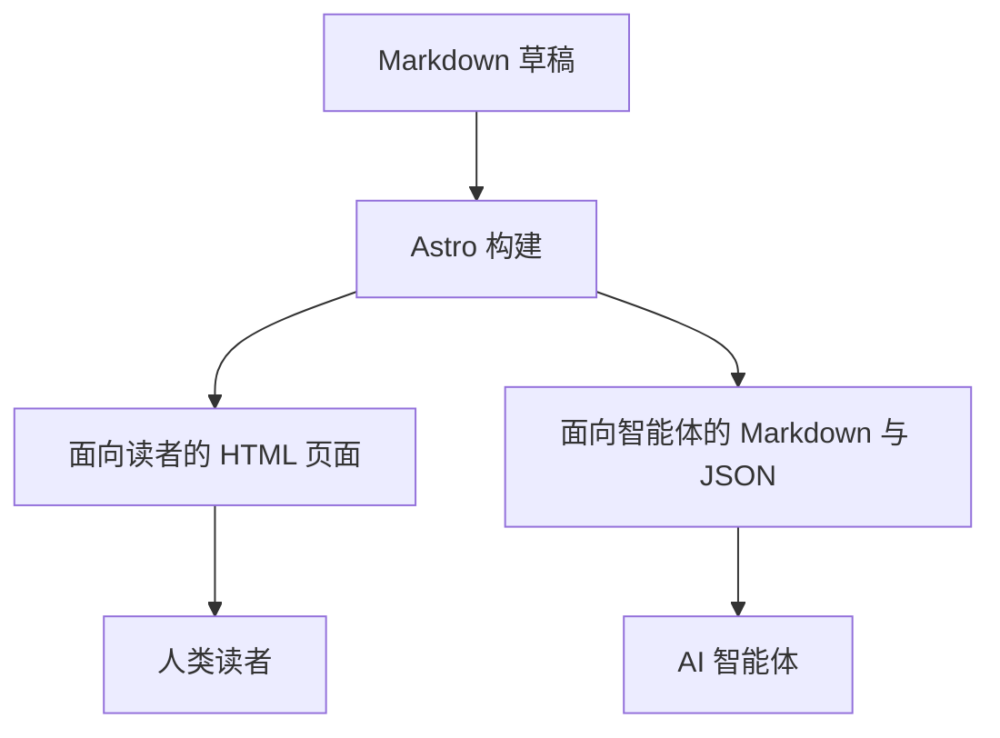

这篇文章演示了 Astro-Theme-Aither 支持的每一个 Markdown 功能。写作时可以将它作为参考。

Markdown 是一种轻量级标记语言，用纯文本就能写出格式丰富的文章。只需一个文本编辑器和几个简单的符号，就能创作出排版优美的内容。

## 标题

使用 `##` 作为章节标题，`###` 作为子章节，`####` 作为三级子章节。避免在正文中使用 `#`——文章标题已经作为顶级标题渲染。

### 三级标题

#### 四级标题

合理使用标题层级能帮助读者快速了解文章结构。建议每篇文章用两到三级标题，层级过深会让结构变得混乱。好的标题应该简短、清晰，能准确概括该章节的内容。

## 段落与换行

普通段落文本自然流动。在段落之间留一个空行来分隔它们。

这是第二个段落。保持每个段落围绕一个想法，以获得最佳阅读体验。

写作建议：每个段落不宜过长，三到五句话为佳。过长的段落会形成大块的文字墙，降低阅读的愉悦感。如果一个段落的内容太多，考虑将它拆分为两个段落，或者用列表来组织信息。

## 强调

- **粗体文本** 使用 `**双星号**`
- *斜体文本* 使用 `*单星号*`
- ***粗斜体*** 使用 `***三星号***`
- ~~删除线~~ 使用 `~~双波浪号~~`

强调应当谨慎使用。如果一段文字中到处都是粗体和斜体，那就等于没有强调。只在真正重要的关键词或短语上使用强调，让它们在视觉上突出出来。

## 链接

[行内链接](https://astro.build) 使用 `[文本](url)` 语法。

链接文本应该有描述性，让读者不点击链接也能知道链接指向什么内容。避免使用"点击这里"或"链接"这样的无意义文本作为链接描述。

## 列表

无序列表：

- 第一项
- 第二项
  - 嵌套项
  - 另一个嵌套项
- 第三项

有序列表：

1. 第一步
2. 第二步
   1. 子步骤一
   2. 子步骤二
3. 第三步

任务列表：

- [x] 搭建项目
- [x] 写第一篇文章
- [ ] 部署到生产环境

列表是组织信息的利器。当你有三个以上的并列项时，用列表比用逗号分隔的句子更清晰。嵌套列表适合展示层级关系，但嵌套不宜超过两层，否则结构会变得难以阅读。

## 引用

> 抽象的目的不是为了模糊，而是为了创造一个新的语义层级，在其中可以做到绝对精确。
>
> — Edsger W. Dijkstra

嵌套引用：

> 第一层
>
> > 第二层
> >
> > > 第三层

引用块非常适合用来展示名人名言、重要提示、或者从其他来源引用的段落。在技术文章中，引用块也常被用来高亮需要特别注意的信息，比如注意事项或警告。

## 代码

使用反引号包裹行内 `代码`。

带语法高亮的代码块：

```typescript showLanguage
interface Post {
  title: string;
  date: Date;
  description?: string;
  tags?: string[];
  draft?: boolean;
}

function getPublishedPosts(posts: Post[]): Post[] {
  return posts
    .filter((post) => !post.draft)
    .sort((a, b) => b.date.getTime() - a.date.getTime());
}
```

```css showLanguage
@theme {
  --font-sans: 'system-ui', sans-serif;
  --font-serif: 'ui-serif', 'Georgia', serif;
}
```

代码块现在默认带行号，写教程、做代码评审，或者引用较长示例时都会更顺手。

代码块在技术写作中至关重要。始终为代码块指定语言标识符（如 `typescript`、`css`、`python`），这样渲染引擎才能正确地进行语法高亮。对于 macOS 上的命令行指令，可以使用 `zsh` 作为语言标识符：

```zsh
pnpm install
pnpm dev
```

如果是 JSON 配置文件，也可以显式打开语言标题，方便教程里快速分辨代码类型：

```json showLanguage
{
  "name": "my-blog",
  "version": "1.0.0",
  "scripts": {
    "dev": "astro dev",
    "build": "astro build"
  }
}
```

行内代码适合在文本中提及变量名、函数名、文件路径等短小的代码片段。比如提到 `getPublishedPosts` 函数或 `src/config.ts` 文件时，用行内代码将它们标记出来，读者能够一眼区分代码和普通文本。

## 数学公式

行内公式可以直接写在句子里，例如 `$E = mc^2$`；较复杂的表达式则适合用块级公式：

$$
\int_0^1 x^2 \, dx = \frac{1}{3}
$$

这些公式会在构建阶段通过 KaTeX 渲染成静态输出，因此页面不需要额外依赖浏览器端数学引擎。

## Mermaid 图表

如果你要写流程图、时序图或结构图，可以使用 `mermaid` 代码块：



这类图表会在 Astro 构建时直接变成 SVG，而不是等到前端再运行 Mermaid。

## 思维导图

如果你想从 Markdown 层级直接生成真正的思维导图，可以使用 `markmap` 代码块：

```markmap
# Aither 写作
## Markdown 基础
### 标题
### 表格
## 富文本能力
### KaTeX 数学公式
### Mermaid 图表
### Markmap 思维导图
## 发布界面
### 面向读者的页面
### 面向智能体的端点
```

它和普通图表不同：Markmap 会保留层级结构，并提供轻量交互，适合整理大纲、课程内容或复杂主题。

## 表格

| 功能 | 状态 | 备注 |
|---|---|---|
| 深色模式 | 支持 | 浅色 / 深色 / 跟随系统 |
| RSS 订阅 | 内置 | `/rss.xml` |
| 站点地图 | 自动生成 | 通过 `@astrojs/sitemap` |
| SEO | 内置 | Open Graph + 规范链接 |

右对齐和居中列：

| 左对齐 | 居中 | 右对齐 |
|:---|:---:|---:|
| 文本 | 文本 | 文本 |
| 较长文本 | 较长文本 | 较长文本 |

表格适合展示结构化的对比信息。当数据有明确的行列关系时，表格比段落文字更直观。但 Markdown 表格不适合太复杂的数据——如果你的表格超过五六列或需要合并单元格，可能需要考虑其他展示方式。

## 分割线

使用 `---` 创建分割线：

---

分割线后的内容。

分割线适合在同一篇文章中分隔两个主题完全不同的部分。不过，大多数情况下用标题来划分章节就足够了，分割线应当节制使用。

## 图片

图片使用标准 Markdown 语法：

```markdown

```

本主题以排版为核心，但在需要时图片同样可以正常使用。

### 图片使用建议

替代文本（alt text）非常重要。它不仅帮助视障用户通过屏幕阅读器理解图片内容，也在图片加载失败时作为后备显示。好的替代文本应该简洁地描述图片的内容和作用，而不是简单地写"图片"或"截图"。

## 写作最佳实践

掌握 Markdown 语法只是第一步，真正重要的是如何运用这些工具写出高质量的内容。以下是一些通用的写作建议：

- **先写大纲再填内容** —— 用标题搭建文章骨架，确定逻辑流向，然后逐节填充细节
- **一个段落一个重点** —— 避免在一个段落中讨论多个不相关的话题
- **善用列表** —— 把并列的信息用列表组织，读者扫一眼就能掌握要点
- **代码配文字** —— 代码块前后加上解释性文字，说明这段代码做了什么、为什么要这样写
- **定期回顾** —— 写完后从头到尾读一遍，删掉多余的内容，改善表达不清的地方

Markdown 的简洁正是它的力量。它让你专注于写作本身，而不是格式调整。希望这篇指南能帮助你充分利用 Astro-Theme-Aither 提供的排版能力，写出赏心悦目的文章。
